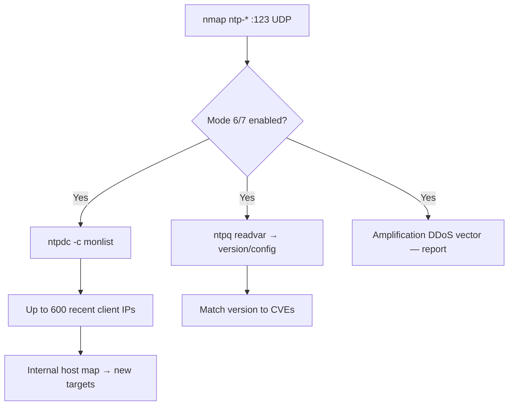

# 28 - NTP (Port 123) Pentesting

## 1. Executive Summary

NTP (Network Time Protocol) synchronizes clocks over **UDP 123**. It is rarely an RCE target, but it matters for two reasons: **reconnaissance** — legacy control queries like `monlist` leak the last 600 IP addresses that talked to the server, exposing internal hosts — and **DDoS amplification**, where `monlist`/Mode 6/7 queries return huge responses to a spoofed source (the 2014 NTP amplification attacks). A misconfigured NTP daemon hands you an internal network map for free.

## 2. Protocol Overview & Architecture

NTP exchanges timestamps in Mode 3 (client) / Mode 4 (server). The trouble lives in the legacy **Mode 6 (control)** and **Mode 7 (private/`ntpdc`)** commands — administrative queries that old `ntpd` answered to anyone, including `monlist` (recent peers), `readvar` (config/version), and `peers`. Modern `ntpd`/`chrony` disable these by default.

## 3. Enumeration & Footprinting

```bash
# Version + safe discovery/vuln scripts
nmap -sU -sV --script "ntp* and (discovery or vuln) and not (dos or brute)" -p123 <IP>

# monlist (internal host disclosure)
ntpdc -c monlist <IP>
nmap -sU -p123 --script ntp-monlist <IP>

# Config / version
ntpq -c readvar <IP>
ntpq -p <IP>
```

## 4. Exploitation Deep Dive

### 4.1 monlist — Internal Recon
If `monlist` works, it returns up to 600 recent client IPs — a ready-made list of internal hosts that communicate with this server, great for targeting.

### 4.2 Information Disclosure
`readvar` leaks the exact `ntpd` version, OS hints, and configuration — version-match to known CVEs.

### 4.3 Amplification (DDoS)
`monlist` has an amplification factor in the hundreds — a tiny spoofed request yields a massive reply toward the victim. Report exposed Mode 6/7; do **not** launch.

## 5. Mermaid Attack Flow



## 6. Post-Exploitation
- monlist IPs expand the scope of internal scanning.
- Version disclosure feeds targeted exploitation of the host OS/daemon.

## 7. Defense & Hardening
1. Disable Mode 6/7 control queries (`monlist`, `ntpdc`) or rate-limit them.
2. `restrict default noquery nomodify`; allow only trusted peers.
3. Run modern `ntpd`/`chrony`; patch.
4. Block external UDP/123 to internal time servers; use NTS for integrity.

## 8. Chaining Opportunities
- monlist host list → broader network enumeration.
- Version → host exploitation.

## 9. Related Notes
- [[24 - rpcbind (Port 111) Pentesting]]
- [[03 - DNS (Port 53) Pentesting]]

## 10. Tools
`ntpdc`, `ntpq`, `nmap` ntp-monlist/ntp-info.
