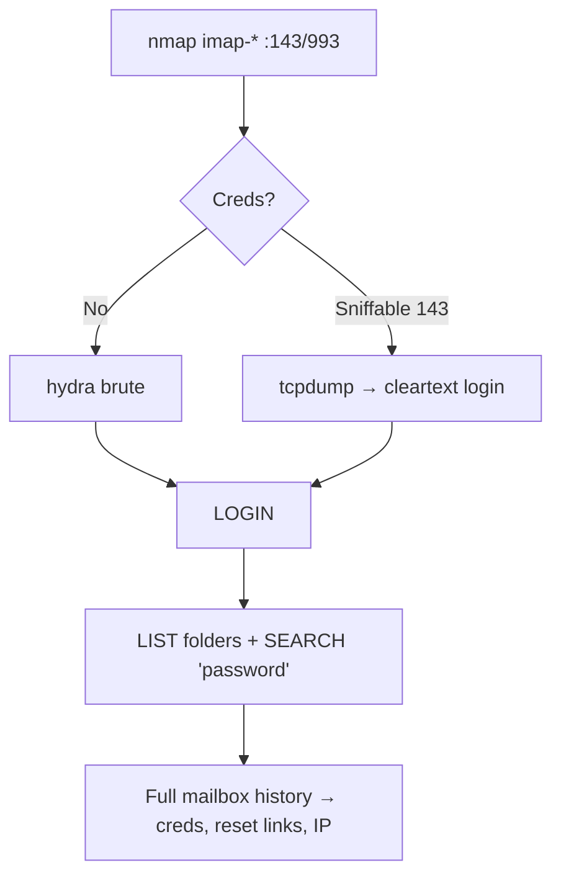

# 30 - IMAP (Ports 143-993) Pentesting

## 1. Executive Summary

IMAP (Internet Message Access Protocol) accesses email kept **on the server** over **TCP 143** (cleartext) and **993** (IMAPS/TLS). Unlike POP3's download-and-delete model, IMAP keeps mail server-side with folders, flags, and search — so a compromised IMAP account exposes the **entire historical mailbox and all folders**, not just new messages. Attack surface mirrors POP3: brute force, cleartext sniffing on 143, NTLM/banner disclosure, and rich mailbox looting after login.

## 2. Protocol Overview & Architecture

Tagged command protocol — each client command has a tag (`A1 LOGIN ...`) and the server replies with the same tag. Key commands: `LOGIN`, `LIST "" *` (enumerate folders), `SELECT INBOX`, `FETCH 1 BODY[]` (read), `SEARCH`. STARTTLS upgrades 143; 993 is TLS from the start.

## 3. Enumeration & Footprinting

```bash
nmap --script "imap-capabilities or imap-ntlm-info" -sV -p 143,993 <IP>
nc -nv <IP> 143
A1 CAPABILITY
A1 LOGIN user pass
A1 LIST "" *
```

## 4. Exploitation Deep Dive

### 4.1 Credential Brute Force
```bash
hydra -L users.txt -P pass.txt -f <IP> imap
hydra -L users.txt -P pass.txt -f -S <IP> imaps
```

### 4.2 Cleartext Sniffing (port 143)
```bash
tcpdump -i eth0 -A 'tcp port 143'
```

### 4.3 Mailbox Looting (all folders)
```bash
openssl s_client -connect <IP>:993       # then LOGIN
A1 LOGIN bob Summer2026!
A1 LIST "" *                # Sent, Archive, etc.
A1 SELECT INBOX
A1 SEARCH TEXT "password"   # hunt secrets across mail
A1 FETCH 1 BODY[]
```

## 5. Mermaid Attack Flow



## 6. Post-Exploitation
- Full folder history (Sent included) = deep intelligence + credentials.
- `SEARCH` for "password"/"vpn"/"reset" rapidly surfaces secrets.
- Reuse creds against OWA/AD/VPN.

## 7. Defense & Hardening
1. Enforce IMAPS (993) / STARTTLS; disable cleartext 143.
2. Strong passwords + lockout + MFA; disable IMAP if unused.
3. Patch the mail server; restrict exposure to the internet.

## 8. Chaining Opportunities
- Mailbox secrets → lateral reuse and **[[Account Takeover]]**.
- Creds → OWA/Exchange → AD.

## 9. Related Notes
- [[29 - POP3 (Ports 110-995) Pentesting]]
- [[05 - SMTP (Port 25) Pentesting]]

## 10. Tools
`nc`, `openssl s_client`, `hydra`, `nmap` imap-*.
