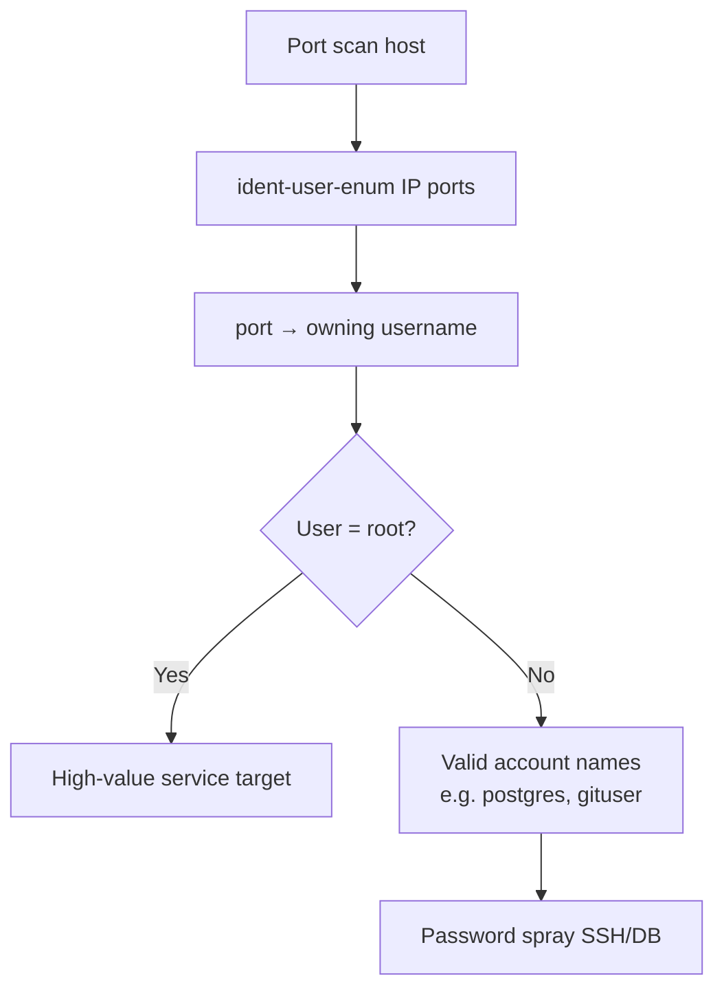

# 33 - ident (Port 113) Pentesting

## 1. Executive Summary

The Ident protocol (RFC 1413) on **TCP 113** associates a TCP connection with the **local username** that owns it. Designed for network management, it inadvertently leaks **which OS user runs each listening service** — for example, telling you that the web server runs as `www-data` or that SSH on a given connection belongs to `root`. That mapping is excellent reconnaissance: it confirms service accounts to target and reveals running daemons' owners without authentication.

## 2. Protocol Overview & Architecture

A querying server connects to the client's port 113 and sends `<server-port>,<client-port>`; the ident daemon replies with the username owning the server-side socket. Tools automate this by first finding open ports, then asking ident who owns each one.

## 3. Enumeration & Footprinting

```bash
nmap -sV --script ident-owner -p 113 <IP>

# ident-user-enum: map every open port to its owning user
ident-user-enum <IP> 22 80 113 443 3306
```

## 4. Exploitation Deep Dive

### 4.1 Service-Owner Mapping
Run `ident-user-enum` against the host's open ports to learn the user behind each service. Finding that a service runs as `root` flags it as a high-value target; finding a custom username (e.g. `oracle`, `postgres`, `gituser`) gives you valid account names for brute force.

### 4.2 Username Harvesting
The usernames returned feed password spraying against SSH/FTP/databases on the same host.

## 5. Mermaid Attack Flow



## 6. Post-Exploitation
- Confirmed service accounts shorten brute-force/spray attacks.
- Knowing a daemon runs as root prioritizes exploitation effort.

## 7. Defense & Hardening
1. **Disable identd** — it provides attackers more than it provides you.
2. If a service requires ident, return obfuscated/random replies; restrict to trusted hosts.
3. Firewall port 113.

## 8. Chaining Opportunities
- Harvested usernames → **[[01 - SSH (Port 22) Pentesting]]** / database brute force.
- Service-owner intel → targeted exploitation.

## 9. Related Notes
- [[32 - Finger (Port 79) Pentesting]]
- [[35 - whois (Port 43) Pentesting]]

## 10. Tools
`ident-user-enum`, `nmap` ident-owner, `nc`.
