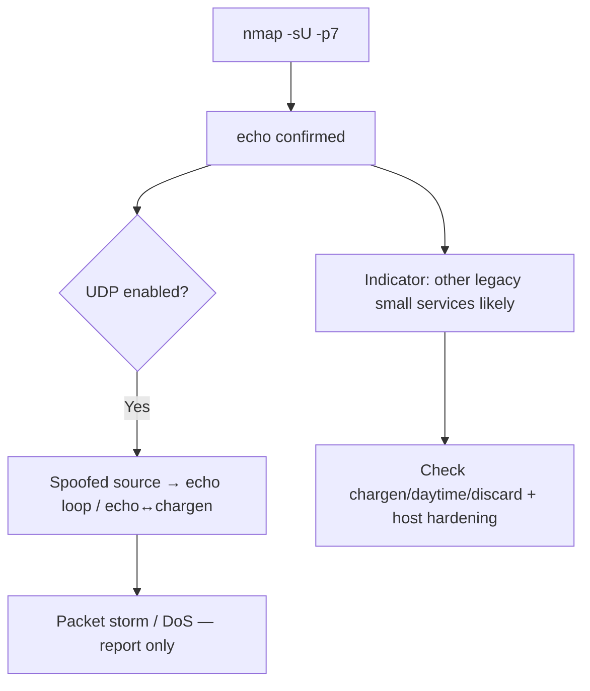

# 34 - Echo (Port 7) Pentesting

## 1. Executive Summary

The Echo service on **TCP/UDP 7** is a legacy diagnostic that simply sends back whatever it receives, unmodified. It carries no useful data and is almost never needed, but it is a **denial-of-service and amplification** liability: looping two UDP echo services (or echo↔chargen) against each other generates a self-sustaining packet storm that can take hosts offline. Its presence is mainly a hygiene/finding item — an old "small service" that should have been disabled.

## 2. Protocol Overview & Architecture

One of the RFC 862 "small services" (echo, discard, chargen, daytime, time). On TCP it echoes the byte stream; on UDP each datagram is echoed back to the source. Because UDP is spoofable, an attacker can forge the source address and direct echoed traffic at a victim, or pair echo with chargen for amplification.

## 3. Enumeration & Footprinting

```bash
nmap -sV -p 7 <IP>            # detects "echo"
nmap -sU -p 7 <IP>            # UDP echo (DoS-relevant)
echo "test" | nc <IP> 7      # confirm: data comes back
```

## 4. Exploitation Deep Dive

### 4.1 Confirm the Service
Sending data and receiving the same bytes confirms echo is live.

### 4.2 UDP Echo Loop / Amplification (DoS)
Spoofing the source so two echo services (or echo→chargen on port 19) bounce packets endlessly produces a packet storm and resource exhaustion. **Report only** — do not launch against production.

### 4.3 Information Value
None directly, but its presence usually means **other legacy small services** (chargen/daytime/discard) and an unhardened host — pivot to checking those.

## 5. Mermaid Attack Flow



## 6. Post-Exploitation
- No data foothold; treated as a configuration weakness and a DoS vector.
- Signals a generally unhardened host worth deeper inspection.

## 7. Defense & Hardening
1. **Disable echo and all RFC 862 small services** (inetd/xinetd, Windows "Simple TCP/IP Services").
2. Block UDP/TCP 7 at the firewall.
3. Anti-spoofing (BCP 38) on network edges to blunt amplification.

## 8. Chaining Opportunities
- Presence → audit other legacy services on the host.

## 9. Related Notes
- [[28 - NTP (Port 123) Pentesting]]
- [[19 - Memcache (Port 11211) Pentesting]]

## 10. Tools
`nmap`, `nc`.
