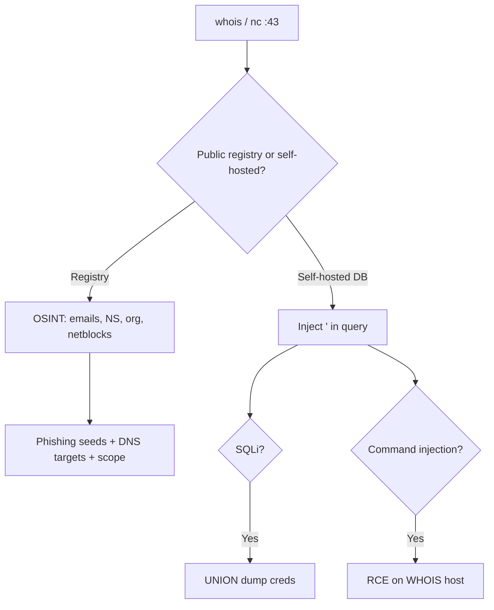

# 35 - whois (Port 43) Pentesting

## 1. Executive Summary

WHOIS on **TCP 43** is a plaintext query service for registration data about domains, IP blocks, and autonomous systems. As a target it is twofold: client-side it is a **reconnaissance/OSINT** goldmine (registrant names, emails, name servers, org details that seed phishing and password lists); server-side, organizations that **run their own WHOIS daemon** backed by a database have repeatedly been vulnerable to **SQL injection** and command injection through the query string, because the protocol has **no authentication, integrity, or confidentiality** and naively passes user input to a backend.

## 2. Protocol Overview & Architecture

Dead simple: the client opens TCP 43, sends a single query line, and the server streams back human-readable text; the connection close marks end-of-response. A self-hosted WHOIS server typically looks the query up in a database — and that lookup is where injection lives.

## 3. Enumeration & Footprinting

```bash
# Standard OSINT lookup (uses the right registry automatically)
whois example.com
whois -h <IP> example.com        # query a specific WHOIS server
whois -h <IP> 1.2.3.4            # IP/netblock ownership

# Raw interaction with a self-hosted server
nc -nv <IP> 43
example.com
```

## 4. Exploitation Deep Dive

### 4.1 OSINT / Recon (client-side)
Domain WHOIS yields registrant org/name, **emails** (phishing + username seeds), **name servers** (→ DNS attacks/AXFR), creation/expiry dates, and abuse contacts. IP WHOIS reveals the owning org and netblock — scope expansion.

### 4.2 SQL Injection (self-hosted server)
A custom WHOIS daemon that builds `SELECT ... WHERE domain='<query>'` is injectable:
```bash
nc -nv <IP> 43
a' UNION SELECT username,password FROM users-- -
```
Confirm with classic SQLi probes (`'`, `' OR '1'='1`), then exfiltrate via UNION/boolean/time techniques. See **[[SQL Injection]]**.

### 4.3 Command Injection
If the query is shelled out (e.g. to a script), inject shell metacharacters (`; id`, `$(id)`).

## 5. Mermaid Attack Flow



## 6. Post-Exploitation
- OSINT feeds targeted phishing and credential lists.
- SQLi → dump the WHOIS/registrar database (accounts, domains).
- Command injection → shell on the WHOIS host.

## 7. Defense & Hardening
1. Use parameterized queries / strict input validation on self-hosted WHOIS.
2. Never shell out raw queries; run the daemon least-privileged.
3. Enable domain registrar **privacy/redaction**; minimize public contact data.

## 8. Chaining Opportunities
- WHOIS emails → phishing → initial access.
- Name servers → **[[03 - DNS (Port 53) Pentesting]]** zone transfer.

## 9. Related Notes
- [[03 - DNS (Port 53) Pentesting]]
- [[32 - Finger (Port 79) Pentesting]]

## 10. Tools
`whois`, `nc`, `sqlmap` (against self-hosted servers), OSINT frameworks.
