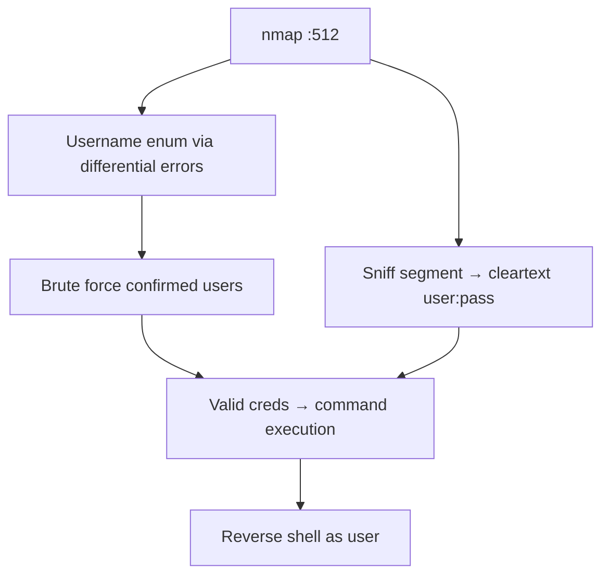

# 39 - rexec (Port 512) Pentesting

## 1. Executive Summary

rexec ("remote execution") on **TCP 512** runs commands on a remote host using a **username and password sent in cleartext** — unlike its siblings rsh/rlogin, it relies on credentials rather than `.rhosts` trust. Two things make it attractive: many implementations (e.g. GNU `rexecd`) return **different error strings for invalid usernames vs invalid passwords**, enabling **username enumeration before brute force**, and the protocol sniffs trivially. Field lengths are also capped (16-byte username/password in common builds), shrinking the keyspace.

## 2. Protocol Overview & Architecture

The client sends username, password, and a command; `rexecd` authenticates against system accounts and runs the command with that user's privileges. No encryption, no trust files — pure credential auth, which is why enumeration + brute force is the standard approach.

## 3. Enumeration & Footprinting

```bash
nmap -sV -p512 <IP>
# Username enumeration via differential errors, then brute force
nmap -p512 --script rexec-brute --script-args "userdb=users.txt,passdb=rockyou.txt" <IP>
```

## 4. Exploitation Deep Dive

### 4.1 Username Enumeration
Watch for distinct responses to valid vs invalid users (some `rexecd` builds leak existence before checking the password) — confirm accounts, then target only those.

### 4.2 Credential Brute Force
```bash
hydra -L users.txt -P pass.txt rexec://<IP>
nmap -p512 --script rexec-brute --script-args userdb=users.txt,passdb=pass.txt <IP>
```

### 4.3 Command Execution
With valid creds, run commands (e.g. a reverse shell) as that user.

### 4.4 Cleartext Sniffing
```bash
tcpdump -i eth0 -A 'tcp port 512'   # captures username + password
```

## 5. Mermaid Attack Flow



## 6. Post-Exploitation
- Command execution as the authenticated user → host foothold.
- Captured/cracked creds reused on SSH and other services.

## 7. Defense & Hardening
1. **Disable rexec**; use SSH.
2. If unavoidable, restrict to trusted hosts and patch differential-error leaks.
3. Firewall 512; never expose over untrusted networks.

## 8. Chaining Opportunities
- Enumerated users → cross-service brute force.
- Shell → **[[08 - Linux Privilege Escalation]]**.

## 9. Related Notes
- [[37 - rlogin (Port 513) Pentesting]]
- [[38 - rsh (Port 514) Pentesting]]
- [[40 - rusersd (Port 1026) Pentesting]]

## 10. Tools
`rexec`, `nmap` rexec-brute, `hydra`, `tcpdump`.
