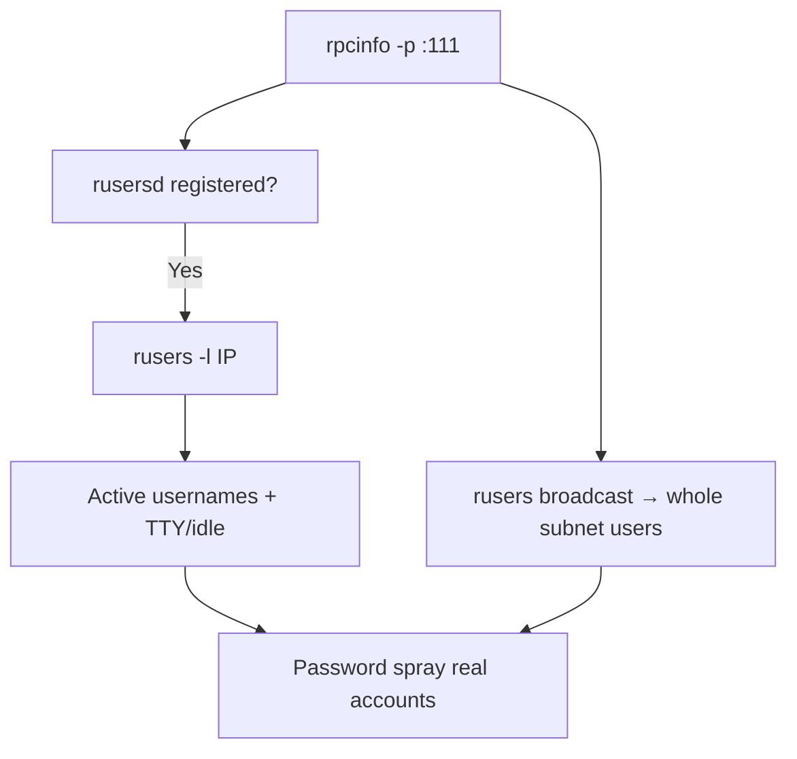

# 40 - rusersd (RPC, ~Port 1026) Pentesting

## 1. Executive Summary

rusersd is a Sun **RPC** service that reports the **users currently logged into a host**. It has no fixed port — it registers a dynamic port (often around **1026**) with the portmapper (rpcbind/111), and responds to a broadcast/direct query. For an attacker it is pure **reconnaissance**: it hands over valid, *active* usernames with no authentication, which directly feed password spraying and tell you which accounts (and admins) are present on the network right now.

## 2. Protocol Overview & Architecture

As an RPC program, rusersd is discovered via the portmapper (`rpcinfo`). The `rusers` client sends an RPC call (often as a broadcast across the subnet) and each running rusersd replies with its logged-in users, optionally with detail (TTY, login time, idle time). It is the network-wide cousin of `finger`/`who`.

## 3. Enumeration & Footprinting

```bash
# Confirm it is registered
rpcinfo -p <IP> | grep ruser

# Query logged-in users (install: apt install rusers)
rusers -l <IP>
rusers -l -a <IP>          # include hosts not responding to broadcast
rusers                     # broadcast the whole subnet
```

## 4. Exploitation Deep Dive

### 4.1 Active-User Harvesting
`rusers -l <IP>` returns usernames plus TTY/login/idle data. Logged-in users are high-value spray targets (their accounts are real and in use), and idle/admin sessions point to privileged accounts.

### 4.2 Subnet Sweep
A broadcast `rusers` enumerates active users across the entire local segment in one shot — rapid mapping of who is where.

## 5. Mermaid Attack Flow



## 6. Post-Exploitation
- Confirmed active usernames → efficient, low-noise password spraying.
- Identify which hosts an admin is logged into → target for credential theft.

## 7. Defense & Hardening
1. Disable rusersd and other RPC info services (rwhod, rstatd) if not needed.
2. Firewall rpcbind/111 and the dynamic RPC range to trusted hosts.
3. Avoid exposing logged-in-user data on untrusted networks.

## 8. Chaining Opportunities
- Discovered via **[[24 - rpcbind (Port 111) Pentesting]]**.
- Usernames → **[[01 - SSH (Port 22) Pentesting]]** / **[[09 - Kerberos (Port 88) Pentesting]]** spray.

## 9. Related Notes
- [[24 - rpcbind (Port 111) Pentesting]]
- [[32 - Finger (Port 79) Pentesting]]
- [[39 - rexec (Port 512) Pentesting]]

## 10. Tools
`rusers`, `rpcinfo`, `nmap` rpcinfo.
