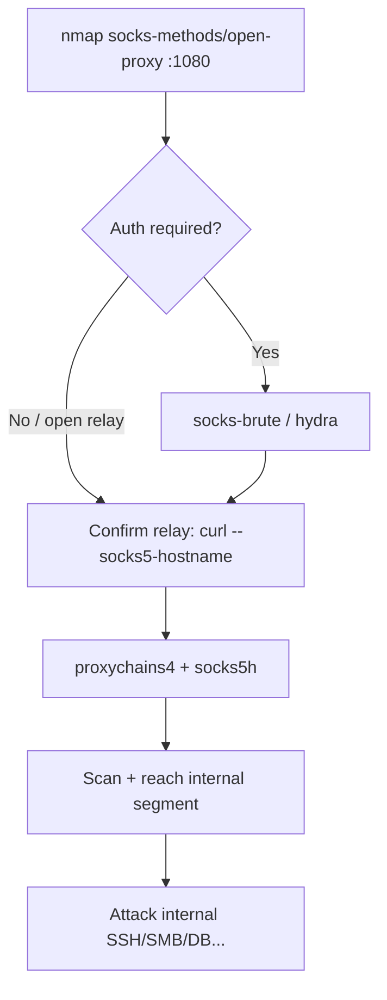

# 41 - SOCKS Proxy (Port 1080) Pentesting

## 1. Executive Summary

SOCKS is a session-layer (OSI Layer 5) proxy protocol that relays TCP connections — and, via the `UDP ASSOCIATE` command, UDP packets — between a client and arbitrary destinations. **SOCKS5** adds optional authentication; **SOCKS4** has none. The default port is **TCP 1080**. For an attacker a reachable SOCKS proxy is a **pivot**: if it is open (no auth) or you can brute/sniff credentials, it becomes a tunnel into whatever network the proxy can reach — often an internal segment you cannot touch directly. The `socks5h` scheme (note the `h`) forces DNS resolution *through* the proxy, so you resolve internal hostnames and avoid leaking lookups from your own host.

## 2. Protocol Overview & Architecture

The client opens a TCP session to the proxy, negotiates an authentication method (none / username-password for SOCKS5), then issues a `CONNECT` (or `BIND` / `UDP ASSOCIATE`) request naming the target host+port. The proxy dials the target on the client's behalf and shuttles bytes. Because the proxy makes the outbound connection, the target sees the *proxy's* source IP — which is exactly what makes SOCKS valuable for reaching internal hosts that trust the proxy's network position.

```
[You] --SOCKS5--> [Proxy 1080] --outbound--> [Internal host: 22/445/3306...]
        DNS via socks5h resolves on the proxy side
```

## 3. Enumeration & Footprinting

```bash
# Identify and probe auth methods + open-relay behaviour
nmap -sV --script socks-methods,socks-open-proxy -p 1080 <IP>
nmap -p 1080 --script socks-auth-info <IP>

# Credential brute force (SOCKS5)
nmap --script socks-brute -p 1080 <IP>
nmap --script socks-brute --script-args userdb=users.txt,passdb=rockyou.txt,unpwdb.timelimit=30m -p 1080 <IP>

# Confirm it actually relays (egress IP test)
curl --socks5-hostname <IP>:1080 https://ifconfig.me
curl --socks5-hostname user:pass@<IP>:1080 http://internal.target
```

## 4. Exploitation Deep Dive

### 4.1 Open / Misconfigured Relay
`socks-open-proxy` attempts an outbound CONNECT — if it succeeds the proxy accepts unauthenticated relaying. Confirm reach with `curl --socks5-hostname` and check the egress IP it presents.

### 4.2 Credential Brute Force
SOCKS5 username/password auth is brute-forceable with `socks-brute` or hydra. Weak/default creds are common on appliance and IoT proxies.

### 4.3 Internal Pivoting (the real prize)
Chain the proxy into your tooling. Use `socks5h://` so DNS resolves internally:
```bash
# proxychains4.conf:  socks5 <IP> 1080   (or with creds)
proxychains4 -q nmap -sT -Pn --top-ports 200 <internal-host>
proxychains4 -q curl http://internal-app.local/
```
Forcing remote DNS (`socks5h`) prevents local DNS leaks and lets you hit internal-only names.

## 5. Mermaid Attack Flow



## 6. Post-Exploitation
- Working proxy = persistent tunnel into the internal network; pivot to internal services.
- Map the internal subnet the proxy can reach (it reveals trust/topology).
- Reuse harvested SOCKS creds against other services.

## 7. Defense & Hardening
1. Require SOCKS5 authentication; disable open relaying / restrict allowed destinations.
2. Bind the proxy to trusted interfaces only; firewall 1080 from untrusted networks.
3. Strong, unique credentials; monitor for anomalous CONNECT volume/destinations.
4. Egress-filter what the proxy itself may reach (deny internal management ranges).

## 8. Chaining Opportunities
- Tunnel → attack internal **[[01 - SSH (Port 22) Pentesting]]**, **[[06 - SMB (Ports 139-445) Pentesting]]**, databases.
- General tunneling theory pairs with **[[42 - Squid Proxy (Port 3128) Pentesting]]**.

## 9. Related Notes
- [[42 - Squid Proxy (Port 3128) Pentesting]]

## 10. Tools
`nmap` socks-methods/socks-open-proxy/socks-brute, `curl --socks5-hostname`, `proxychains4`, `hydra`.
