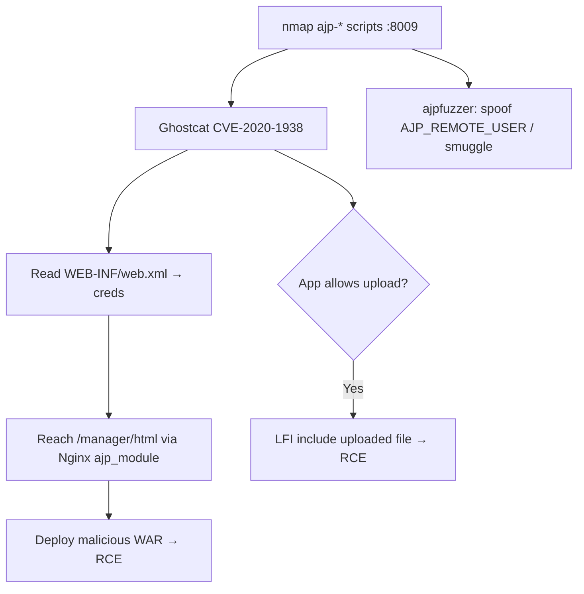

# 46 - AJP / Apache JServ Protocol (Port 8009) Pentesting

## 1. Executive Summary

AJP (Apache JServ Protocol) on default **TCP 8009** is the binary connector Tomcat uses to talk to a fronting web server (Apache/Nginx via `mod_proxy_ajp`). It is **"the forgotten Tomcat port"**: admins firewall 8080 but leave 8009 open. The headline bug is **Ghostcat (CVE-2020-1938)** — an LFI in the AJP connector that reads files under the webroot like `WEB-INF/web.xml` (often holding credentials), and on apps that allow file upload can escalate to RCE. AJP also carries **trusted request attributes** (authenticated user, TLS info, arbitrary `req_attribute`), so a proxied AJP backend can be tricked into trusting attacker-supplied identity/path data.

## 2. Protocol Overview & Architecture

AJP is *not* "HTTP on another port" — it is a packed binary protocol that conveys, beyond the request, **trusted attributes**: `AJP_REMOTE_USER`, `AJP_LOCAL_ADDR`, `AJP_REMOTE_PORT`, `AJP_SSL_PROTOCOL`, client-cert material, and arbitrary `req_attribute` name/value pairs. Ghostcat abused the `javax.servlet.include.servlet_path` / `path_info` attributes to force server-side includes of `WEB-INF/*`. Because frontends and AJP backends can disagree on request boundaries, an external HTTP desync can smuggle into AJP.

## 3. Enumeration & Footprinting

```bash
nmap -sV --script ajp-auth,ajp-headers,ajp-methods,ajp-request -n -p 8009 <IP>

# Pull a specific path through AJP
nmap -p 8009 --script ajp-request \
  --script-args 'path=/manager/html,method=GET,filename=ajp-manager.out' <IP>
nmap -p 8009 --script ajp-headers,ajp-methods \
  --script-args 'ajp-headers.path=/,ajp-methods.path=/manager/html' <IP>
```

## 4. Exploitation Deep Dive

### 4.1 Ghostcat — CVE-2020-1938 (LFI → creds → RCE)
The connector lets you read files under the webroot via the include attributes:
```bash
python2 ghostcat.py -p 8009 -f WEB-INF/web.xml <IP>   # leak web.xml → DB/app creds
# Exploit-DB 48143 implements the same; AJP exposed ports may be vulnerable
```
If the app permits file upload, Ghostcat can be chained from LFI to **RCE** by including an uploaded file.

### 4.2 Reach Tomcat Manager via AJP → RCE
Proxy to the Manager app through 8009 using Nginx's third-party `ajp_module` (or an Apache `mod_proxy_ajp` front). If `/manager/html` becomes reachable with creds (often leaked by Ghostcat), deploy a malicious WAR for RCE.

### 4.3 Trusted-Attribute / Smuggling Abuse
With protocol-aware tooling (`ajpfuzzer`) you can set arbitrary `req_attribute`s — e.g. spoof `AJP_REMOTE_USER` to assert an authenticated identity, or smuggle via frontend/backend boundary disagreement:
```bash
java -jar ajpfuzzer_v0.7.jar
```

## 5. Mermaid Attack Flow



## 6. Post-Exploitation
- web.xml/context creds → DB and Manager access.
- WAR deploy → shell as the Tomcat user; loot other webapps on the server.

## 7. Defense & Hardening
1. Patch Tomcat (Ghostcat fix); set a `secret`/`requiredSecret` on the AJP connector or disable it if unused.
2. Bind the AJP connector to `127.0.0.1`; firewall 8009 from untrusted networks.
3. Don't trust AJP attributes from untrusted sources; align frontend/backend request parsing.
4. Lock down Tomcat Manager (strong creds, restrict access).

## 8. Chaining Opportunities
- Leaked DB creds → **[[10 - MSSQL (Port 1433) Pentesting]]** / **[[11 - MySQL (Port 3306) Pentesting]]**.
- WAR shell → **[[08 - Linux Privilege Escalation]]**.
- Reach via proxy pivot from **[[42 - Squid Proxy (Port 3128) Pentesting]]**.

## 9. Related Notes
- [[47 - FastCGI (Port 9000) Pentesting]]

## 10. Tools
`nmap` ajp-* scripts, `ghostcat.py` / Exploit-DB 48143, `ajpfuzzer`, Nginx `ajp_module`.
