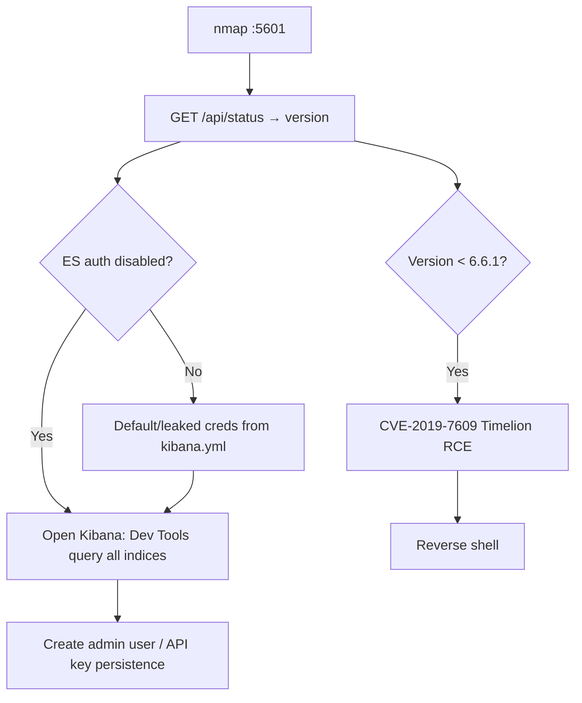

# 50 - Kibana (Port 5601) Pentesting

## 1. Executive Summary

Kibana is the web UI for searching/visualizing data in **Elasticsearch**, on default **TCP 5601**. Its authentication is **inherited from Elasticsearch**: if Elasticsearch has auth disabled, Kibana opens with **no credentials at all**. When it is secured, the *same* creds work — and creds often sit in **`/etc/kibana/kibana.yml`**; if those belong to a user other than the restricted `kibana_system` account, they grant broad access. Once inside, you manage users/roles/API keys and can hit version-specific RCEs (e.g. **pre-6.6.0 RCE**).

## 2. Protocol Overview & Architecture

Kibana is an HTTP app fronting Elasticsearch; it issues queries to the cluster with whatever credentials it is configured to use. Because the trust boundary is really Elasticsearch's, an open ES cluster means an open Kibana. `kibana.yml` stores `elasticsearch.username`/`password` — a high-value file post-foothold. The `kibana_system` user is monitoring-only; any *other* configured user likely has real data access.

## 3. Enumeration & Footprinting

```bash
nmap -sV -p 5601 <IP>
curl -s http://<IP>:5601/api/status | jq '.version.number, .status.overall'   # version + health, often no auth
# Brute / default creds if a login is shown (ties to Elasticsearch users)
```
Note the version — it gates which CVEs apply.

## 4. Exploitation Deep Dive

### 4.1 Unauthenticated Access (ES auth off)
If Elasticsearch auth is disabled, browse straight in. Use **Dev Tools** console to query all indices — read sensitive data directly from the cluster.

### 4.2 Credential Discovery
Post-foothold on the host, read creds:
```bash
cat /etc/kibana/kibana.yml | grep -iE 'username|password|elasticsearch'
```
Non-`kibana_system` creds = broader cluster access; reuse against Elasticsearch (9200).

### 4.3 Account & API-Key Abuse
With access: Stack Management → Users/Roles/API Keys → create an admin user or API key for persistence and full data control.

### 4.4 Version RCE
Check the version for known RCEs (e.g. **CVE-2019-7609**, the Timelion prototype-pollution RCE in Kibana < 6.6.1). If vulnerable, the Timelion canvas payload yields a reverse shell.

## 5. Mermaid Attack Flow



## 6. Post-Exploitation
- Read all Elasticsearch data via Dev Tools (PII, logs, secrets).
- Create API keys/users for persistence.
- RCE → host foothold; reuse `kibana.yml` creds on ES (9200).

## 7. Defense & Hardening
1. Enable Elasticsearch security (auth + TLS) — Kibana inherits it.
2. Use the least-privilege `kibana_system` user; protect `kibana.yml` perms.
3. Patch Kibana (Timelion/other RCEs); restrict 5601 to trusted nets/VPN.
4. Audit user/role/API-key changes.

## 8. Chaining Opportunities
- Creds/data pivot to **[[18 - Elasticsearch (Port 9200) Pentesting]]**.
- RCE → **[[08 - Linux Privilege Escalation]]**.

## 9. Related Notes
- [[18 - Elasticsearch (Port 9200) Pentesting]]
- [[51 - Splunkd (Port 8089) Pentesting]]

## 10. Tools
`curl`, browser Dev Tools, CVE-2019-7609 PoC, `nmap`.
