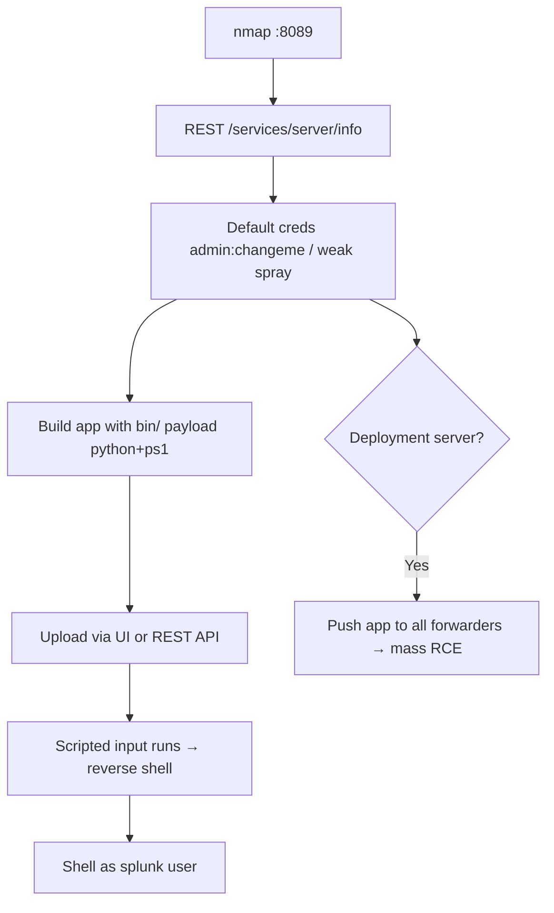

# 51 - Splunkd (Port 8089) Pentesting

## 1. Executive Summary

Splunk is a log/SIEM platform; the management daemon **splunkd** listens on **TCP 8089** (the web UI is usually 8000). The classic path to **Remote Code Execution** is authenticated abuse: log in (old builds ship **`admin:changeme`**; weak passwords like `Welcome`, `Password123` are common), then **deploy a custom Splunk app** whose `bin/` contains a script. Splunk runs **Python, Batch, Bash, or PowerShell**, and **bundles Python even on Windows**, so a malicious app gives cross-platform reverse shells running with Splunk's (often high) privileges.

## 2. Protocol Overview & Architecture

splunkd exposes a REST management API (8089) and supports a deployment-server model that pushes apps to forwarders. An "app" is a directory bundle; scripted inputs / custom commands in its `bin/` execute on the Splunk host. So **app upload == code execution**. In distributed setups, compromising a deployment server can push your malicious app to *every* forwarder — mass RCE.

## 3. Enumeration & Footprinting

```bash
nmap -sV -p 8089 <IP>
curl -sk https://<IP>:8089/services/server/info -u admin:changeme    # version, auth check
# Try default/weak creds: admin:changeme, admin:admin, admin:Password123
```

## 4. Exploitation Deep Dive

### 4.1 Default / Weak Credentials
Old Splunk ships `admin:changeme`. Confirm login via the REST API or web UI; spray a small weak-password list if defaults fail.

### 4.2 Malicious Custom App → RCE
Build an app whose `bin/` holds your payload (e.g. `reverse_shell_splunk` with `rev.py` for *nix and `run.ps1` for Windows):
```
splunk_shell/
├── bin/
│   ├── rev.py          # python reverse shell (works on Win too — bundled python)
│   └── run.ps1
├── default/
│   └── inputs.conf     # scripted input that runs bin/ on a schedule
└── metadata/
```
Package and upload via the UI (Apps → Install app from file) or the REST API, then it executes on the host.

### 4.3 Deployment-Server Spread
If splunkd is a deployment server, register your app as a server class deployed to forwarders → RCE on all managed endpoints (high impact; authorized scope only).

## 5. Mermaid Attack Flow



## 6. Post-Exploitation
- Shell as the Splunk service account (often privileged).
- Read indexed data (logs may contain creds/PII); harvest other host secrets.
- Deployment server → lateral RCE across the fleet.

## 7. Defense & Hardening
1. Change default creds; enforce strong passwords + MFA on Splunk.
2. Run Splunk as a low-privilege account; restrict who can install apps.
3. Firewall 8089/8000 to admin/VPN; TLS with verified certs.
4. Monitor app installs and scripted-input changes.

## 8. Chaining Opportunities
- Shell → **[[08 - Linux Privilege Escalation]]** / Windows priv-esc.
- Indexed creds → cross-service reuse.

## 9. Related Notes
- [[50 - Kibana (Port 5601) Pentesting]]
- [[52 - InfluxDB (Port 8086) Pentesting]]

## 10. Tools
`curl`, custom Splunk app (`reverse_shell_splunk`), Splunk REST API, `nmap`.
