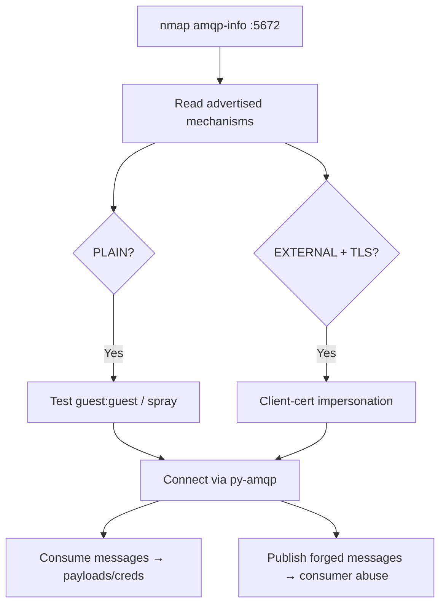

# 54 - AMQP (Ports 5671-5672) Pentesting

## 1. Executive Summary

AMQP (Advanced Message Queuing Protocol) is the broker protocol behind RabbitMQ and others — **5672 plaintext**, **5671 TLS (AMQPS)**. The default RabbitMQ login is **`guest:guest`**; RabbitMQ restricts it to localhost via `loopback_users`, but **many Docker/IoT images disable that**, so always test remote login. With broker access you enumerate vhosts/queues/exchanges, **consume messages** (often app data, tokens, internal commands), and **publish forged messages**. RabbitMQ 4.x can also expose **AMQP 1.0** on the same listener — targeting `/queues/<queue>` routes through the internal `amq.default` exchange.

## 2. Protocol Overview & Architecture

AMQP 0-9-1 (RabbitMQ's classic protocol) negotiates auth mechanisms at connect: **PLAIN** and **AMQPLAIN** are enabled by default, **ANONYMOUS** maps to `anonymous_login_user`/`pass`, and **EXTERNAL** (x509 client-cert) appears when TLS is on. Enumerate the advertised mechanisms first — they tell you whether to password-spray (PLAIN) or attempt certificate impersonation (EXTERNAL). Messages flow producer → exchange → (routing) → queue → consumer.

## 3. Enumeration & Footprinting

```bash
nmap -sV -Pn -n -T4 -p 5672 --script amqp-info <IP>
# amqp-info reveals product/version + advertised mechanisms, e.g.:
#   mechanisms: PLAIN AMQPLAIN
# Probe AMQPS:
nmap -sV -p 5671 --script amqp-info <IP>
```

## 4. Exploitation Deep Dive

### 4.1 Default Creds / Spray
Test `guest:guest` remotely (don't assume loopback blocks it). If the broker advertises PLAIN, password-spray known app users.
```python
import amqp
conn = amqp.connection.Connection(host="<IP>", port=5672, virtual_host="/",
                                  userid="guest", password="guest")
conn.connect()
```

### 4.2 Consume / Publish Messages
With a connection, list queues (via the management API on 15672 if present) and drain or inject:
```python
ch = conn.channel()
# consume
msg = ch.basic_get(queue="<queue>")
print(msg.body)
# publish a forged message straight to a known queue (via amq.default)
ch.basic_publish(amqp.Message("<payload>"), routing_key="<queue>")
```
On AMQP 1.0 (RabbitMQ 4.x), addressing `/queues/<queue>` sends through `amq.default` to an existing queue — handy when you know queue names but cannot declare topology.

### 4.3 Certificate Impersonation (EXTERNAL)
If TLS + EXTERNAL is exposed and you can obtain/forge a trusted client cert, authenticate as that identity without a password.

## 5. Mermaid Attack Flow



## 6. Post-Exploitation
- Message payloads → app data, tokens, internal commands.
- Forged messages → drive/abuse downstream workers.
- Creds reused on the management console (15672) and other services.

## 7. Defense & Hardening
1. Remove/disable `guest`; keep `loopback_users` on; per-app least-privilege creds + vhost isolation.
2. Require TLS (5671); use EXTERNAL/x509 only with a properly managed CA.
3. Firewall 5671/5672 to app hosts; authenticate producers and validate payloads.
4. Disable unused mechanisms (ANONYMOUS).

## 8. Chaining Opportunities
- Web console front end: **[[53 - RabbitMQ Management (Port 15672) Pentesting]]**.
- Other brokers: **[[55 - NATS (Port 4222) Pentesting]]**, **[[56 - MQTT (Port 1883) Pentesting]]**.

## 9. Related Notes
- [[53 - RabbitMQ Management (Port 15672) Pentesting]]

## 10. Tools
`nmap` amqp-info, Python `amqp`/`pika`, RabbitMQ mgmt API, `openssl s_client` (AMQPS).
