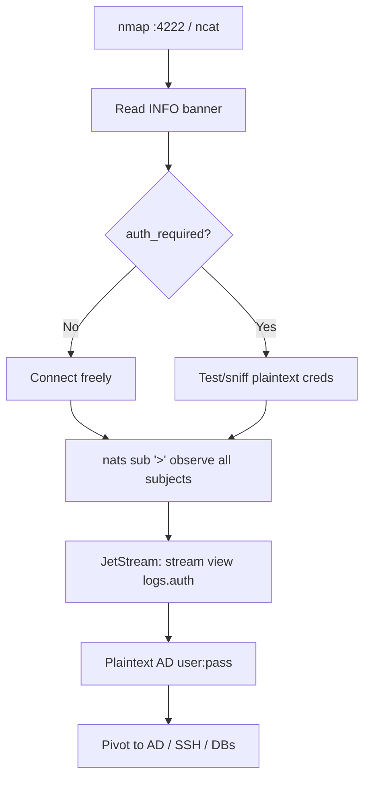

# 55 - NATS (Port 4222) Pentesting

## 1. Executive Summary

NATS is a high-performance message bus with a simple text protocol on **TCP 4222** (4223+ for cluster routes). On connect the server sends an `INFO {...}` JSON banner; the client replies `CONNECT {"user":...,"pass":...}`. **TLS and auth are optional**, so many internal deployments run **plaintext AUTH** — credentials sniffable on the wire. The big loot is **JetStream** (NATS' persistence layer): teams often log auth events into subjects like `logs.auth`, persisting **plaintext usernames/passwords** (frequently AD creds) into streams you can read.

## 2. Protocol Overview & Architecture

Text protocol: `INFO` (server banner, advertises `auth_required`, TLS, version), `CONNECT` (client auth), then `PUB`/`SUB`/`PING`. **JetStream** adds Streams (persisted message logs) and Consumers on the same port. Because the banner shows whether auth/TLS are required, one TCP connect tells you the attack surface. Stale AD DNS for the broker hostname (`nats-svc.domain.local`) can sometimes be recreated by a low-priv domain user (dynamic-update ACLs) to impersonate the server.

## 3. Enumeration & Footprinting

```bash
nmap -p4222 -sV --script banner <IP>
# Read the INFO banner directly
ncat <IP> 4222          # server prints INFO {...} immediately (auth_required, tls_required, version)
```

## 4. Exploitation Deep Dive

### 4.1 Banner Recon & Auth Test
The `INFO` banner reveals `auth_required`. If false, connect freely; if true, test creds. Plaintext AUTH means on-segment sniffing recovers `CONNECT` user/pass.

### 4.2 JetStream Looting (password hunting)
With creds (even low-priv), browse streams — auth/log subjects often hold plaintext secrets:
```bash
nats context add tgt -s nats://<IP> --user <u> --password '<p>'
nats stream ls
nats stream view <stream>            # e.g. logs.auth → {"user":"...","password":"...","ip":"..."}
nats sub "logs.>"                    # live-subscribe to logging subjects
```

### 4.3 Subscribe to Everything
```bash
nats sub ">"                          # wildcard: all subjects → observe app traffic/secrets
```

## 5. Mermaid Attack Flow



## 6. Post-Exploitation
- Plaintext creds from JetStream → AD / SSH / DB access.
- Observe all app messaging (`>` wildcard) for tokens and logic.
- Publish forged messages to influence consumers.

## 7. Defense & Hardening
1. Require TLS + auth (NKeys/JWT, not plaintext passwords).
2. **Never log credentials** into subjects; scrub secrets before publishing; set JetStream retention limits.
3. Firewall 4222 to app hosts; monitor for banner anomalies / short-lived auth-timeout connections (spoofed servers).
4. Fix stale broker DNS records (AD dynamic-update abuse).

## 8. Chaining Opportunities
- Plaintext AD creds → **Active Directory** category, **[[01 - SSH (Port 22) Pentesting]]**.
- Sibling brokers: **[[54 - AMQP (Ports 5671-5672) Pentesting]]**, **[[56 - MQTT (Port 1883) Pentesting]]**.

## 9. Related Notes
- [[56 - MQTT (Port 1883) Pentesting]]

## 10. Tools
`nats` CLI, `ncat`, Wireshark (plaintext auth), `nmap`.
