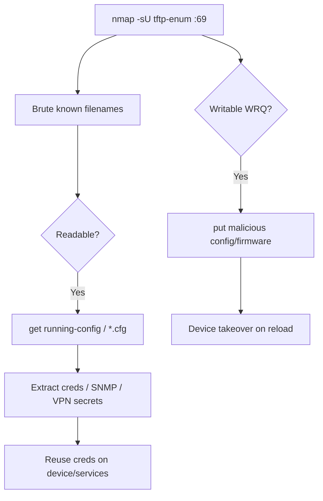

# 61 - TFTP (Port 69/UDP) Pentesting

## 1. Executive Summary

TFTP (Trivial File Transfer Protocol) is a bare-bones file transfer protocol on **UDP 69** with **no authentication** (RFC 1350). It's heavily used inside large networks to push **configuration files** and **ROM/firmware images** to devices like VoIP phones, routers, and switches. For an attacker: if you can **read** files you may grab device configs (which routinely contain credentials, SNMP strings, and VPN secrets); if you can **write**, you can overwrite configs/firmware. TFTP has **no directory listing**, so enumeration means brute-forcing well-known filenames.

## 2. Protocol Overview & Architecture

A client sends an RRQ (read) or WRQ (write) for a filename; the server responds with data blocks over UDP. No auth, no listing, no encryption. Because device config filenames are predictable (`router-confg`, `<mac>.cfg`, `phone.cfg`, `running-config`), guessing them is the whole game. Whether you can read or write depends purely on the server's filesystem permissions/config.

## 3. Enumeration & Footprinting

```bash
# Brute-force default/known paths (no listing exists)
nmap -n -Pn -sU -p69 -sV --script tftp-enum <IP>
# Metasploit transfer util
msf> use auxiliary/admin/tftp/tftp_transfer_util
```

## 4. Exploitation Deep Dive

### 4.1 Read Sensitive Files
Guess common config names and pull them:
```bash
tftp <IP>
tftp> get running-config
tftp> get <mac>.cfg
```
```python
import tftpy
client = tftpy.TftpClient("<IP>", 69)
client.download("router-confg", "router-confg")
```
Device configs commonly leak enable/SNMP/VPN credentials.

### 4.2 Write / Overwrite Files
If WRQ is allowed, push a malicious config or firmware:
```bash
tftp <IP>
tftp> put evil-confg
```
Overwriting a device's startup config or firmware → device takeover on next boot/load (authorized scope only).

## 5. Mermaid Attack Flow



## 6. Post-Exploitation
- Device configs → enable passwords, SNMP communities, VPN PSKs, AD/RADIUS creds.
- Writable TFTP → persistent device compromise via config/firmware overwrite.

## 7. Defense & Hardening
1. Disable TFTP if not needed; never expose it beyond the device management segment.
2. Restrict to read-only with tight directory scoping; firewall UDP 69.
3. Don't store plaintext secrets in TFTP-served configs; rotate any exposed.
4. Prefer authenticated transfer (SCP/SFTP) for device provisioning.

## 8. Chaining Opportunities
- Config SNMP strings → **[[07 - SNMP (Ports 161-162) Pentesting]]**.
- VPN PSKs → **[[59 - IPsec IKE VPN (Port 500) Pentesting]]**.

## 9. Related Notes
- [[02 - Telnet (Port 23) Pentesting]]
- [[04 - FTP (Port 21) Pentesting]]

## 10. Tools
`nmap` tftp-enum, `tftp` client, `tftpy` (Python), Metasploit `tftp_transfer_util`.
