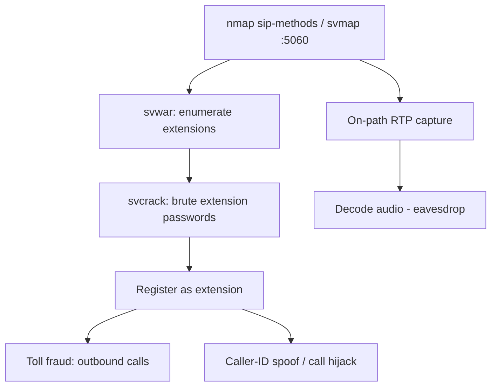

# 63 - SIP / VoIP (Port 5060) Pentesting

## 1. Executive Summary

SIP (Session Initiation Protocol) sets up VoIP calls on **UDP/TCP 5060** (5061 TLS); RTP carries the audio. Attacks: **extension enumeration** (which user/extension numbers exist), **credential brute force** of those extensions, then **toll fraud** (placing calls on the victim's dime), **eavesdropping** (capture + decode RTP), and **call manipulation** (spoof caller-ID, hijack/teardown calls). SIP responses leak existence (`401`/`407` vs `404`), making enumeration reliable. SIPVicious and sippts are the workhorse toolkits.

## 2. Protocol Overview & Architecture

SIP is HTTP-like text. Methods: `REGISTER` (bind a user to a location), `INVITE` (start a call), `OPTIONS` (capability probe — common for scanning). The registrar/PBX (Asterisk, FreePBX, etc.) authenticates via digest. Differential responses to requests for valid vs invalid extensions enable enumeration; weak extension passwords (often the extension number itself) enable registration hijack and fraud.

## 3. Enumeration & Footprinting

```bash
# Method probe
sudo nmap --script=sip-methods -sU -p 5060 <IP>
# Locate SIP services (SIPVicious; svmap UA is 'friendly-scanner' = easy to block)
svmap <IP>/24
# Faster, flexible scanner (TCP/UDP/TLS, custom UA):
sippts scan -i <IP> -r 5060
```

## 4. Exploitation Deep Dive

### 4.1 Extension Enumeration
```bash
svwar -m INVITE -e 100-999 <IP>          # SIPVicious: which extensions exist
sippts enumerate -i <IP>
```

### 4.2 Credential Brute Force
```bash
svcrack -u 101 -d wordlist.txt <IP>      # crack extension 101's password
sippts rcrack -i <IP> -e 101 -w wordlist.txt
```

### 4.3 Toll Fraud / Call Spoofing
With a registered extension, place outbound calls (premium-rate fraud) or spoof caller-ID on INVITE. (Authorized scope only — real financial impact.)

### 4.4 Eavesdropping (RTP capture)
On-path, capture the call's RTP and decode to audio:
```bash
# Wireshark: Telephony → VoIP Calls → Play, or:
tcpdump -i eth0 -w call.pcap udp
```

## 5. Mermaid Attack Flow



## 6. Post-Exploitation
- Toll fraud (financial), eavesdropping (confidential calls), caller-ID spoof (social engineering).
- PBX admin access → full telephony control; configs leak SIP trunk creds.

## 7. Defense & Hardening
1. Strong, non-numeric extension passwords; disable SIP user enumeration where possible.
2. TLS (5061) + SRTP for encryption; fail2ban on registration attempts.
3. Restrict 5060 to trusted networks/SBC; rate-limit and geo-restrict trunks.
4. Patch the PBX; monitor for `friendly-scanner`/abnormal REGISTER volume.

## 8. Chaining Opportunities
- PBX often Linux/Asterisk web UI → **[[08 - Linux Privilege Escalation]]**.
- Trunk creds → cross-service reuse.

## 9. Related Notes
- [[62 - RTSP (Ports 554-8554) Pentesting]]

## 10. Tools
SIPVicious (`svmap`/`svwar`/`svcrack`), `sippts`, `nmap` sip-methods, Wireshark (RTP).
