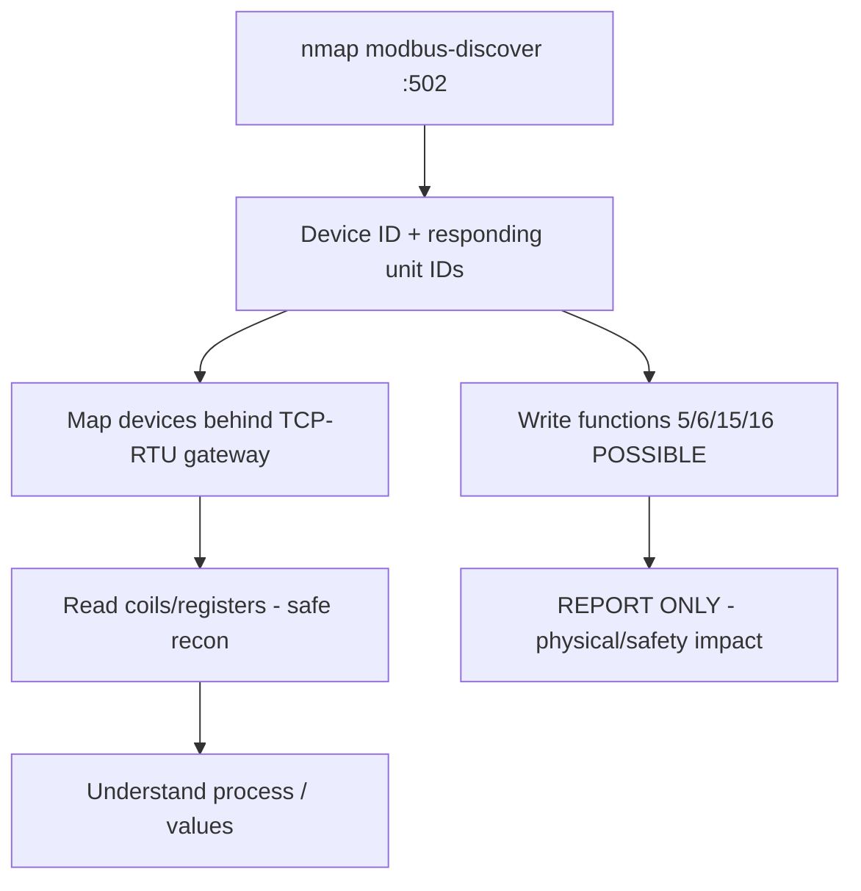

# 64 - Modbus (Port 502) Pentesting

## 1. Executive Summary

Modbus is a 1979 industrial master/slave protocol for **ICS/SCADA** devices (PLCs, RTUs, sensors), Modbus TCP on **port 502**. It has **no authentication and no encryption** — anyone who can reach a PLC can **read and write its registers/coils**, i.e. read process values and *change device outputs*. In an OT context this is safety-critical: writing a coil can start/stop a motor, open a valve, or trip a breaker. **SECURITY/SAFETY CONSTRAINT: enumerate read-only; never write to or stress live OT equipment — report the exposure.**

## 2. Protocol Overview & Architecture

Modbus TCP = 7-byte **MBAP header** + Modbus PDU (function code + data). Data model: discrete inputs, coils (read/write bits), input registers, holding registers (read/write 16-bit words). The **Unit ID** is often ignored by native TCP devices but is critical for a **TCP-to-RTU gateway**, where you enumerate multiple unit/slave IDs to reach devices behind the bridge. Function codes 1-4 read; 5/6/15/16 write.

## 3. Enumeration & Footprinting

```bash
nmap -sV --script modbus-discover -p 502 <IP>
nmap --script modbus-discover --script-args='modbus-discover.aggressive=true' -p 502 <IP>
msf> use auxiliary/scanner/scada/modbusdetect
msf> use auxiliary/scanner/scada/modbusclient   # read holding/coils (read funcs only)
```
`modbus-discover` reports device identification (vendor/product) and responding unit IDs.

## 4. Exploitation Deep Dive

### 4.1 Device Identification & Unit-ID Mapping
Aggressive `modbus-discover` returns the Read Device Identification object (vendor, product code, version) and which **unit IDs** answer — map devices behind any gateway.

### 4.2 Read Process Data (safe)
Use `modbusclient` (read functions) or pymodbus to read coils/registers and understand the process:
```python
from pymodbus.client import ModbusTcpClient
c = ModbusTcpClient("<IP>", port=502)
print(c.read_holding_registers(0, 10, unit=1).registers)
```

### 4.3 Write Capability (DOCUMENT, do not execute on live OT)
Functions 5/6/15/16 would change coils/registers (start/stop equipment). In a sanctioned ICS test this is only done on isolated test rigs with engineering approval. On production: **report that writes are possible — do not perform them.**

## 5. Mermaid Attack Flow



## 6. Post-Exploitation
- Full read of process state (intel on the physical process).
- Documented write capability = critical finding (potential physical sabotage).
- Pivot to engineering workstations/HMIs on the OT network.

## 7. Defense & Hardening
1. Segment OT from IT (Purdue model); firewall 502 to engineering hosts only.
2. Use Modbus security gateways / protocol-aware firewalls; deny external access entirely.
3. Where supported, migrate to authenticated/encrypted variants (Modbus/TCP Security).
4. Monitor for write function codes from unexpected sources.

## 8. Chaining Opportunities
- OT network entry from IT side → **[[59 - IPsec IKE VPN (Port 500) Pentesting]]** / pivots.
- Sibling ICS protocols: **[[65 - BACnet (Port 47808) Pentesting]]**, **[[67 - EtherNet-IP (Port 44818) Pentesting]]**.

## 9. Related Notes
- [[66 - OPC UA (Port 4840) Pentesting]]

## 10. Tools
`nmap` modbus-discover, Metasploit `modbusdetect`/`modbusclient`, `pymodbus`.
