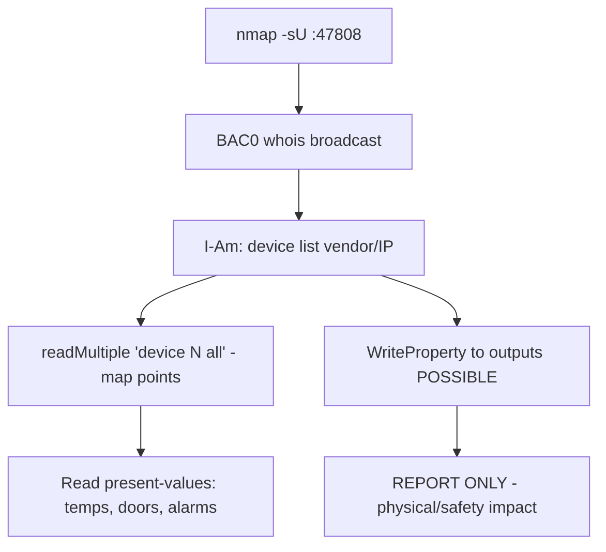

# 65 - BACnet (Port 47808/UDP) Pentesting

## 1. Executive Summary

BACnet is the dominant **building-automation** protocol (HVAC, lighting, access control, fire/life-safety) — ASHRAE/ANSI/ISO 16484-5 — on **UDP 47808**. Like most OT protocols it is **unauthenticated**: a `Who-Is` broadcast makes every BACnet device announce itself, and you can then **read** (and potentially **write**) device objects/properties — temperatures, setpoints, occupancy, door/relay states. Writing setpoints or overriding outputs has real physical impact (HVAC, access control), so **enumerate read-only and report write exposure; do not manipulate live building systems.**

## 2. Protocol Overview & Architecture

BACnet devices expose **objects** (Analog/Binary Input/Output/Value, Device, etc.), each with **properties** (present-value, etc.). `Who-Is`/`I-Am` provide discovery; `ReadProperty`/`ReadPropertyMultiple` read; `WriteProperty` writes. You must be on the **same subnet/broadcast domain** for `Who-Is` (or use a BBMD). No auth means any reachable host can query the whole site's building systems.

## 3. Enumeration & Footprinting

```bash
nmap -sU -p 47808 -sV <IP>
# BAC0 (Python) — must be on the same subnet as the device
python3 - <<'PY'
import BAC0
bacnet = BAC0.connect(ip='<YOUR_IP>/24')
bacnet.whois()                       # broadcast discovery
for dev in bacnet.devices:
    print(dev)
PY
```

## 4. Exploitation Deep Dive

### 4.1 Device & Object Discovery
`whois()` returns deviceId, vendor, IP. Then read all objects/properties of a device:
```python
print(bacnet.readMultiple(f"{devIp} device {numDeviceId} all"))
```
This maps every sensor/actuator point in the building — high-value recon.

### 4.2 Read Process/Building State (safe)
ReadProperty on present-values reveals temperatures, occupancy, door states, alarm status — full situational awareness of the facility.

### 4.3 Write Capability (DOCUMENT only)
`WriteProperty` to a writable Output/Value (e.g. override a setpoint, unlock a door, disable HVAC) has direct physical/safety consequences. On production: **report it as a critical finding; do not perform the write.**

## 5. Mermaid Attack Flow



## 6. Post-Exploitation
- Full map + live state of building systems (HVAC, access, fire).
- Documented write capability = critical (could unlock doors / disable safety systems).
- Pivot to building-management workstations.

## 7. Defense & Hardening
1. Isolate the BAS on a dedicated VLAN; firewall 47808 from IT/internet.
2. Use BACnet/SC (Secure Connect, TLS) where available.
3. Restrict BBMD/foreign-device registration; monitor for external Who-Is.
4. Lock down BMS workstations.

## 8. Chaining Opportunities
- Sibling ICS protocols: **[[64 - Modbus (Port 502) Pentesting]]**, **[[67 - EtherNet-IP (Port 44818) Pentesting]]**.
- BMS workstation → **System and Privilege Escalation**.

## 9. Related Notes
- [[66 - OPC UA (Port 4840) Pentesting]]

## 10. Tools
`BAC0` (Python), `nmap`, BACnet stack explorers (YABE).
