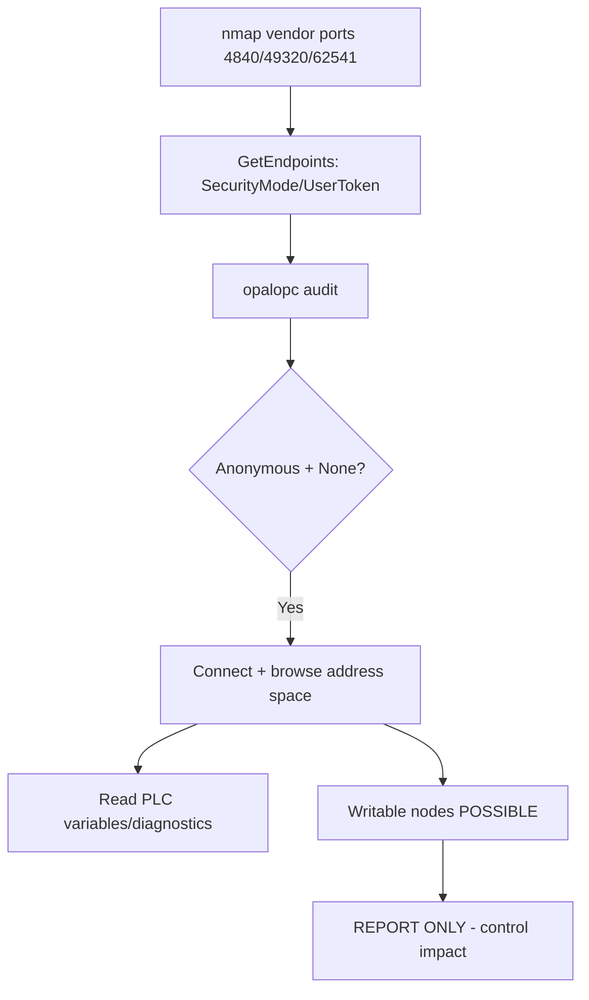

# 66 - OPC UA (Port 4840) Pentesting

## 1. Executive Summary

OPC UA (Open Platform Communications Unified Architecture) is a modern, vendor-neutral industrial protocol for data exchange and equipment control (Manufacturing, Energy, Aerospace) — the bridge that lets different vendors' **PLCs** interoperate. Binary `opc.tcp` on **port 4840** (plus HTTPS 4843/443 and vendor ports like 49320 KepServerEX, 62541, 48050). Unlike legacy OT protocols OPC UA *can* be strongly secured — but for backward compatibility it's frequently weakened: **anonymous access enabled**, `SecurityMode=None`, or self-signed/over-trusted certs. That lets an attacker browse the address space and read/write PLC variables. **Report write capability; don't manipulate live control variables.**

## 2. Protocol Overview & Architecture

A server exposes endpoints, each advertising a **transport profile, SecurityPolicy, SecurityMode, and UserTokenType**. `FindServers`/`GetEndpoints` enumerate these. The address space is a graph of **Nodes** (NodeIds like `i=2267` ServerDiagnosticsSummary); browsing it reveals all variables/methods. Auth tokens: Anonymous, Username/Password, or Certificate. Weak combos (Anonymous + None) = unauthenticated read/write. Scanners often miss OPC UA on nonstandard ports — scan the known vendor ports too.

## 3. Enumeration & Footprinting

```bash
# Locate all OPC UA transports
nmap -sV -Pn -n --open -p 4840,4843,49320,48050,53530,62541 <IP>
# Automated security assessment
opalopc -vv opc.tcp://<IP>:4840
```
For each transport, invoke `FindServers`/`GetEndpoints` to capture `SecurityPolicyUri`, `SecurityMode`, `UserTokenType`, application URI, product strings.

## 4. Exploitation Deep Dive

### 4.1 Endpoint Security Audit (OpalOPC)
`opalopc` flags anonymous access, `SecurityMode=None`, weak/legacy SecurityPolicies, and cert trust issues — the misconfigs that grant access.

### 4.2 Anonymous Browse & Read
If Anonymous/None is allowed, connect and browse the address space, reading PLC variables:
```python
from opcua import Client
c = Client("opc.tcp://<IP>:4840"); c.connect()
root = c.get_root_node()
print(root.get_children())
print(c.get_node("ns=2;i=2").get_value())   # read a variable
```
`i=2267` (ServerDiagnosticsSummary) shows session counts — also useful to spot brute-force defenses.

### 4.3 Write Capability (DOCUMENT only)
Writable nodes let you change control variables (setpoints/outputs) — physical/safety impact. On production: **report; do not write.**

## 5. Mermaid Attack Flow



## 6. Post-Exploitation
- Full read of process variables and server diagnostics.
- Documented write = critical control-system finding.
- Pivot to SCADA/HMI/engineering systems.

## 7. Defense & Hardening
1. Disable Anonymous; require `SecurityMode=SignAndEncrypt` with strong SecurityPolicy.
2. Proper PKI: trust only known client certs; rotate; no self-signed acceptance.
3. Segment OT network; firewall 4840 + vendor ports to authorized clients.
4. Patch the OPC UA stack; monitor session/diagnostic anomalies.

## 8. Chaining Opportunities
- Sibling ICS: **[[64 - Modbus (Port 502) Pentesting]]**, **[[65 - BACnet (Port 47808) Pentesting]]**, **[[67 - EtherNet-IP (Port 44818) Pentesting]]**.

## 9. Related Notes
- [[67 - EtherNet-IP (Port 44818) Pentesting]]

## 10. Tools
`OpalOPC`, `nmap`, Python `opcua` (FreeOpcUa), UaExpert.
