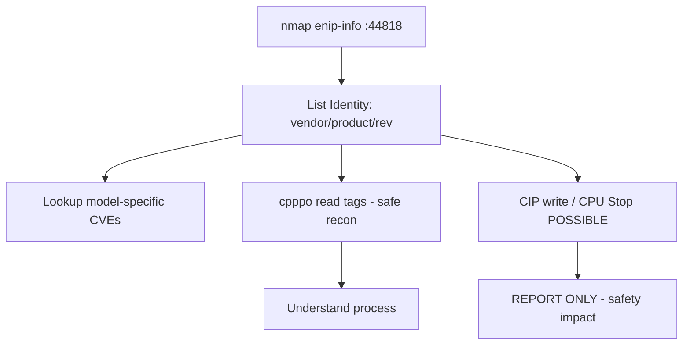

# 67 - EtherNet/IP (Port 44818) Pentesting

## 1. Executive Summary

EtherNet/IP (ENIP) is the industrial protocol carrying **CIP** (Common Industrial Protocol) over Ethernet, used heavily by **Allen-Bradley/Rockwell** and other vendor PLCs, on **TCP/UDP 44818** (implicit I/O on UDP 2222). It is **unauthenticated**: a List Identity request makes devices reveal vendor, product name, serial, revision, and IP — rich fingerprinting of PLCs. CIP can then read/write tags and issue device control (start/stop CPU). **Enumerate read-only; report write/control capability — do not alter live PLC state.**

## 2. Protocol Overview & Architecture

ENIP encapsulates CIP. **List Identity** (`0x63`) and List Services are unauthenticated discovery commands. CIP sessions then read/write **tags** and invoke object services — including, on many PLCs, **CPU mode changes** (Run/Program/Stop). No auth/encryption in the base protocol, so reachability == control. Identity data uniquely fingerprints the PLC for targeted CVEs.

## 3. Enumeration & Footprinting

```bash
nmap -n -sV --script enip-info -p 44818 <IP>
# cpppo List Identity (TCP or UDP/broadcast)
python3 -m cpppo.server.enip.list_services --list-identity -a <IP>
python3 -m cpppo.server.enip.list_services --udp --broadcast --list-identity
# shodan: port:44818 "product name"
```
`enip-info` returns vendor, product name, serial, device type, revision.

## 4. Exploitation Deep Dive

### 4.1 Identity Fingerprinting
List Identity gives exact PLC model/firmware → look up model-specific CVEs (Rockwell advisories) and default behaviors.

### 4.2 Tag Read (safe)
Read PLC tags with cpppo to understand the process:
```bash
python3 -m cpppo.server.enip.client -a <IP> "<TagName>"
```

### 4.3 Tag Write / CPU Control (DOCUMENT only)
CIP write services and CPU mode changes (Stop/Program) would disrupt the process — direct physical/safety impact. On production: **report the capability; do not execute.**

## 5. Mermaid Attack Flow



## 6. Post-Exploitation
- Precise PLC fingerprint → targeted exploits.
- Process tag visibility; documented write/CPU-control = critical finding.
- Pivot to engineering workstations (RSLogix/Studio 5000) on the OT net.

## 7. Defense & Hardening
1. Segment OT; firewall 44818/2222 to engineering hosts only; no internet exposure.
2. Enable CIP Security (authentication/integrity) on capable devices.
3. Set PLC keyswitch to Run; restrict who can change CPU mode; patch firmware.
4. Monitor for List Identity / CIP writes from unexpected sources.

## 8. Chaining Opportunities
- Sibling ICS: **[[64 - Modbus (Port 502) Pentesting]]**, **[[65 - BACnet (Port 47808) Pentesting]]**, **[[66 - OPC UA (Port 4840) Pentesting]]**.

## 9. Related Notes
- [[66 - OPC UA (Port 4840) Pentesting]]

## 10. Tools
`nmap` enip-info, `cpppo`, pycomm3 (Rockwell), Wireshark (CIP).
