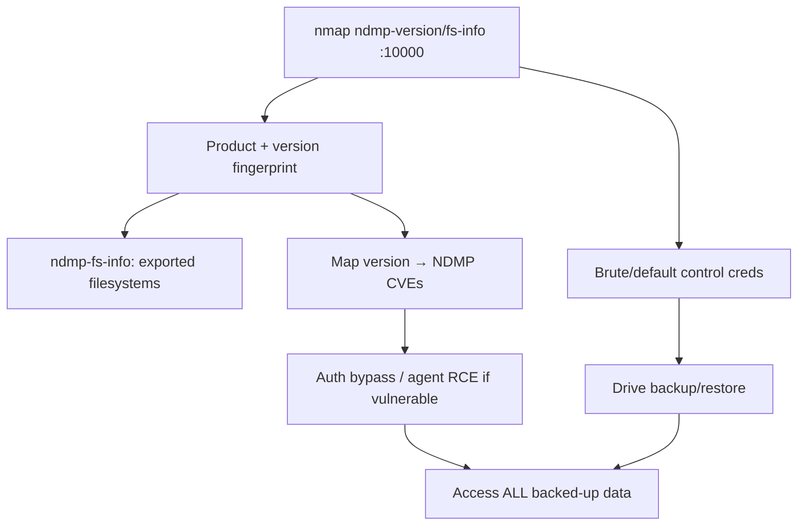

# 68 - NDMP (Port 10000) Pentesting

## 1. Executive Summary

NDMP (Network Data Management Protocol) moves backup data directly between **NAS** devices and **backup systems** (Veritas/Symantec Backup Exec, NetBackup, NetApp), on **TCP 10000**, bypassing the backup server for speed. For an attacker it's both an **information-disclosure** surface (version/host/filesystem details that fingerprint the backup infrastructure) and, with credentials, a path to the **backed-up data** — backups are a goldmine (everything, including secrets, in one place). Several NDMP implementations have had auth-bypass/RCE CVEs.

## 2. Protocol Overview & Architecture

NDMP separates control (the backup app) from data (NAS ↔ tape/disk). The control connection authenticates (MD5 or cleartext); enumeration of version and filesystem info is often available pre-auth. Because it orchestrates full-system backups, abusing it can expose or exfiltrate entire datasets. Note: port 10000 is also Webmin — fingerprint to distinguish.

## 3. Enumeration & Footprinting

```bash
nmap -n -sV --script "ndmp-fs-info or ndmp-version" -p 10000 <IP>
# ndmp-version → product (e.g. 'Symantec/Veritas Backup Exec ndmp')
# ndmp-fs-info → exported filesystems on the NAS
```

## 4. Exploitation Deep Dive

### 4.1 Version & Filesystem Disclosure
`ndmp-version` fingerprints the exact backup product/version (→ targeted CVEs); `ndmp-fs-info` lists the NAS filesystems available for backup — maps what data exists.

### 4.2 Credential / Auth Attacks
NDMP control auth (often weak/default service accounts) can be brute-forced or bypassed on vulnerable versions. With valid creds you can drive backup/restore operations.

### 4.3 Known CVEs
Map the fingerprinted version to NDMP CVEs (Backup Exec agent auth-bypass/RCE families) — several allow unauthenticated file access or command execution against the agent.

### 4.4 Data Exposure
Authenticated NDMP access can restore/copy backup images → access to *all* backed-up data (configs, databases, AD, secrets).

## 5. Mermaid Attack Flow



## 6. Post-Exploitation
- Access to full backups = everything (DBs, AD, configs, secrets) in one place.
- Agent RCE → host foothold on the backup/NAS infrastructure.
- Pivot across all systems whose data lives in the backups.

## 7. Defense & Hardening
1. Restrict NDMP (10000) to the backup network/hosts only; never internet-facing.
2. Strong unique NDMP credentials + MD5 auth (not cleartext); patch the backup product.
3. Encrypt backups at rest/in transit; tightly control restore permissions.
4. Monitor NDMP control connections.

## 8. Chaining Opportunities
- Backup data → creds for **Active Directory**, databases, everything.
- Distinguish from Webmin on 10000 (different service).

## 9. Related Notes
- [[69 - iSCSI (Port 3260) Pentesting]]
- [[25 - NFS (Port 2049) Pentesting]]

## 10. Tools
`nmap` ndmp-version/ndmp-fs-info, Metasploit NDMP/Backup Exec modules.
