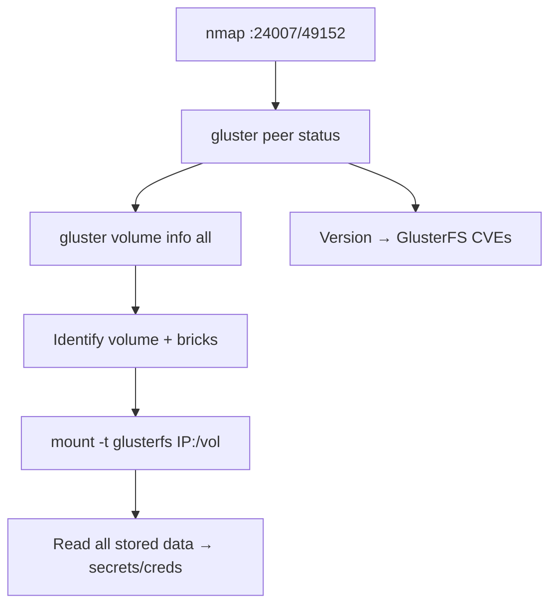

# 70 - GlusterFS (Ports 24007/49152) Pentesting

## 1. Executive Summary

GlusterFS is a **distributed file system** that pools storage from many servers into one namespace. The management daemon **`glusterd`** listens on **24007/TCP**; data-plane **bricks** start at **49152/TCP** (one port per brick, incrementing); legacy clusters (<9.x) also used **24008-24009/TCP**. In default setups `glusterd` answers RPC **without authentication**, so you can enumerate peers and volumes and — if you can reach the bricks — **mount volumes without privileges** and read all stored data. `glusterd` answers even on storage-only nodes, making it a reliable infrastructure pivot point.

## 2. Protocol Overview & Architecture

`glusterd` (24007) is the control RPC; it directs **bricks** (the actual storage backends, 49152+). A client mounts a **volume** (a collection of bricks) via the native FUSE client or NFS. Default deployments have no auth on the management RPC and no transport encryption, so peer/volume enumeration and volume mounting are open to anyone who can reach the ports.

## 3. Enumeration & Footprinting

```bash
nmap -sV -p 24007,24008,24009,49152 <IP>
sudo apt install -y glusterfs-cli glusterfs-client
# Works without auth in default setups:
gluster --remote-host <IP> peer status
gluster --remote-host <IP> volume info all
```

## 4. Exploitation Deep Dive

### 4.1 Peer & Volume Enumeration
`peer status` maps every node in the cluster; `volume info all` lists volume names, brick locations, and transport/options — the blueprint for mounting.

### 4.2 Unprivileged Mount → Data Access
Mount a discovered volume and read everything:
```bash
sudo mkdir /mnt/gluster
sudo mount -t glusterfs <IP>:/<volume> /mnt/gluster
ls -la /mnt/gluster        # all stored files, often ignoring intended app ACLs
```

### 4.3 Version CVEs
Map the `glusterd` version to known GlusterFS CVEs (several info-leak / RCE issues exist in older releases).

## 5. Mermaid Attack Flow



## 6. Post-Exploitation
- Read all data on mounted volumes (configs, DBs, secrets) bypassing app ACLs.
- Cluster map = pivot to all storage nodes.
- Write access → tamper/persist on stored systems.

## 7. Defense & Hardening
1. Enable auth/TLS for the management + data path (`auth.allow`, TLS for glusterd/bricks).
2. Restrict 24007/24008-24009/49152+ to cluster + authorized client subnets; never internet-facing.
3. Patch GlusterFS; segment the storage network.
4. Monitor unexpected peer/volume queries and mounts.

## 8. Chaining Opportunities
- Stored data → creds for **Active Directory**, databases, apps.
- Storage siblings: **[[69 - iSCSI (Port 3260) Pentesting]]**, **[[25 - NFS (Port 2049) Pentesting]]**.

## 9. Related Notes
- [[71 - Hadoop (Ports 50070-9870) Pentesting]]

## 10. Tools
`gluster` CLI, `glusterfs-client` (FUSE mount), `nmap`.
