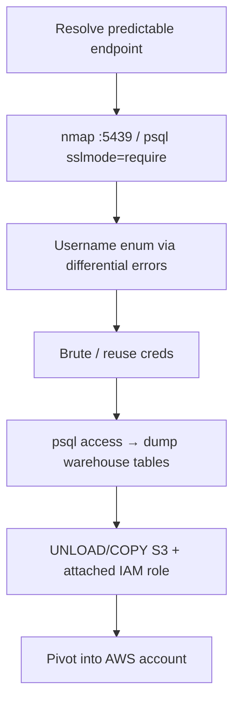

# 73 - Amazon Redshift (Port 5439) Pentesting

## 1. Executive Summary

Amazon Redshift is AWS's managed **data warehouse**, default **TCP 5439**. Its wire protocol is a slightly modified **PostgreSQL** protocol, so standard Postgres tooling (psql, psycopg2, JDBC/ODBC) connects — but auth and TLS rules differ. The pentest angles: **publicly-exposed clusters** (the endpoint pattern is predictable), **username enumeration** (error messages differentiate bad-password vs missing-user), and **credential brute force / reuse**. A warehouse holds aggregated business data — high-value loot — and DB access can pivot into the wider AWS account.

## 2. Protocol Overview & Architecture

Endpoints look like `<clusterid>.<random>.<region>.redshift.amazonaws.com` (or `redshift-serverless.amazonaws.com` for serverless), both on 5439. Redshift **requires TLS 1.2+** with PFS ciphers; the `require_ssl` parameter group setting controls whether plaintext is allowed (new clusters default to `require_ssl=true`, so downgrade/MITM is hard). Because it's Postgres-compatible, the same enumeration/brute techniques as PostgreSQL apply, with AWS-specific catalogs (`svv_*`) for recon.

## 3. Enumeration & Footprinting

```bash
nmap -sV -p 5439 <endpoint>
# Connect (force modern TLS)
psql "host=<endpoint> port=5439 user=awsuser dbname=dev sslmode=require"
# Session / system views once in:
# select * from svv_redshift_sessions;
```

## 4. Exploitation Deep Dive

### 4.1 Public Exposure Check
Resolve the predictable endpoint and test reachability — internet-exposed Redshift on 5439 is a common misconfig.

### 4.2 Username Enumeration
Login errors distinguish *wrong password* from *no such user*, so you can enumerate valid usernames before brute-forcing:
```bash
for u in awsuser admin root analytics etl; do
  PGPASSWORD=x psql "host=<endpoint> port=5439 user=$u dbname=dev sslmode=require" -c '\q' 2>&1 | grep -qi 'password' && echo "VALID USER: $u"
done
```

### 4.3 Brute Force / Credential Reuse
Spray confirmed users with leaked/common passwords (respect AWS lockout). Reused app DB creds frequently work.

### 4.4 Data & AWS Pivot
With access, dump warehouse tables; check for `COPY`/`UNLOAD` to S3 and any attached IAM roles — Redshift's IAM role can be a path deeper into the AWS account.

## 5. Mermaid Attack Flow



## 6. Post-Exploitation
- Exfiltrate aggregated business data (the warehouse is the crown jewels).
- Abuse Redshift's IAM role / S3 integration → broader AWS access.
- Reuse cracked creds across services.

## 7. Defense & Hardening
1. Keep clusters in private subnets; never publicly accessible; restrict SG to known IPs.
2. Enforce `require_ssl=true`; strong unique passwords / IAM auth; enable MFA where possible.
3. Least-privilege IAM role on the cluster; audit `UNLOAD`/`COPY`.
4. Enable logging/CloudTrail; alert on failed-login spikes.

## 8. Chaining Opportunities
- Postgres-compatible — see **[[12 - PostgreSQL (Port 5432) Pentesting]]** techniques.
- IAM/S3 pivot → **Cloud and Container Security**.

## 9. Related Notes
- [[12 - PostgreSQL (Port 5432) Pentesting]]
- [[74 - Bitcoin Node (Port 8333) Pentesting]]

## 10. Tools
`psql`/`psycopg2`, JDBC/ODBC, `nmap`, AWS CLI (post-access).
