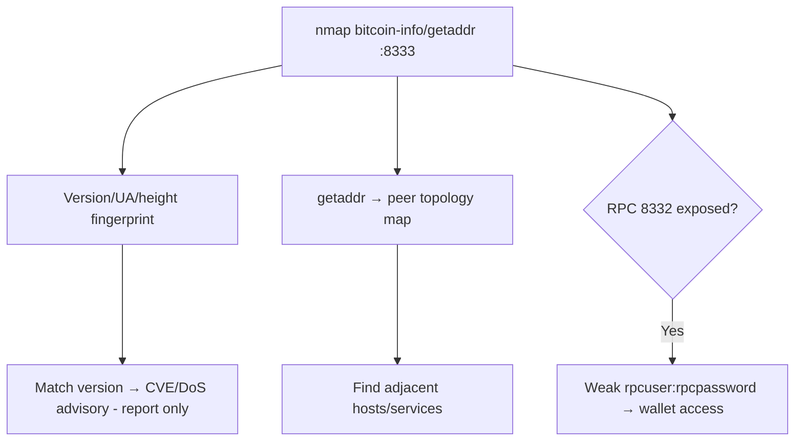

# 74 - Bitcoin Node (Port 8333) Pentesting

## 1. Executive Summary

Bitcoin full nodes gossip over a P2P protocol: **8333** (mainnet), **18333** (testnet), **38333** (signet), **18444** (regtest/local). There's no "exploit the blockchain" here — the value is **reconnaissance and exposure mapping**. A node that thinks you're a peer discloses its **version/user-agent, block height, services, and known peer addresses** (network topology). That fingerprints the host (often a Linux server also running a wallet/RPC) and reveals adjacent nodes. The real risk usually sits next door: the **wallet RPC (8332)** if exposed with weak creds.

## 2. Protocol Overview & Architecture

Peers exchange `version`/`verack` handshakes, then `getaddr`/`addr` (peer lists) and inventory messages. The protocol is public and unauthenticated by design — anyone can peer. So info disclosure is "working as intended," useful for mapping. Operationally, the sensitive surface is the JSON-RPC interface (`bitcoind` on 8332) and any wallet on the host, not the P2P port itself.

## 3. Enumeration & Footprinting

```bash
sudo nmap -p 8333 --script bitcoin-info --script bitcoin-getaddr <IP>
# bitcoin-info: protocol version, user-agent, services, block height
# bitcoin-getaddr: list of peer node addresses (topology)
# shodan dork: port:8333 bitcoin
```

## 4. Exploitation Deep Dive

### 4.1 Node Fingerprinting
`bitcoin-info` reveals the client + version (e.g. Bitcoin Core x.y) and block height — match version to any known node CVEs/DoS advisories (report, don't launch DoS).

### 4.2 Peer Topology Mapping
`bitcoin-getaddr` dumps known peers — map the node's network neighborhood and find other reachable hosts/services to target.

### 4.3 Adjacent RPC / Wallet Surface
The same host commonly runs `bitcoind` RPC on **8332**. If exposed, test it (weak/default `rpcuser:rpcpassword`) — RPC access can read/move wallet funds and run `getwalletinfo`:
```bash
curl --user rpcuser:rpcpassword --data '{"method":"getblockchaininfo"}' http://<IP>:8332/
```

## 5. Mermaid Attack Flow



## 6. Post-Exploitation
- Host/version fingerprint + peer topology for targeting.
- If RPC reachable + weak creds: wallet info and potential fund movement (authorized scope only).

## 7. Defense & Hardening
1. The P2P port is meant to be public, but never expose **RPC 8332** to untrusted nets; strong `rpcauth`.
2. Run latest Bitcoin Core; limit peer info leakage where feasible.
3. Firewall RPC/wallet to localhost; encrypt and back up wallets.

## 8. Chaining Opportunities
- Adjacent exposed RPC/wallet → fund theft.
- Host fingerprint → service-specific attacks elsewhere in this module.

## 9. Related Notes
- [[75 - SAProuter (Port 3299) Pentesting]]

## 10. Tools
`nmap` bitcoin-info/bitcoin-getaddr, `curl` (RPC), `bitcoin-cli`.
