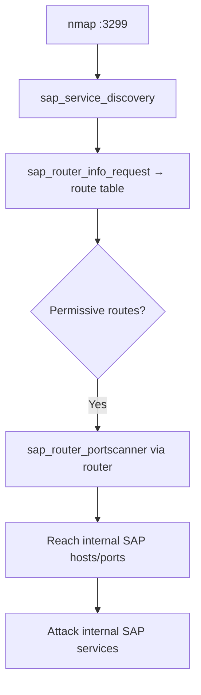

# 75 - SAProuter (Port 3299) Pentesting

## 1. Executive Summary

SAProuter is a reverse proxy that gates access between the internet and an organization's **internal SAP network**, on **TCP 3299**, commonly punched through the firewall. That makes it a prime pivot: a misconfigured route table (ACL) lets an attacker **tunnel through SAProuter to reach internal SAP systems** (and sometimes other internal hosts) that are otherwise unreachable. Metasploit has dedicated SAP modules to discover it, dump its route configuration, and proxy attacks through it.

## 2. Protocol Overview & Architecture

SAProuter forwards connections according to a **route permission table** that should restrict which sources may reach which internal targets/ports. When entries are too permissive (or info requests are allowed), you can enumerate reachable internal services and relay traffic — turning the perimeter proxy into an attack conduit toward SAP Dispatcher (3200+), message servers (3600+), and management ports.

## 3. Enumeration & Footprinting

```bash
nmap -sV -p 3299 <IP>       # 'saprouter?'
# Metasploit discovery + info
msf> use auxiliary/scanner/sap/sap_service_discovery
msf> set RHOSTS <IP>
msf> run
msf> use auxiliary/scanner/sap/sap_router_info_request
msf> set RHOST <IP>
msf> run
```

## 4. Exploitation Deep Dive

### 4.1 Route Table / Info Disclosure
`sap_router_info_request` queries SAProuter for its configuration/route info — revealing internal targets and which connections are permitted.

### 4.2 Pivot Through SAProuter
Use the permitted routes to reach internal SAP hosts/ports through the router (proxychains-style relay via the SAP modules / `sapni` proxy), then attack internal SAP services you couldn't see from outside:
```bash
# enumerate internal SAP services reachable via the router's allowed routes
msf> use auxiliary/scanner/sap/sap_router_portscanner
msf> set RHOSTS <internal-sap-ip-range>
msf> run
```

### 4.3 Attack Internal SAP
Once internal services are reachable, target SAP-specific surfaces (SAP GUI/Dispatcher, ICM, default SAP* accounts) — see the SAP note.

## 5. Mermaid Attack Flow



## 6. Post-Exploitation
- Pivot into the internal SAP landscape (and possibly other internal hosts).
- Foothold toward business-critical ERP data and SAP credentials.

## 7. Defense & Hardening
1. **Lock down the SAProuter route permission table** — explicit allow only; deny info requests.
2. Require SNC (Secure Network Communications) for routed connections.
3. Don't expose 3299 broadly; restrict to known partner IPs; patch SAProuter.
4. Monitor route info requests and port-scan patterns.

## 8. Chaining Opportunities
- Pivot → **[[76 - SAP (Port 3200) Pentesting]]** internal services.
- Tunneling concept overlaps with **[[41 - SOCKS Proxy (Port 1080) Pentesting]]** / **[[42 - Squid Proxy (Port 3128) Pentesting]]**.

## 9. Related Notes
- [[76 - SAP (Port 3200) Pentesting]]

## 10. Tools
Metasploit SAP modules (`sap_service_discovery`, `sap_router_info_request`, `sap_router_portscanner`), `nmap`.
