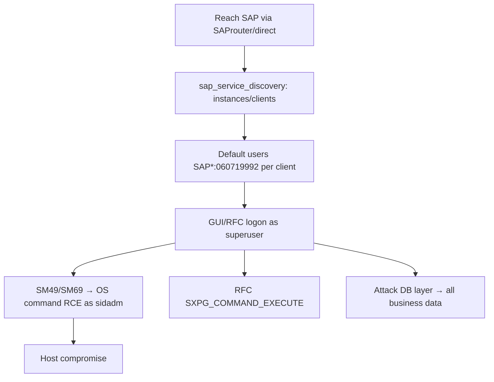

# 76 - SAP (Port 3200) Pentesting

## 1. Executive Summary

SAP is the dominant enterprise ERP — it runs the business (finance, HR, supply chain), so a compromise is maximum impact. A SAP instance (**SID**) has database/application/presentation layers; the Application Server **Dispatcher** listens on **3200+NN** (3200 for instance 00), the message server on **3600+NN**, ICM web on **8000+NN**, and management. The classic foothold is **default SAP standard-user credentials** that go unchanged in dev/test/QA — most notably **`SAP*` (the "root" user) with default password `060719992`** — plus `DDIC`, `EARLYWATCH`, `TMSADM`. Greatest impact comes from **attacking the database** layer behind the app.

## 2. Protocol Overview & Architecture

Each SID typically spans four instances (dev/test/QA/prod), each divided into **clients** (e.g. 000, 001, 066), and each client has the `SAP*` superuser. Communication uses the SAP NI/RFC protocols (via SAProuter at the perimeter — see note 75). Attack surfaces: SAP GUI/Dispatcher (3200), RFC interfaces (often weak/no auth), the ICM web stack (8000), and standard transactions that allow OS command execution (`SM49`/`SM69`) or report execution for ABAP-level code.

## 3. Enumeration & Footprinting

```bash
nmap -sV -p 3200,3300,3600,8000 <IP>
# Bizploit / pysap / Metasploit SAP modules
msf> use auxiliary/scanner/sap/sap_service_discovery
# Enumerate clients and standard users
msf> use auxiliary/scanner/sap/sap_mgmt_con_getaccesspoints
```

## 4. Exploitation Deep Dive

### 4.1 Default Standard-User Credentials
Test the well-known accounts per client (000/001/066):
```
SAP*      : 060719992  (also 06071992 / PASS on some)
DDIC      : 19920706
EARLYWATCH: SUPPORT
TMSADM    : PASSWORD / $1Pawd2&
```
A valid `SAP*` login = application superuser.

### 4.2 RFC Abuse
Unauthenticated/weak RFC functions (`RFC_PING`, callback abuse, `SXPG_COMMAND_EXECUTE`) can leak data or run OS commands. Enumerate with pysap/Bizploit.

### 4.3 OS Command Execution
With GUI access, transactions **SM49/SM69** define and run external OS commands → RCE as the `<sid>adm` user. ABAP report execution (SE38) similarly runs code.

### 4.4 Database Layer
The highest-impact target — direct DB access (Oracle/HANA/MSSQL behind SAP) yields all business data and credential tables.

## 5. Mermaid Attack Flow



## 6. Post-Exploitation
- Application superuser → full ERP control (financial fraud, data theft).
- OS RCE as `<sid>adm`; DB access = all business data + credential tables.
- Pivot across dev/test/QA/prod instances.

## 7. Defense & Hardening
1. **Change all default standard-user passwords**; lock/deactivate `SAP*` where possible; secure every client (incl. 066).
2. Secure RFC (auth, SNC, disable dangerous function modules); restrict SM49/SM69.
3. Network-segment SAP; SNC/TLS; patch (SAP Security Notes); restrict the message server.
4. Audit logons and command-execution transactions.

## 8. Chaining Opportunities
- Reached via **[[75 - SAProuter (Port 3299) Pentesting]]** pivot.
- DB layer → **[[10 - MSSQL (Port 1433) Pentesting]]** / **[[13 - Oracle TNS (Port 1521) Pentesting]]**.

## 9. Related Notes
- [[75 - SAProuter (Port 3299) Pentesting]]

## 10. Tools
pysap, Bizploit, Metasploit SAP modules, SAP GUI, `nmap`.
