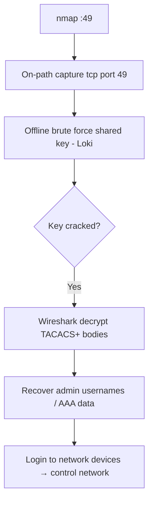

# 77 - TACACS+ (Port 49) Pentesting

## 1. Executive Summary

TACACS+ centrally validates users accessing **network devices** (routers, switches, NAS) — the AAA (Authentication, Authorization, Accounting) backbone of Cisco-style infrastructure, on **TCP 49**. The body of every TACACS+ packet is encrypted with a **shared secret key** between the device and the server. The attack: **capture TACACS+ traffic, then offline brute-force the shared key** (MD5-based) — undetectable, no logs. Crack the key and you can **decrypt the traffic** in Wireshark to recover admin usernames/banners, and effectively own the network-device authentication.

## 2. Protocol Overview & Architecture

A network device (NAS client) forwards login attempts to the TACACS+ server; the packet body (containing credentials and AAA data) is obfuscated by an MD5 keystream derived from the **shared key + session fields**. The key is the single secret protecting everything. If you sit on-path (or compromise a span) and capture an exchange, the key is brute-forceable offline; once recovered, all past/future captured TACACS+ traffic is decryptable.

## 3. Enumeration & Footprinting

```bash
nmap -sV -p 49 <IP>          # tacacs
# Capture TACACS+ exchanges on-path:
tcpdump -i eth0 -w tacacs.pcap 'tcp port 49'
```

## 4. Exploitation Deep Dive

### 4.1 Capture the Exchange
On-path between a network device and the TACACS+ server, capture an authentication exchange (`tcp port 49`).

### 4.2 Offline Key Brute Force
Brute-force the shared key against the capture — silent, no server logs:
```bash
# Loki, or tac2cat/tacacs-cracker style tools, or hashcat-compatible extraction
loki_gtk.py        # GUI brute force of the TACACS+ key
```

### 4.3 Decrypt Traffic → Creds
Feed the cracked key to Wireshark (TACACS+ protocol preferences → secret) to decrypt the bodies — recover **admin usernames, banners, and authorization data**. With device creds, log into the network equipment and control routing/ACLs.

## 5. Mermaid Attack Flow



## 6. Post-Exploitation
- Decrypted AAA traffic → admin credentials for routers/switches.
- Device control → reroute/sniff traffic, modify ACLs, persistence.
- Cracked key works on all devices sharing it.

## 7. Defense & Hardening
1. Use a **long, random shared key**, unique per device; rotate regularly.
2. Protect the management plane — segment/encrypt the path; prevent on-path capture.
3. Prefer modern, integrity-protected AAA transport; monitor for capture/MITM.
4. Restrict TCP 49 to device↔server only.

## 8. Chaining Opportunities
- Device admin → pivot/sniff → reach more services in this module.
- Captured device configs → SNMP/VPN secrets (**[[07 - SNMP (Ports 161-162) Pentesting]]**, **[[59 - IPsec IKE VPN (Port 500) Pentesting]]**).

## 9. Related Notes
- [[78 - distcc (Port 3632) Pentesting]]

## 10. Tools
`Loki`, `tcpdump`, Wireshark (TACACS+ decrypt), `nmap`.
